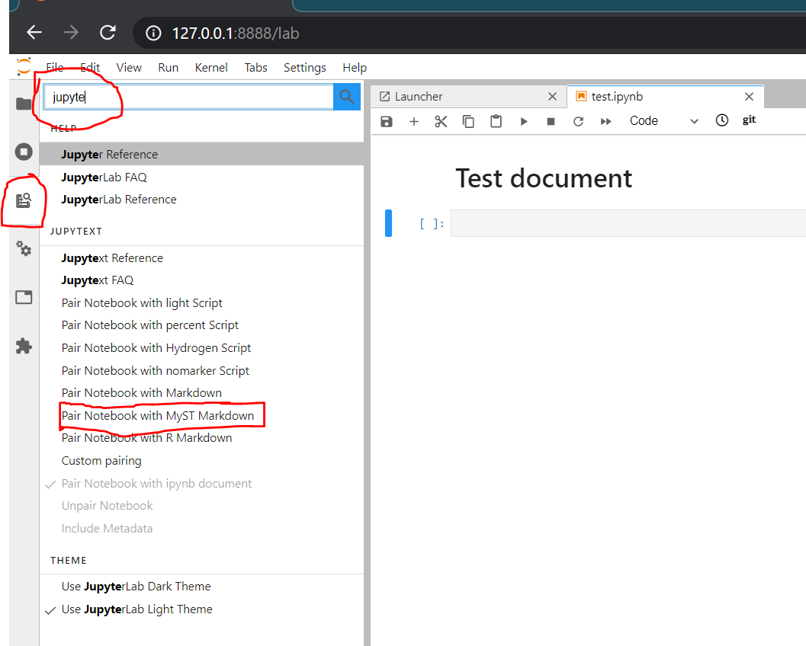

# How to develop contents to this book project? - Guidelines

**Contents**

 - [Objectives](#objectives)
 - [Technologies used](#technologies-used)
 - [How to create content?](##pipeline---how-to-create-content)
 - [Build local version of the docs](#to-build-local-version-of-the-docs)
 - [Upload contents to Github](#to-upload-the-contents-to-github)
 - [Ask for a review by making PR](#ask-for-a-review-by-making-a-pull-request)
 - **How to?**
    - [Sync Notebook with MyST Markdown](#sync-jupyter-notebook-with-myst_markdown)
    - [Add a citation](#add-a-citation)
    - [Allow errors to be included in the docs](#allow-an-error-to-happen-in-code-blocks)

## Objectives

By using the approaches described in this document we aim that producing the materials would:

 1. **be easy**
 2. allow us to benefit from all the latest developments in online education (e.g. the features developed by `executablebooks` -project)
 3. allow us to easily see the changes/additions made to the documents by contributors
 4. allow us to comment on texts / additions made by others (in GitHub)

## Technologies used

To achieve the goals specified above, we will use following technologies:

 1. Jupyter Book / sphinx-book-theme: allows us to make the learning experience better e.g. with interactive functionalities
 2. Jupyter Notebooks using [MyST markdown syntax](https://jupyterbook.org/content/myst.html) allowing us to use Sphinx directives and control the page layout 
 3. [Jupytext](https://github.com/mwouts/jupytext) - Syncs the notebooks with markdown version of the same file **allowing us to better use GitHub diff functionalities**
 4. [MyST_NB](https://myst-nb.readthedocs.io/en/latest/) - Converts the notebooks into RST files that are rendered by Sphinx. 
 

## Pipeline - How to create content?

The materials for the book are organized under different chapters. 

### To produce the content:
 
 1. Add your Jupyter notebook under the folder where your content belongs
 2. Name your file in an intuitive manner, and include chapter numbering, e.g. `2-1_intro-to-data-analysis-with-pandas.ipynb`
 3. Sync / pair your notebook with MyST Markdown (see [details and how to do it here](#sync-jupyter-notebook-with-myst_markdown)) 
 4. Write contents into this notebook as you would do normally. Remember to use [MyST markdown syntax](https://jupyterbook.org/content/myst.html) for enriching the contents with Jupyter Book functionalities.
 5. Push the files / changes to the branch you are working on (e.g. `chapter_1` branch)
    - Remember to push both the Jupyter Notebook and the paired Markdown version of the file

### To build local version of the docs:

Once you have written materials, and you want to see the results **live**, you can build and see the local version of the documentation by:

 1. Build the docs with `$ make html` (with sphinx-book-theme) 
 2. You can see the docs under `_build/html` directory located in the root of the project
    
### To upload the contents to GitHub:

Once you are happy with the contents, you can upload the contents (both Notebook and Markdown version) to GitHub into the `<chapter>` branch 
(see docs about our [branching workflow below](#ask-for-a-review-by-making-a-pull-request)).
 
**NOTE**: Pushing to `master` branch directly is not allowed (it is restricted), hence when you want to add something to master, you need to do it
 via Pull Request (PR).  
 
### Ask for a review by making a Pull Request

For building the book we use a **branching workflow** consisting of 3 levels (following best practices):


Hence, when you are working on a topic (e.g. Chapter 2) you should have a separate branch for that topic and add your materials there 
(as demonstrated in the figure above).

When you are happy with the contents, and you would like to ask comments from other contributors, you should **make a Pull Request**
by merging the contents from your branch into the **develop** branch (note: not master). When you have done the pull request,
other contributors can make comments in GitHub directly to your "code" (documentation) and we can discuss in there easily. 
Once everything seems to be okay, some of the maintainers will accept the review and merge the contents to `develop` branch.

**Why not merging to master straight away?**

The master branch is facing the "outside" world. Hence, it is reserved for contents that are in a "publishable state". Once we
think that we want to publish the materials (e.g. for asking comments from "public"), we certainly can do that. But by default,
master is to be used only when we want to publish something, and send materials to "production".  

## How to?

### Sync Jupyter Notebook with MyST_Markdown

To be able to use GitHub's `diff` functionalities e.g. when doing a review of the materials that some of us has developed, 
it is "necessary" to have a Markdown version of the notebook. *Showing differences between notebooks in GitHub is a mess because 
the notebooks are essentially JSON files containing lots of metadata etc. which makes it hard to see the differences in the 
actual contents that we are interested in.*

To make a ST_Markdown **paired version** of the notebook in Jupyterlab, choose the `Commands` tab from the left panel, and 
write `Jupytext` to the search box which will show you an option to `Pair Notebook with MyST Markdown`:
  

After you have activated the *pairing*, you will always have an identical copy of the Notebook in the same directory 
as a Markdown file. **NOTE**: The files are **really** synced, hence if you make a change to the Markdown version of the notebook
and save it, those changes will be automatically reflected to the Notebook as well (and vice versa). If you don't see the changes
in the Notebook in Jupyterlab, you might need to refresh the page (F5).  

### Add a citation

For adding citations, we take advantage of [sphinx-bibtex](https://sphinxcontrib-bibtex.readthedocs.io/en/latest/usage.html) extension for Sphinx.
There is a specific syntax for adding these using MyST markdown syntax ([see full docs here](https://jupyterbook.org/content/citations.html)).

The basic workflow:

 1. Add references to `references.bib` file that should be located on the same directory where you Notebook is located.
    - Hint: to add a reference to this file from Mendeley is easy by right clicking the document in Mendeley list and choosing 
    `Copy As --> BibTex Entry`. This is then copied to clipboard, and you can paste it into the `references.bib`.  
    
 2. Add a reference to the markdown cell with ```{cite}`myReference2020` ```
    - This name should match with the entry name that you added to `references.bib`

 3. When you want to add the bibliography (see also note below), you should add ```{bibliography} path/to/references.bib ``` 
 to the location where you want to add the reference list (e.g. at the end of each Chapter).
 
**NOTE**: If you want to use a custom APA style (defined in conf.py), you should add the bibliography as follows:
```
{bibliography} path/to/references.bib
:style: apa
```  
 
### Allow an error to happen in code blocks?

Introducing errors in the code is quite typical when teaching. Writing contents that raise errors is straightforward, **however**,
when you want to **build** the website having errors you most probably end up having a build error when executing `make html`. 
To avoid this, it is necessary to add **a cell tag** `raises-exception` to those cells with errors that you want to include into the final documentation. 

To get information how to add a cell-tag, follow [these instructions](https://github.com/jupyterlab/jupyterlab-toc/issues/87).

## Build PDF of the book

### Installations

TexLive installation on Ubuntu (and Windows WSL):
```
$ sudo apt-get install texlive-latex-recommended texlive-fonts-recommended texlive-latex-extra latexmk
```

Python environment for the book is in `ci/py38-book-building.yaml`

### Build commands

After you have installed the packages, you can build the pdf by:

First generate the latex files:
```
# At the project root --> will create directory latex
$ sphinx-build -b latex source latex
```

Then build the pdf (with default settings):
```
# At the latex directory

# Create first version of the pdf
$ pdflatex introductiontopythonforgeographicdataanalysis.tex

# Generate the table of contents
$ makeindex introductiontopythonforgeographicdataanalysis.idx

# Update the pdf accordingly
$ pdflatex introductiontopythonforgeographicdataanalysis.tex
```

After these steps, you can check the resulting PDF named `introductiontopythonforgeographicdataanalysis.pdf` 
that should be in the `latex` -directory.
