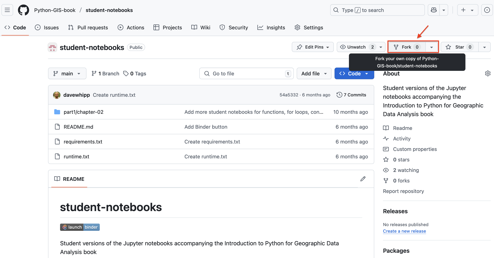
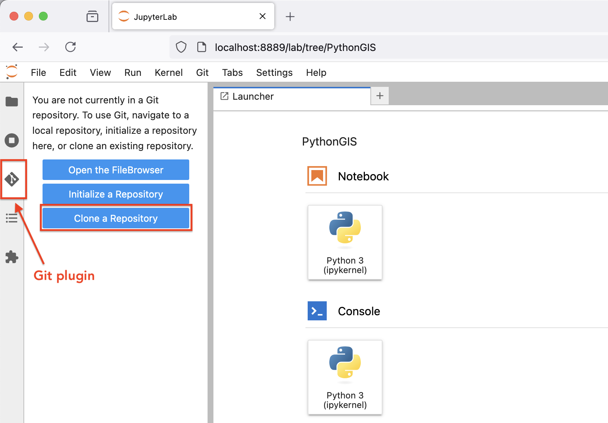
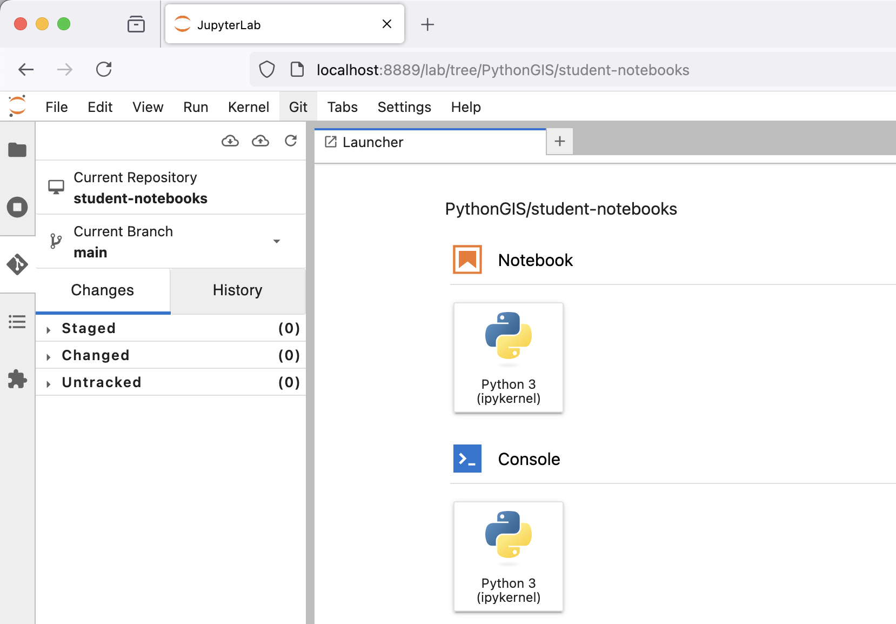
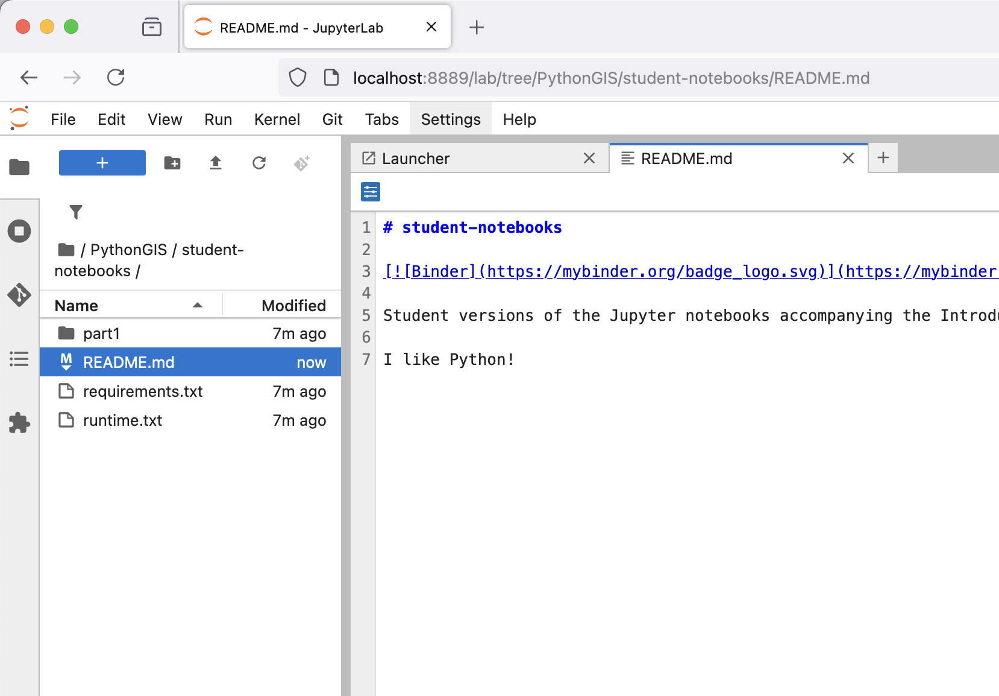
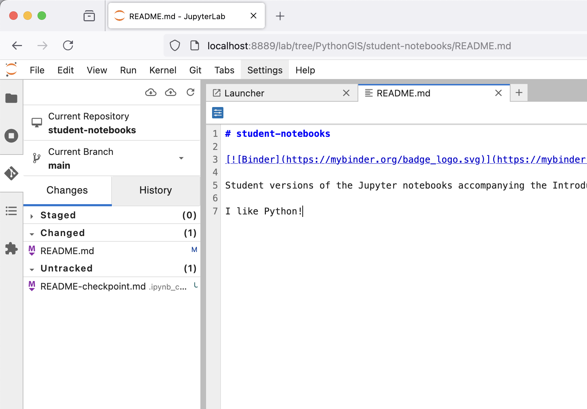
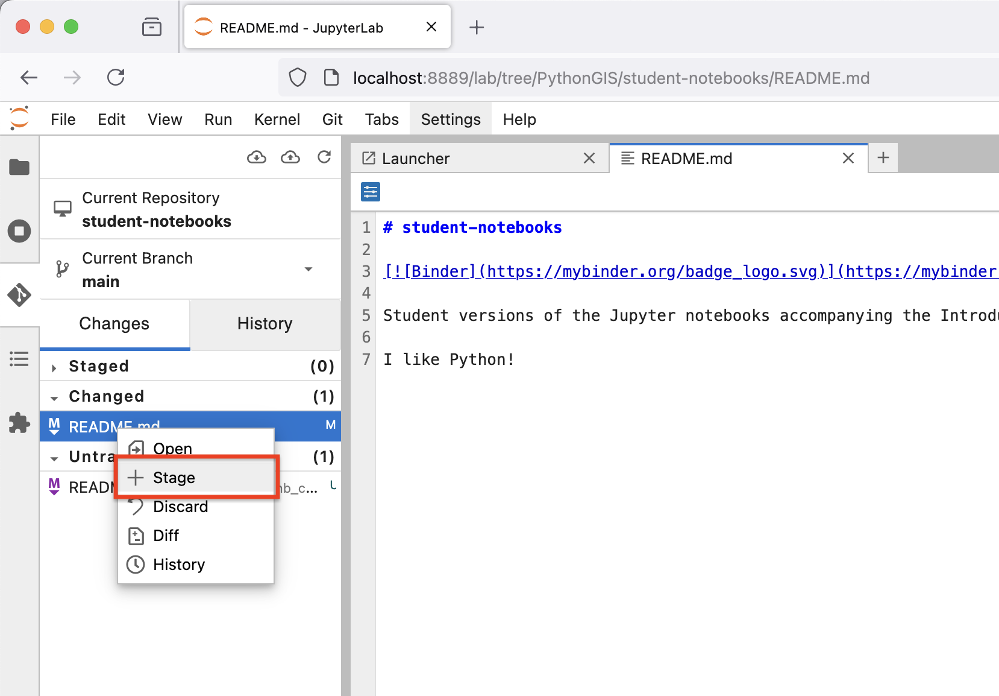
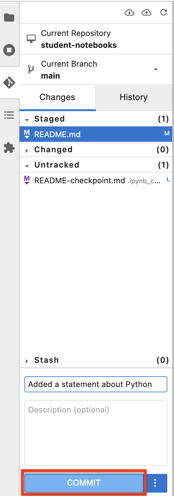
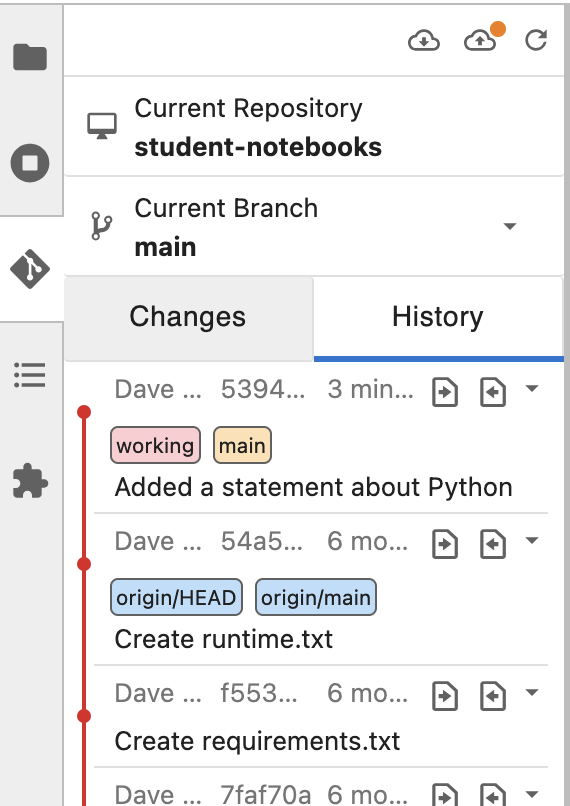

---
jupyter:
  jupytext:
    text_representation:
      extension: .md
      format_name: markdown
      format_version: '1.3'
      jupytext_version: 1.16.7
  kernelspec:
    display_name: Python 3 (ipykernel)
    language: python
    name: python3
---

<!-- #region editable=true slideshow={"slide_type": ""} -->
# A.3 Version control with using git and GitHub
<!-- #endregion -->

<!-- #region editable=true slideshow={"slide_type": ""} -->
Short intro text.

This appendix provides step-by-step instructions about how to record changes to our files using Git and GitHub.
<!-- #endregion -->

## The problem


_**Figure A.X**. An example of the challenge of tracking versions of a manuscript. Source: <https://phdcomics.com/comics/archive.php?comicid=1531>._

We've all been in this situation before, and it seems ridiculous to have multiple nearly identical versions of the same document. Some word processors can help us deal with this situation to some extent, by storing past revisions or using Microsoft Word's "Track Changes" feature. However, this can be quite impractical if you would like to see modifications that are older than your previous round of changes. And just like changes to a text document, the same issue can arise when making changes to software. And even worse, sometimes your changes break the program entirely. Luckily there are tools to help avoid this problem.

<!-- #region editable=true slideshow={"slide_type": ""} -->
## What is version control?

*{term}`Version control`* [^versioncontrol] is used to track and store changes in your files without losing the history of your previous changes. Version control systems start with a base version of a document and then save only the changes you make at each step of the way. You can think of it as a tape: if you rewind the tape and start at the base document, then you can play back each change and end up with your latest version.


_**Figure A.X**. Illustration of committing changes. Source: <https://swcarpentry.github.io/git-novice/01-basics.html>._

A version control system is a tool that keeps track of these changes for us and helps us version our files ([and even merge different versions, a more advanced topic](https://en.wikipedia.org/wiki/Merge_(version_control))). It allows you to decide which changes should be included the next version, called a commit, and keeps useful metadata about those changes. The complete history of commits for a particular project and their metadata make up a repository (such as our [book material repository](https://github.com/Python-GIS-book/site)). Repositories can be kept in sync between different computers and users facilitating collaboration among different people.

One of the most obvious reasons to use version control is to avoid the situation illustrated in Figure A.X entirely by tracking the full history of your changes in a systematic way without the need to have multiple versions of the same file. This history of changes then provides the ability to "go back in time." Thus, if something goes wrong with your program, you can start from some earlier version of the file when everything was still working. You can also easily compare the differences between versions and see exactly what has changed. In addition to these benefits, version control makes it possible for multiple people to work on the same file or project at the same time while still keeping track of their own changes to the files.

There are multiple different Version Control Systems (VCS; software for doing version control) and one of the most popular ones is [Git](https://en.wikipedia.org/wiki/Git_(software)).
<!-- #endregion -->

<!-- #region editable=true slideshow={"slide_type": ""} -->
## What is Git?

._](../img/Git-Logo-2Color.png)

_**Figure A.X**. The Git logo by Jason Long, licensed under the [Creative Commons Attribution 3.0 Unported License](https://creativecommons.org/licenses/by/3.0/)._

[Git](https://en.wikipedia.org/wiki/Git_(software)) is a version control software (developed in 2005 by a rather famous Finn named Linus Torvalds, who also created Linux!) that is used to track and store changes in your files (often source code for programs) without losing the history of past changes. Files in Git are stored in a repository, which you can simply think of as a directory containing files (or other directories) related to a single "project". In practice git takes "snapshots" of your files each time you commit changes and follows the idea of [distributed version control](https://git-scm.com/book/en/v2/Getting-Started-About-Version-Control). Git is widely used by professionals to keep track of what they've done and to collaborate with other people. Git is the version control system that is running behind the scenes and used with GitHub ("Git" + "Hub"!).
<!-- #endregion -->

<!-- #region editable=true slideshow={"slide_type": ""} -->
## What is GitHub?


_**Figure A.X**. The GitHub Logo._

GitHub provides a handful of important features that build upon what is offered by Git alone:

1. GitHub relies on Git. The GitHub is a web based Git repository hosting service in principle. Thus, it would not exist without the version control system Git. Git is running all the time in the background when using GitHub.
2. GitHub is a social (collaborative) network. GitHub is much more than just a hosting service for Git repositories as it is also a social network where people can collaborate and communicate with each other. It is easy to invite other GitHub users to work together on the same project and to discuss project developments. It should thus come as no surprise that GitHub is a highly popular place for sharing codes both openly to the entire world and to smaller groups of collaborators working on the same project.
3. GitHub supports open source software and open science. Sharing your work publicly to others is one of the basic principles of open science. All publicly available GitHub repositories can be downloaded to your own local computer where you can start modifying the codes for your own purpose. This process is called "forking". Be aware, however, that you should always check and follow the license terms mentioned in the project, which tell you what you can (or can not) do with the codes that are shared. It is possible that there might be some limitations for commercial use of the codes, for example.
4. GitHub provides a home for software documentation. GitHub repositories are often also used as web pages for software projects. In GitHub, such web pages typically include technical documentation, instructions, and examples of how to use the codes or software within that project. It is extremely important that you document the codes and programs that you have created, and GitHub provides a nice platform for doing this and sharing the documentation. Almost every GitHub repository (and possibly its subfolders) includes a file called `README.md`, which is the front-page of the given repository in GitHub by default. These files are written using a specific simple language called [Markdown](https://daringfireball.net/projects/markdown/), which can be used to create nice looking web documents with rich formatting, figures, tables, and so on. Markdown is very easy (and fast) to use once you have learned the basic syntax of how different textual elements are written.
5. GitHub includes useful online tools. There are multiple useful tools integrated into GitHub, such as the possibility to edit the documents or codes directly on the web site. What is even better is that Git is always running in background, so all changes made in the web browser will be saved as git commits. It is also possible to browse the complete history of a file directly from GitHub's online interface and view all of the changes that have been made.
6. GitHub has issue tracking. In GitHub it is also possible to give feedback to the developer by creating an "issue" that can be used to report a bug that was found in the code or software, for example. Issues can also be used to track ideas, enhancements, or other plans to projects on GitHub. You can even use issues to organize tasks you'd like to accomplish, such as adding new features or revising old ones.

Usually the Git software is run from a command prompt, however GitHub also provides a way to use Git commands without the need to run any commands in a terminal. It is also possible to use Git and GitHub in some {term}`Integrated Development Environments (IDEs) <Integrated Development Environment>`.
<!-- #endregion -->

<!-- #region editable=true slideshow={"slide_type": ""} -->
## Basic vocabulary

Here are a few basic terms that are used often when using git and GitHub (not exhaustive).

- *{term}`Repository`*: A location where all the files for a particular project are stored, often referred to as a "repo." Each project will have its own repo, which is usually located on a server and can be accessed by a unique URL (e.g., a link to GitHub page).
- *{term}`Commit <Git commit>`*: To commit is to write or merge the changes made in the working copy back to the repository. When you commit, you are basically taking a "snapshot" of your repository at that point in time, giving you a checkpoint to which you can reevaluate or restore your project to any previous state. The terms 'commit' or 'checkin' can also be used as nouns to describe the new revision that is created as a result of committing.
- *{term}`Revision`* / *{term}`Version`*: A revision or a version is any change in made in any form to a document(s).
- *{term}`Clone <Git clone>`*: Cloning means creating a repository containing the revisions from another repository. This is equivalent to pushing or pulling into an empty (newly initialized) repository. As a noun, two repositories can be said to be clones if they are kept synchronized, and contain the same revisions.
- *{term}`Pull <Git pull>` / *{term}`Push <Git push>`*: Copy revisions from one repository to another. Pull is initiated by the receiving repository, while push is initiated by the source. Fetch is sometimes used as a synonym for pull, or to mean a pull followed by an update.
- *{term}`Merge <Git merge>`*: A merge or integration is an operation in which two sets of changes are applied to a file or set of files.
<!-- #endregion -->

<!-- #region editable=true slideshow={"slide_type": ""} -->
## Using Git and GitHub

The following sections cover the very basics of version control using Git and GitHub. Specifically, we will introduce how to use JupyterLab to:

1. Clone a repository from GitHub
2. Add changes
3. Commit changes
4. Push changes to GitHub

We will show how to complete these steps using both the JupyterLab git plugin (recommended) and using Git from the command line.
<!-- #endregion -->

<!-- #region editable=true slideshow={"slide_type": ""} -->
### Key concepts

We use Git to (1) record changes to our files over time and (2) to communicate between the local repository on our computer and the remote repository (repo) on GitHub. Each Git repo contains all the files and folders associated with a project, as well as the revision history of each entity. In general, it is recommended that each project, library, or discrete piece of software have it's own repository. For example, Python libraries such as [`pandas`](https://github.com/pandas-dev/pandas), [`numpy`](https://github.com/numpy/numpy), and [`matplotlib`](https://github.com/matplotlib/matplotlib) all have their own repositories.

The most common starting point for working with software in Git is creating a copy of the software, or "cloning" it. This can be done using the command `git clone`, for example. For repositories you have already copied, you can download the latest changes using the command using `git pull`, which will fetch (and merge) new changes from GitHub. Finally, the command `git push` publishes any local changes to GitHub. You can find more information about interacting with Git projects on the [Git Source Control Management site](https://git-scm.com/book/en/v2/Appendix-C:-Git-Commands-Sharing-and-Updating-Projects).


_**Figure A.X**. Update your Git project using the pull and push commands. Always pull before you push (especially when working in a shared project)!_

The version control history consists of snapshots of all the files in your project. In order to record changes to your files, we first add changes to a so called staging area (using the command `git add`). The idea is that you can have a (sometimes messy) working directory, and by using `git add` you tell Git precisely which files to include in the next committed snapshot. After this, the command `git commit` can be used to record a permanent snapshot of the staged changes. You can find more information about snapshotting on the [Git Source Control Management site](https://git-scm.com/book/en/v2/Appendix-C:-Git-Commands-Basic-Snapshotting).


_**Figure A.X**. Version control steps using Git (adapted from <https://git-scm.com/about/staging-area>)._
<!-- #endregion -->

<!-- #region editable=true slideshow={"slide_type": ""} -->
## Preparations

With a general sense of how Git and GitHub work, we can now go through the basics of using Git with a hands-on example. For this we will use the "student" version of the notebooks for this book, which can be found on GitHub at <https://github.com/Python-GIS-book/student-notebooks>. In order to do this, we assume:

1. You have installed the Python environment for this course using {doc}`the instructions from Chapter 1.7 </part1/chapter-01/nb/06-installation>`.
2. You have an account on [GitHub.com](https://github.com) If not, now is a good time to create one.

Before we continue, open a new JupyterLab session if you do not already have one open.
<!-- #endregion -->

### Creating a Personal Access Token

We will start by creating a Personal Access Token for our GitHub account that will allow you to save changes you make to files in GitHub. A Personal Access Token can be used for many things, but it is required when trying to push changes or access files in private repositories to which you have access rights, for example. For our use, the token will enable us to both push and pull files to/from GitHub.

You can find detailed instructions about how to create a Personal Access Token in the [GitHub documentation](https://docs.github.com/en/github/authenticating-to-github/keeping-your-account-and-data-secure/creating-a-personal-access-token) [^token]. However, we note a few things below that may be helpful in the process.

- You will need to verify your email address for your GitHub account to create a Personal Access Token. See [GitHub email verification](https://docs.github.com/en/get-started/signing-up-for-github/verifying-your-email-address) [^email] for details.
- We are creating a "classic" token using **Generate new token (classic)**.
- You can name your token whatever you like, but a name like "PythonGIS" might make sense.
- The expiration date will be short by default. We recommend an expiration date of one year.
- Typical scopes (or permissions) for tokens include: **repo**, **admin:repo_hook**, and **delete_repo**.
- **Important**: Your token will only be visible to you once, so we recommend saving a copy in a secure location, such as with a password manager. Remember, anyone with the token can access, edit, or even delete repositories within the scope of that token!


### Creating a fork of the book notebooks

In order to make a copy of the book notebooks that you can access and edit, we will create a *{term}`fork`* of the student version of the book materials. You can create your fork by visiting <https://github.com/Python-GIS-book/student-notebooks> and clicking on the **Fork** button on the top left side of the page (Figure A.X).



_**Figure A.X**. Creating a for in GitHub._

After clicking on the **Fork** button, you can leave everything as it is on the Create a new fork page and simply click **Create fork**. This will create your personal copy, which can be found in GitHub at `https://github.com/<your GitHub username>/student-notebooks`. For example, `https://github.com/davewhipp/student-notebooks`.

Now that your personal fork has been created, you can go to the URL of your fork (e.g., `https://github.com/davewhipp/student-notebooks`), click on the **Code** button, and copy the URL listed there under HTTPS. Be sure you go to your personal copy of the book materials at `https://github.com/<your GitHub username>/student-notebooks`!


## Using Git with the JupyterLab Git plugin

Our next task is to create a copy of your fork on your own computer by cloning the files from GitHub. To do this, we will use the Git plugin for JupyterLab, as that will make it easy to both pull and push changes to any files as you work with them.

### Cloning a repository

You can start by navigating to a directory in the JupyterLab file browser, where you would like to store your copy of the book materials. Once there, create a directory for the book materials, such as `PythonGIS`. Double click on the new directory to enter it in the JupyterLab file browser. Next, click on the Git plugin button to activate it, and then click on **Clone a repository** (Figure A.X).



_**Figure A.X**. Using the JupyterLab Git plugin._

Once the Clone a repo dialog box appears, paste in the URL to your fork of the book materials and click **Clone**. You can leave the checkboxes ticked as they are. This is equivalent to the `git clone` command in a terminal.

If cloning was successful you should now see a directory titled `student-notebooks` in the JupyterLab file browser.

### Checking the Git status

You can now double click on the `student-notebooks` directory to enter it, and then activate the Git plugin once again to view some basic information. This includes which repository you're working in, the branch you are in within the repository, and whether any files have changed or are ready to be committed in Git, for example (Figure A.X). This is the equivalent of running the `git status` command in a terminal.



_**Figure A.X**. Checking the repository status in the JupyterLab Git plugin._

### Making changes

Now we can make our first change to one of the repository files. Return to the JupyterLab file browser and double click to open the `README.md` file. In the tab that opens in JupyterLab, make a small change to the file, such as adding the text "I like Python!" at the end of the document. Once you finish editing, save your changes.



_**Figure A.X**. Making a change to a file._

After saving, return to the Git plugin to check the status of the repository. You should see `README.md` listed under **Changed** files. Note that you can ignore temporary checkpoint files, such as `README-checkpoint.md`, which are automatically generated backup copies of files in JupyterLab.



_**Figure A.X**. Changed file status in the JupyterLab plugin._

### Staging changed file(s)

These changes are not yet staged for commit, which means that we need to add them first to the list of files we intend to save in a permanent snapshot in Git (i.e., the staging area). To add a file to the staging area, right click on the file in the JupyterLab Git plugin and then click **+ Stage**. You should now see the file under **Staged** files. This is the equivalent of running the `git add` command in a terminal.



_**Figure A.X**. Staging a file in the JupyterLab plugin._

If you accidentally stage a file or wish to remove it for any reason, simply right click on a staged file and select **- Unstage** to return it to the **Changed** list.

### Committing changes

Now that the changed file is in the staging area, we can create we can create a permanent snapshot by committing the changes. It is important to always remember to write a short, informative commit message to accompany your changes so you document how the file(s) have changed! Type a message into the commit message text box and then click **COMMIT** to save a permanent snapshot of your changes. This is the equivalent of running `git commit -m "commit message"` in a terminal.



_**Figure A.X**. Committing a change in the JupyterLab plugin._

Once you click **COMMIT**, the plugin will most likely ask you to enter your name and email address. This is because every commit in Git needs to record not only what has changed, but also who made the change (including their email address!). You can use the same information you used when creating your GitHub account.

Once the commit succeeds, you should see the latest set of changes in the History tab of the JupyterLab Git plugin. The output here is the equivalent of running `git log` in a terminal.



_**Figure A.X**. Repository history in the JupyterLab plugin._

Note that you will also see earlier changes that have been made to the files in your repository. Remember, Git will record all changes since the Git repository was created!

### Pushing changes to GitHub

Our last step is to synchronize our local changes with the remote repository hosted on GitHub. To do this we will first pull changes from GitHub and then push our modified files to GitHub. It is always good to pull changes before pushing to ensure that any remote changes do not conflict with the changes you are trying to push. You may have already noticed that there is an orange dot that appears in the JuptyerLab git plugin indicating we have changes that have not yet been pushed (e.g., Figure A.X).

We can pull any changes from GitHub by clicking on the cloud icon with an arrow pointing downwards (Figure A.X). If everything is OK, you should see "Successfully pulled" in the bottom right corner of the JupyterLab window shortly after clicking. Now you can push the changes to GitHub by clicking the cloud icon with an arrow pointing upwards (Figure A.X). This is the equivalent of running the `git push` command in a terminal.

Most likely, you will now be prompted to enter your GitHub user credentials. When the Git credentials required dialog box appears, enter your GitHub username, your Personal Access Token, and then click **Ok**. You GitHub credentials can be managed in a terminal using the command `git config`.

If you now visit your repository in GitHub, you should find your changed have been pushed from JupyterLab!

<!-- #region -->
## Using Git from the command line

There are many different ways of using Git, and you might want to try
out using Git from the command line at some point.

# Terminal

:::: note
::: title
Note
:::

You will need to know a couple of basic command line commands in order
to use Git from the command line. Code Academy\'s [list of command line
commands](https://www.codecademy.com/articles/command-line-commands)
provides a good overview of commonly used commands for navigating trough
files on the command line. For using Git on the command line, you should
at least be familiar with these commands:

-   `ls` - list contents of the current directory
-   `ls -a` - list contents of the current directory including hidden
    files
-   `cd` - change directory. For example, `cd exercises`
-   `cd ..` - move one directory up
::::

**Start a new Terminal session in JupyterLab** using the icon on the
Launcher, or from *File* \> *New* \> *Terminal*.


**Check if you have git installed** by typing `git --version` in the
terminal window:

``` bash
git --version
```

Anything above version 2 is just fine.

:::: note
::: title
Note
:::

You can paste text on the terminal using `Ctrl + V` or
`Shift + Right Click --> paste`
::::

# Configuring Git credentials

Configure Git to remember your identity using the `git config` tools.
You (hopefully) only need to do this once if working on your own
computer, or on a cloud computer with persistent storage on CSC
notebooks.

``` bash
git config --global user.name "[firstname lastname]"
git config --global user.email "[email@example.com]"
```

# Basic commands

The basic workflow of cloning a repository, adding changes to the
staging area, committing and pushing the changes can be completed using
these command line commands:

-   `git clone [url]` - retrieve a repository from a remote location
    (often from GitHub)
-   `git status`- review the status of your repository (use this command
    often!)
-   `git add [file]` - add files to the next commit (add files to the
    staging area)
-   `git commit -m "[descriptive message]"` - commit staged files as a
    new snapshot
-   `git pull` - bring the local branch up to date (fetch and merge
    changes from the remote)
-   `git push` - transmit local branch commits to the remote repository

:::: note
::: title
Note
:::

Remember to use `git status` often to check the status of our
repository.
::::

::: admonition
Other useful Git commands

Check out other commonly used git commands from [the GIT CHEAT
SHEET](https://education.github.com/git-cheat-sheet-education.pdf)
:::

::: admonition
Remote repository

Remote repositories are versions of your project that are hosted on a
network location (such as GitHub). When we cloned the repository using
`git clone`, Git automatically started tracking the remote repository
from where we cloned the project. You can use the `git remote -v`
command to double check which remote your repository is tracking.

**A common mistake during this course is that you have accidentally
cloned the template repository in stead of your own/your teams
repository.**

[Read more about managing
remotes](https://git-scm.com/book/en/v2/Git-Basics-Working-with-Remotes).
:::

::: admonition
Main branch

**Branches and branching** are powerful features in Git that allow
maintaining parallel versions of the same project. During this course
you don\'t need to worry too much about branches. However, it is good to
understand that **we are working on the main branch of our repository**.
For example, when using the `git push` command, the full syntax is
`git push origin main` which means that we are pushing the changes to
the main branch of the remote repository called origin. [Read more about
git branches](https://git-scm.com/docs/git-branch).
:::

## Resolving conflicts

It is possible that you will encounter a **merge conflict** at some
point of this course. A merge conflict might happen if two users have
edited the same content, or if you yourself have edited the same content
both on GitHub and locally without properly synchronizing the changes.
In short, Git will tell you if it is not able to sort out the version
history of your project by announcing a merge conflict.

We won\'t cover how to solve merge conflicts in detail during the
lessons. You can read more about [how to resolve merge conflicts from
the Git
documentation](https://git-scm.com/docs/git-merge#_how_to_resolve_conflicts).
**The best thing to do to avoid merge conflicts is to always Pull before
you Push new changes.** In case you encounter a merge conflict, don\'t
panic! Read carefully the message related to the merge conflict, and try
searching for a solution online and ask for help on Slack.

Remember that you can always download your files on your own computer,
and upload them manually to GitHub like we did in Exercise 1!

<figure>

<figcaption>Source: <a
href="https://xkcd.com/1597/">https://xkcd.com/1597/</a></figcaption>
</figure>

<!-- #endregion -->

## Resources

-  `Screencast series in Youtube for learning GitHub <https://www.youtube.com/playlist?list=PL4Q4HssKcxYsTuqUUvEHJ8XxOVOHTSmle>`__
-  `Tutorial on few extra features of GitHub not (most probably) covered in this course (e.g. branch, pull-request, merge) <https://guides.github.com/activities/hello-world/>`__
-  `A TechCrunch article about 'What is GitHub Anyway?' <https://techcrunch.com/2012/07/14/what-exactly-is-github-anyway/>`__
-  `A list of resources for learning Git and GitHub <https://help.github.com/articles/good-resources-for-learning-git-and-github/>`__


## Footnotes

[^email]: <https://docs.github.com/en/get-started/signing-up-for-github/verifying-your-email-address>
[^token]: <https://docs.github.com/en/github/authenticating-to-github/keeping-your-account-and-data-secure/creating-a-personal-access-token>
[^versioncontrol]: <https://en.wikipedia.org/wiki/Version_control>
