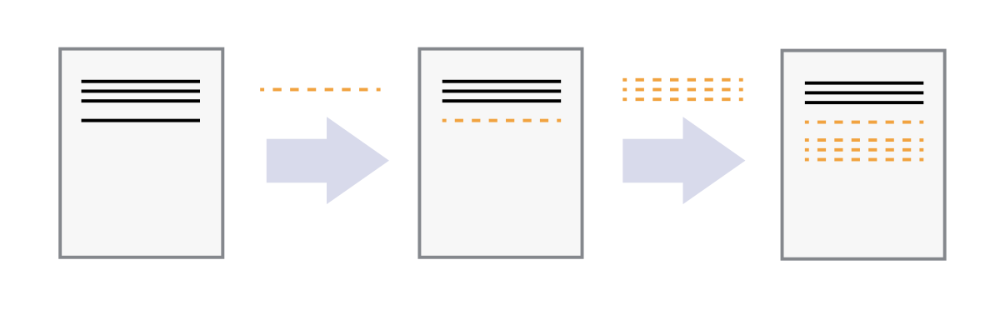
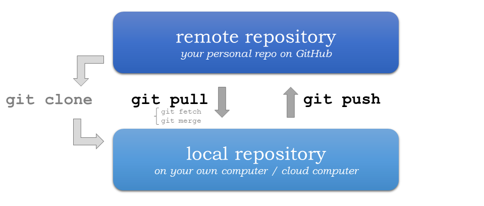
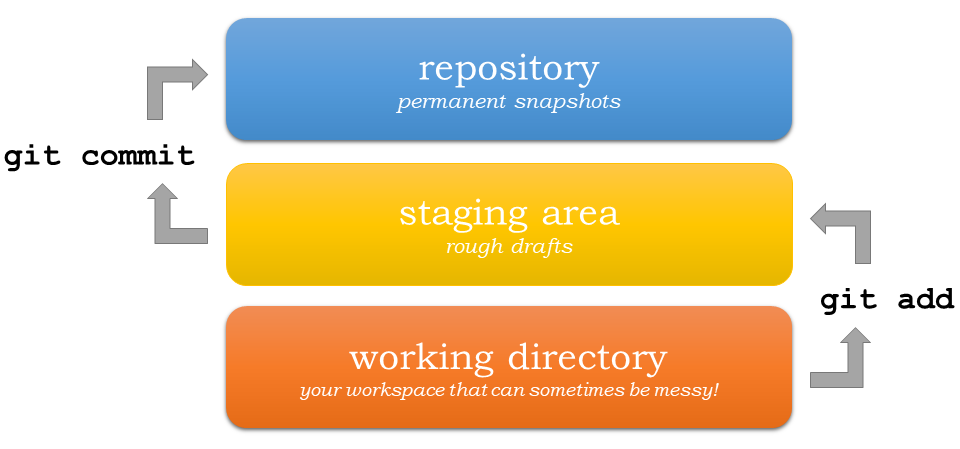

---
jupyter:
  jupytext:
    text_representation:
      extension: .md
      format_name: markdown
      format_version: '1.3'
      jupytext_version: 1.16.4
  kernelspec:
    display_name: Python 3 (ipykernel)
    language: python
    name: python3
---

# A.3 Version control with using git and GitHub


Short intro text.

This appendix provides step-by-step instructions about how to record changes to our files using Git and GitHub.


## The problem


_**Figure A.X**. An example of the challenge of tracking versions of a manuscript. Source: <https://phdcomics.com/comics/archive.php?comicid=1531>._

We've all been in this situation before, and it seems ridiculous to have multiple nearly identical versions of the same document. Some word processors can help us deal with this situation to some extent, by storing past revisions or using Microsoft Word's "Track Changes" feature. However, this can be quite impractical if you would like to see modifications that are older than your previous round of changes. And just like changes to a text document, the same issue can arise when making changes to software. And even worse, sometimes your changes break the program entirely. Luckily there are tools to help avoid this problem.


## What is version control?

[Version control](https://en.wikipedia.org/wiki/Version_control) [^versioncontrol] is used to track and store changes in your files without losing the history of your previous changes. Version control systems start with a base version of a document and then save only the changes you make at each step of the way. You can think of it as a tape: if you rewind the tape and start at the base document, then you can play back each change and end up with your latest version.



_**Figure A.X**. Illustration of committing changes. Source: <https://swcarpentry.github.io/git-novice/01-basics.html>._

A version control system is a tool that keeps track of these changes for us and helps us version our files ([and even merge different versions, a more advanced topic](https://en.wikipedia.org/wiki/Merge_(version_control))). It allows you to decide which changes should be included the next version, called a commit, and keeps useful metadata about those changes. The complete history of commits for a particular project and their metadata make up a repository (such as our [book material repository](https://github.com/Python-GIS-book/site)). Repositories can be kept in sync between different computers and users facilitating collaboration among different people.

One of the most obvious reasons to use version control is to avoid the situation illustrated in Figure A.X entirely by tracking the full history of your changes in a systematic way without the need to have multiple versions of the same file. This history of changes then provides the ability to "go back in time." Thus, if something goes wrong with your program, you can start from some earlier version of the file when everything was still working. You can also easily compare the differences between versions and see exactly what has changed. In addition to these benefits, version control makes it possible for multiple people to work on the same file or project at the same time while still keeping track of their own changes to the files.

There are multiple different Version Control Systems (VCS; software for doing version control) and one of the most popular ones is [Git](https://en.wikipedia.org/wiki/Git_(software)).


## What is Git?

._](../img/Git-Logo-2Color.png)

_**Figure A.X**. The Git logo by Jason Long, licensed under the [Creative Commons Attribution 3.0 Unported License](https://creativecommons.org/licenses/by/3.0/)._

[Git](https://en.wikipedia.org/wiki/Git_(software)) is a version control software (developed in 2005 by a rather famous Finn named Linus Torvalds, who also created Linux!) that is used to track and store changes in your files (often source code for programs) without losing the history of past changes. Files in Git are stored in a repository, which you can simply think of as a directory containing files (or other directories) related to a single "project". In practice git takes "snapshots" of your files each time you commit changes and follows the idea of [distributed version control](https://git-scm.com/book/en/v2/Getting-Started-About-Version-Control). Git is widely used by professionals to keep track of what they've done and to collaborate with other people. Git is the version control system that is running behind the scenes and used with GitHub ("Git" + "Hub"!).


## What is GitHub?


_**Figure A.X**. The GitHub Logo._

GitHub provides a handful of important features that build upon what is offered by Git alone:

1. GitHub relies on Git. The GitHub is a web based Git repository hosting service in principle. Thus, it would not exist without the version control system Git. Git is running all the time in the background when using GitHub.
2. GitHub is a social (collaborative) network. GitHub is much more than just a hosting service for Git repositories as it is also a social network where people can collaborate and communicate with each other. It is easy to invite other GitHub users to work together on the same project and to discuss project developments. It should thus come as no surprise that GitHub is a highly popular place for sharing codes both openly to the entire world and to smaller groups of collaborators working on the same project.
3. GitHub supports open source software and open science. Sharing your work publicly to others is one of the basic principles of open science. All publicly available GitHub repositories can be downloaded to your own local computer where you can start modifying the codes for your own purpose. This process is called "forking". Be aware, however, that you should always check and follow the license terms mentioned in the project, which tell you what you can (or can not) do with the codes that are shared. It is possible that there might be some limitations for commercial use of the codes, for example.
4. GitHub provides a home for software documentation. GitHub repositories are often also used as web pages for software projects. In GitHub, such web pages typically include technical documentation, instructions, and examples of how to use the codes or software within that project. It is extremely important that you document the codes and programs that you have created, and GitHub provides a nice platform for doing this and sharing the documentation. Almost every GitHub repository (and possibly its subfolders) includes a file called `README.md`, which is the front-page of the given repository in GitHub by default. These files are written using a specific simple language called [Markdown](https://daringfireball.net/projects/markdown/), which can be used to create nice looking web documents with rich formatting, figures, tables, and so on. Markdown is very easy (and fast) to use once you have learned the basic syntax of how different textual elements are written.
5. GitHub includes useful online tools. There are multiple useful tools integrated into GitHub, such as the possibility to edit the documents or codes directly on the web site. What is even better is that Git is always running in background, so all changes made in the web browser will be saved as git commits. It is also possible to browse the complete history of a file directly from GitHub's online interface and view all of the changes that have been made.
6. GitHub has issue tracking. In GitHub it is also possible to give feedback to the developer by creating an "issue" that can be used to report a bug that was found in the code or software, for example. Issues can also be used to track ideas, enhancements, or other plans to projects on GitHub. You can even use issues to organize tasks you'd like to accomplish, such as adding new features or revising old ones.


## NEEDS A HOME

Usually Git (the software) is run from the command prompt but GitHub provides a way to use Git commands without the need to run any commands in the terminal.
There are, however, also other graphical user interfaces for Git that come with some `Integrated Development Environments (IDE) <https://en.wikipedia.org/wiki/Integrated_development_environment>`__.


## Basic vocabulary

Here are a few basic terms that are used often when using git and GitHub (not exhaustive).

- Repository: A location where all the files for a particular project are stored, ofter referred to as a "repo." Each project will have its own repo, which is usually located on a server and can be accessed by a unique URL (e.g., a link to GitHub page).
- Commit: To commit is to write or merge the changes made in the working copy back to the repository. When you commit, you are basically taking a "snapshot" of your repository at that point in time, giving you a checkpoint to which you can reevaluate or restore your project to any previous state. The terms 'commit' or 'checkin' can also be used as nouns to describe the new revision that is created as a result of committing.
- Revision / version: A revision or a version is any change in made in any form to a document(s).
- Clone: Cloning means creating a repository containing the revisions from another repository. This is equivalent to pushing or pulling into an empty (newly initialized) repository. As a noun, two repositories can be said to be clones if they are kept synchronized, and contain the same revisions.
- Pull / push: Copy revisions from one repository to another. Pull is initiated by the receiving repository, while push is initiated by the source. Fetch is sometimes used as a synonym for pull, or to mean a pull followed by an update.
- Merge: A merge or integration is an operation in which two sets of changes are applied to a file or set of files.


## Using Git and GitHub

Here we cover the very basics of version control using Git and GitHub. Specifically, we will introduce how to use JupyterLab to:

1. Clone a repository from GitHub
2. Add changes
3. Commit changes
4. Push changes to GitHub

We will show how to complete these steps using both the JupyterLab git plugin (recommended) and using Git from the command line.


## Key concepts

We use Git to record changes to our files over time, and for communicating between the local repository on our computer and the
remote repository (repo) on GitHub. The repo contains all the files and folders associated with a project and the revision history of each entity. In general, it is recommended that each project, library or discrete piece of software have it's own repository. For
example, Python libraries such as [`pandas`](https://github.com/pandas-dev/pandas), [`numpy`](https://github.com/numpy/numpy), and [`matplotlib`](https://github.com/matplotlib/matplotlib) all have their own repositories.

The most common starting point for working with software in Git is creating a copy of the software, or "cloning" it. This can be done using the command `git clone`, for example. For repositories you have already copied, you can download the latest changes using the command Using `git pull`, which will fetch (and merge) new changes from GitHub. Finally, the command `git push` publishes
any local changes to GitHub. You can find more information about interacting with Git projects on the [Git Source Control Management site](https://git-scm.com/book/en/v2/Appendix-C:-Git-Commands-Sharing-and-Updating-Projects).



_**Figure A.X**. Update your Git project using the pull and push commands. Always pull before you push (especially when working in a shared project)!_

The version control history consists of snapshots of all the files in your project. In order record changes to your files, we first add changes to a so called staging area (using the command `git add`). The idea is that you can have a (sometimes messy) working directory, and by using `git add` you tell Git exactly which files to include in the next committed snapshot. After this, the command `git commit` can be used to record a permanent snapshot of the staged changes. You can find more information about snapshotting on the [Git Source Control Management site](https://git-scm.com/book/en/v2/Appendix-C:-Git-Commands-Basic-Snapshotting).



_**Figure A.X**. Version control steps using Git (adapted from <https://git-scm.com/about/staging-area>)._

<!-- #region -->
## Preparations

With a general sense of how Git and GitHub work, we can now go through the basics of using Git with a hands-on example. For this we will use the student version of the notebooks for this book, which can be found on GitHub at <https://github.com/Python-GIS-book/student-notebooks>. In order to do this, we assume:

1. You have installed the Python environment for this course using {doc}`the instructions from Chapter 1.7 </part1/chapter-01/nb/06-installation>`. Note: Finnish university students can use the [CSC Noppe platform](https://noppe.csc.fi) without installing Python on their own computers.
2. You have an account on [GitHub.com](https://github.com) If not, now is a good time to create one.

Before we start, open a new JupyterLab session if you do not already have one open.

# Create a Personal Access Token

Before we start cloning our repository from GitHub, we need to create a
Personal Access Token for us to be able to interact with GitHub. We will
go through the basic setup here, but you can find more detailed
instructions in the [GitHub
documentation](https://docs.github.com/en/github/authenticating-to-github/keeping-your-account-and-data-secure/creating-a-personal-access-token).

1.  If you have not already verified your email address, make sure to do
    so in your GitHub settings ([GitHub email
    verification](https://docs.github.com/en/get-started/signing-up-for-github/verifying-your-email-address)).
    On GitHub, go into your settings.

    {width="200px"}

2.  Click on **Developer settings** in the left sidebar.

3.  Click on **Personal access tokens**.

4.  Click on **Tokens (classic)**.

5.  We will create the token by clicking on **Generate new token** and
    then **Generate new token (classic)**.

    -   If you are using two-factor authentication, you may be prompted
        to enter an authentication code or use your passkey at this
        point.

6.  We can start by giving our token a name in under **Note**.

    {width="500px"}

7.  We can then give the token an expiration date. You can choose the
    duration you prefer, but it would be best to set it to at least the
    end of the year.

    {width="300px"}

8.  Now we need to set the permissions, or scopes, that our token is
    granted. We are going to need it to be able to access and change our
    exercise repositories. For that, we can select the check boxes for
    **repo**, **admin:repo_hook**, and **delete_repo**.

    {width="500px"}

9.  At this point we can click the **Generate token** button to create
    and see our token.

10. We are then presented with our Personal access token, click the copy
    button to copy it to your clipboard and then paste it into a text
    file in the JupyterLab session.

    -   Open a text document and copy and paste your Personal access
        token in a text file, because for now we are going to use it
        like this, and we will later see how we can cache it so that we
        don\'t need to copy and paste it every time we need it. If your
        access token is ever lost, you can just follow the steps above
        again to create a new one.

Now that we have created a personal access token, the next thing we need
is the URL of your exercise repository from GitHub. **Go to**
<https://github.com/geo-python-2024/> **and navigate to your personal
Exercise-1 repository.**

On GitHub, find the button **Code** and copy the url under *HTTPS*.

The URL looks something like this:
<https://github.com/Geo-Python-2024/exercise-1-davewhipp.git> but with
your own username or team name.


## JupyterLab git plugin

# Clone a repository from GitHub

During this course, we will most often start working with the exercises
using an existing repository from GitHub. In order to get a copy of the
exercise repository on our own computer (or the cloud computer), we need
to `clone` it.

Navigate to the **my-work** folder in JupyterLab, create a new folder
inside it called **exercises**, and double-click to enter that folder.
Next, activate the git-plugin. The plugin will tell you that
**exercises** is not a Git repository and gives you some options.

In our case, we want to **Clone a Repository**:


Go ahead and paste your exercise repository URL into the pop-up window:


On the command line this action is equivalent to the `git clone`
command.

:::: note
::: title
Note
:::

**Pay attention to which folder you are in!** Git will create a new
folder under the folder you are located in when cloning a repo.
::::

# Credentials

Git needs to know who you are in order to give you access to remote
repositories.

**Insert your GitHub username and personal access token**:


Now you should see a new folder in JupyterLab that is identical to the
repository on GitHub.

On the command line, credentials can be managed using `git config`.

# Git status

Navigate to the new folder in JupyterLab and activate the Git plugin.
You should now see some basic info about your repository:


On the command line `git status` shows the status of the repository.

# Add changes

Let\'s start making changes in the repository! Open the `README.md` file
and make some edits. For example, add some text at the end of the file:

<figure>

<figcaption>Edit a file in JupyterLab</figcaption>
</figure>

After saving your changes, check the status of the repository. You
should see `README.md` listed under **Changed** files:

<figure>

<figcaption>Changes visible in the Git plugin</figcaption>
</figure>

These changes are not yet \"staged for commit\", which means that we
need to add them first to the staging area if we want to make a
permanent snapshot of these changes.

{width="350px"}

After adding the changes, you should see the changed file under
**Staged** in the Git plugin.

Note that you can also **unstage** and **discard changes** using the
plugin. For now, we are happy with the changes made, and are ready to
commit them.

On the command line, `git add` is the command for adding changes to the
staging area.

# Commit changes

Once the changed files are in the staging area, we can create a
permanent snapshot by committing the changes. Always remember to write
an informative commit message to accompany your changes:

{width="300px"}

Once you hit the commit button, the plugin will most likely ask your
name and email.


You can insert the same details you used when signing up to GitHub.


Once the commit succeeds, you should see the latest set of changes under
the History tab in the Git plugin:


*Note: You might also see some previous changes by the course
instructors. These changes have been generated automatically and you can
ignore them.*

On the command line the syntax for committing is
`git commit -m "commit message"`. After committing, it is good practice
to check the repository status using `git status`.

:::: note
::: title
Note
:::

We can **tell Git to remember our GitHub username and access token** to
avoid typing them in all the time. Open up a Terminal window and type in
this command:

`git config --global credential.helper 'store --file /home/jovyan/my-work/.git-credentials'`

Then change the folder you are in by typing (with your username):

`cd exercises/exercise-1-davewhipp/`

We then pull from our GitHub repository:

`git pull`

Type your username, press enter, and go to the text file with your
access token, copy it, and paste into your terminal with **Ctrl** +
**v** and press **Enter**. Then your username and access token should be
stored and you can pull and push to and from GitHub without having to
type your access token every time.
::::

# Push changes to GitHub

Next, we want to synchronize our local changes with the remote
repository on GitHub.

<figure>

<figcaption>Buttons for Pulling and Pushing changes between the local
and remote repositories</figcaption>
</figure>

First, it\'s good to use `git pull` (button with arrow down) to double
check for remote changes before contributing your own changes.


In this case, the repository is probably up-to-date and no new changes
are downloaded. However, it is good practice to always use git pull
before publishing your local changes in case someone made changes in the
remote repository in the meanwhile!

Now we are ready to push the local changes to GitHub using `git push`
(button with arrow up):


Now you should see the updates in GitHub! Go and have a look at your
personal repository in <https://github.com/Geo-Python-2024/> .

On the command line, `git pull` fetches and merges changes from the
remote repository, and `git pull` publishes local changes.

That\'s all you need to know about Git for now :)

## Git from the command line

There are many different ways of using Git, and you might want to try
out using Git from the command line at some point.

# Terminal

:::: note
::: title
Note
:::

You will need to know a couple of basic command line commands in order
to use Git from the command line. Code Academy\'s [list of command line
commands](https://www.codecademy.com/articles/command-line-commands)
provides a good overview of commonly used commands for navigating trough
files on the command line. For using Git on the command line, you should
at least be familiar with these commands:

-   `ls` - list contents of the current directory
-   `ls -a` - list contents of the current directory including hidden
    files
-   `cd` - change directory. For example, `cd exercises`
-   `cd ..` - move one directory up
::::

**Start a new Terminal session in JupyterLab** using the icon on the
Launcher, or from *File* \> *New* \> *Terminal*.


**Check if you have git installed** by typing `git --version` in the
terminal window:

``` bash
git --version
```

Anything above version 2 is just fine.

:::: note
::: title
Note
:::

You can paste text on the terminal using `Ctrl + V` or
`Shift + Right Click --> paste`
::::

# Configuring Git credentials

Configure Git to remember your identity using the `git config` tools.
You (hopefully) only need to do this once if working on your own
computer, or on a cloud computer with persistent storage on CSC
notebooks.

``` bash
git config --global user.name "[firstname lastname]"
git config --global user.email "[email@example.com]"
```

# Basic commands

The basic workflow of cloning a repository, adding changes to the
staging area, committing and pushing the changes can be completed using
these command line commands:

-   `git clone [url]` - retrieve a repository from a remote location
    (often from GitHub)
-   `git status`- review the status of your repository (use this command
    often!)
-   `git add [file]` - add files to the next commit (add files to the
    staging area)
-   `git commit -m "[descriptive message]"` - commit staged files as a
    new snapshot
-   `git pull` - bring the local branch up to date (fetch and merge
    changes from the remote)
-   `git push` - transmit local branch commits to the remote repository

:::: note
::: title
Note
:::

Remember to use `git status` often to check the status of our
repository.
::::

::: admonition
Other useful Git commands

Check out other commonly used git commands from [the GIT CHEAT
SHEET](https://education.github.com/git-cheat-sheet-education.pdf)
:::

::: admonition
Remote repository

Remote repositories are versions of your project that are hosted on a
network location (such as GitHub). When we cloned the repository using
`git clone`, Git automatically started tracking the remote repository
from where we cloned the project. You can use the `git remote -v`
command to double check which remote your repository is tracking.

**A common mistake during this course is that you have accidentally
cloned the template repository in stead of your own/your teams
repository.**

[Read more about managing
remotes](https://git-scm.com/book/en/v2/Git-Basics-Working-with-Remotes).
:::

::: admonition
Main branch

**Branches and branching** are powerful features in Git that allow
maintaining parallel versions of the same project. During this course
you don\'t need to worry too much about branches. However, it is good to
understand that **we are working on the main branch of our repository**.
For example, when using the `git push` command, the full syntax is
`git push origin main` which means that we are pushing the changes to
the main branch of the remote repository called origin. [Read more about
git branches](https://git-scm.com/docs/git-branch).
:::

## Resolving conflicts

It is possible that you will encounter a **merge conflict** at some
point of this course. A merge conflict might happen if two users have
edited the same content, or if you yourself have edited the same content
both on GitHub and locally without properly synchronizing the changes.
In short, Git will tell you if it is not able to sort out the version
history of your project by announcing a merge conflict.

We won\'t cover how to solve merge conflicts in detail during the
lessons. You can read more about [how to resolve merge conflicts from
the Git
documentation](https://git-scm.com/docs/git-merge#_how_to_resolve_conflicts).
**The best thing to do to avoid merge conflicts is to always Pull before
you Push new changes.** In case you encounter a merge conflict, don\'t
panic! Read carefully the message related to the merge conflict, and try
searching for a solution online and ask for help on Slack.

Remember that you can always download your files on your own computer,
and upload them manually to GitHub like we did in Exercise 1!

<figure>

<figcaption>Source: <a
href="https://xkcd.com/1597/">https://xkcd.com/1597/</a></figcaption>
</figure>

<!-- #endregion -->

## Resources

-  `Screencast series in Youtube for learning GitHub <https://www.youtube.com/playlist?list=PL4Q4HssKcxYsTuqUUvEHJ8XxOVOHTSmle>`__
-  `Tutorial on few extra features of GitHub not (most probably) covered in this course (e.g. branch, pull-request, merge) <https://guides.github.com/activities/hello-world/>`__
-  `A TechCrunch article about 'What is GitHub Anyway?' <https://techcrunch.com/2012/07/14/what-exactly-is-github-anyway/>`__
-  `A list of resources for learning Git and GitHub <https://help.github.com/articles/good-resources-for-learning-git-and-github/>`__


## Footnotes

[^versioncontrol]: <https://en.wikipedia.org/wiki/Version_control>
