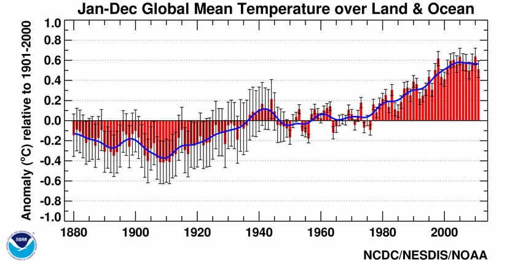

---
jupyter:
  jupytext:
    text_representation:
      extension: .md
      format_name: markdown
      format_version: '1.3'
      jupytext_version: 1.15.2
  kernelspec:
    display_name: Python 3 (ipykernel)
    language: python
    name: python3
---

<!-- #region editable=true slideshow={"slide_type": ""} -->
# Motivation

Over the past decades, the volumes of data that we can easily access via the internet, for example, have grown tremendously. With the ease of access to data, it has become increasingly appealing to perform analyses of massive datasets to extract important factors recorded in the data over varying temporal and spatial scales, such as global climate change. In spite of the potential all of this easily accessible data might provide, analyzing and interpreting that data in a way in which people can easily understand remains a significant challenge.

As you might imagine, programming skills can help with some parts of the challenge of data analysis. In particular, even basic programming skills can help take a massive text file of data and process it in such a way that a lengthly list of numbers, for example, becomes something we can look at and almost instantly understand. Let's consider some examples of just this type in the rest of this section.
<!-- #endregion -->

<!-- #region editable=true slideshow={"slide_type": ""} -->
## Effective data visualization

One of the things we will learn in this part of the book is how to use Python to plot data. As you well know, the raw data alone are often not particularly useful in helping you understand what the data show. Let's look at an example that might be familiar to you, global temperature data. The first ten lines of a climate data file can be found below.

```
  USAF  WBAN YR--MODAHRMN DIR SPD GUS CLG SKC L M H  VSB MW MW MW MW AW ...
029740 99999 195201010000 200  23 ***  15 OVC 7 2 *  5.0 63 ** ** ** ** ...
029740 99999 195201010600 220  18 ***   8 OVC 7 2 *  2.2 63 ** ** ** ** ...
029740 99999 195201011200 220  21 ***   5 OVC 7 * *  3.8 59 ** ** ** ** ...
029740 99999 195201011800 250  16 *** 722 CLR 0 0 0 12.5 02 ** ** ** ** ...
029740 99999 195201020000 220   7 *** 722 CLR 0 0 0 12.5 02 ** ** ** ** ...
029740 99999 195201020600 220  16 ***  15 OVC 5 * *  9.4 02 ** ** ** ** ...
029740 99999 195201021200 110  14 ***   8 OVC 5 * * 12.5 70 ** ** ** ** ...
029740 99999 195201021800 160  14 ***   8 OVC 7 * *  1.2 73 ** ** ** ** ...
029740 99999 195201030000 180  18 ***  15 OVC 5 * *  3.8 26 ** ** ** ** ...
029740 99999 195201030600 200  14 ***  15 BKN 5 * *  5.0 02 ** ** ** ** ...
...
```

Not that exciting, right? There is an interesting story here, but we need some way to illustrate the power of this data.
<!-- #endregion -->

<!-- #region editable=true slideshow={"slide_type": ""} -->


_**Figure 1.1**. Global mean temperature anomalies from 1880-2011. Source: <https://www.ncdc.noaa.gov/sotc/global/201113>._

One option is to use an *x*-*y* plot of temperature anomalies versus time (Figure 1.1). This example is obviously much better than the raw text data, nicely showing how temperatures have changed with time and how global temperatures have increased significantly since 1970. Now we have taken a clear step toward making the data easier to understand. However, these are global data and we are missing something important about them, their connection to geographical locations.
<!-- #endregion -->


_**Figure 1.2**. Global temperature anomalies for January 2020. Source: <https://www.ncdc.noaa.gov/sotc/global/201603>._

Let's consider another option, plotting temperature anomalies on a map (Figure 1.2). Yet again, this helps us understand the data further. Not only do we see the changes in temperature, but now we see how temperatures vary in space across the globe. The drawback here is that we only see a single time snapshot, rather than a time series. Seeing both will require a truly remarkable visualization.


_**Figure 1.3**. Global temperature anomalies by country from 1900-2017. Visualization by Antti Lipponen (<https://twitter.com/anttilip>). The animation can be viewed by clicking on the image or online at <https://flic.kr/p/293M1oa>._

So, let's look now at some excellent examples of data visualization with Python. We have essentially the same data that were plotted in Figures 1.1 and 1.2, but now we can see how temperatures vary in both space and time. An [animated "pill packet" plot]((https://flic.kr/p/293M1oa)) of temperature anomalies (Figure 1.3) conveys a huge amount of information in a simple form. People can immediately understand what is plotted, and the combination of the plot format, colors and animation are very effective. What even better is the fact that this animation was made using Python!


_**Figure 1.4**. Global temperature anomalies past and future, 1900-2100. Visualization by Antti Lipponen (<https://twitter.com/anttilip>). The animation can be viewed by clicking on the image or online at <https://flic.kr/p/QYnKre>._

Figure 1.4 provides another example with similar data in a different format, including a peek into the future. This [animated "temperature spoke" plot](https://flic.kr/p/QYnKre) (Figure 1.4) nicely conveys the warming of different regions on Earth, again in an intuitive format.

For the rest of the first part of this book, plots like those above will be our inspiration. In fact, we will be working with similar data throughout this part of the book and may even end up producing similar plots in by the end Part 1.
