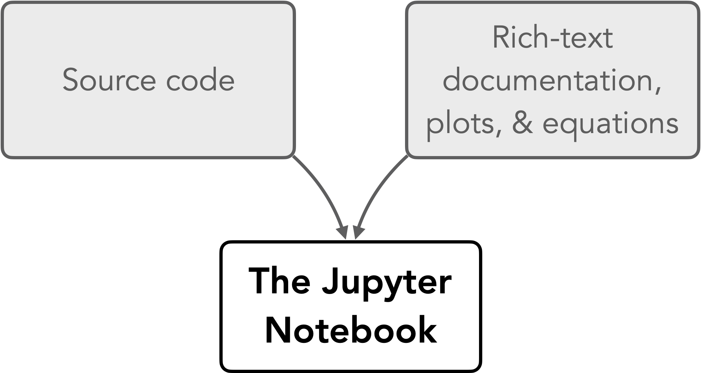

---
jupyter:
  jupytext:
    text_representation:
      extension: .md
      format_name: markdown
      format_version: '1.3'
      jupytext_version: 1.11.5
  kernelspec:
    display_name: Python 3 (ipykernel)
    language: python
    name: python3
---

# Jupyter Notebooks

## The traditional coding environment

The traditional approach to writing programs comprises writing the actual program in source code files (normally plain text) and documenting the code either as text comments within the source code files or separately in a word processed document or a website. There is nothing inherently wrong with this approach, however there are drawbacks. First, documentation in source code files relies on users being able to access and read the source code. This may be difficult for non-programmers. Second, documenting the functionality of software outside of the source code requires programmers to take an additional step to write documentation separately, and also to keep the documentation in sync with the code as its functionality changes. Among natural scientists, this often means that the documentation simply never gets written, or that it does not keep up with changes in the software, which may mean the documentation has little value. Clearly, a solution that would combine documentation of the code with the code itself would be quite helpful! Computational notebooks offer a solution to this problem through combining text, code, results, graphics and much more all in one file. In this book, we will be using Jupyter Notebooks - computational notebooks developed in the [Project Jupyter](https://jupyter.org/) [^project_jupyter].

## Jupyter Notebooks: Code and documentation combined

_**Figure 1.8**. Features of a Jupyter Notebook._

Jupyter Notebooks are an application that combines source code with rich-text documentation, equations, images, and plots in the form of a single interactive document (Figure 1.8). The notebooks are divided into cells, where each cell contains part of the document intended for either source code or documentation. The most common cell types for use in Jupyter Notebooks are "Code" cells and "Markdown" cells (Figure 1.9). The code cells support several different programming languages, including Python. The Markdown cells are for creating nicely formatted text using the [Markdown markup language](https://en.wikipedia.org/wiki/Markdown) [^markdown]. To interact with the notebooks, they must be hosted on a server either locally or remotely, and accessed via a web browser.

_**Figure 1.9**. An example Jupyter Notebook._

Combining source code and documentation into a single document is an excellent solution to the problem of having these two exist separately in the traditional way of programming, however there are other benefits to Jupyter Notebooks as well. For example, data science workflows often use Jupyter Notebooks to provide complete descriptions of how the author loads, processes, and otherwise interacts with data files or other data sources in their data analysis. In this way, Jupyter Notebooks can be used to give step-by-step descriptions of a data processing workflow, including producing plots and other data visualizations that are saved within the notebook. By including references to scientific articles and sources in the notebook, you can basically have a self-contained, reproducible scientific document where anyone can easily see exactly how you've done your analysis (and redo it themselves if they like). In terms of open science, this is a huge benefit.

## Footnotes

[^project_jupyter]: <https://jupyter.org/>
[^markdown]: <https://en.wikipedia.org/wiki/Markdown>
