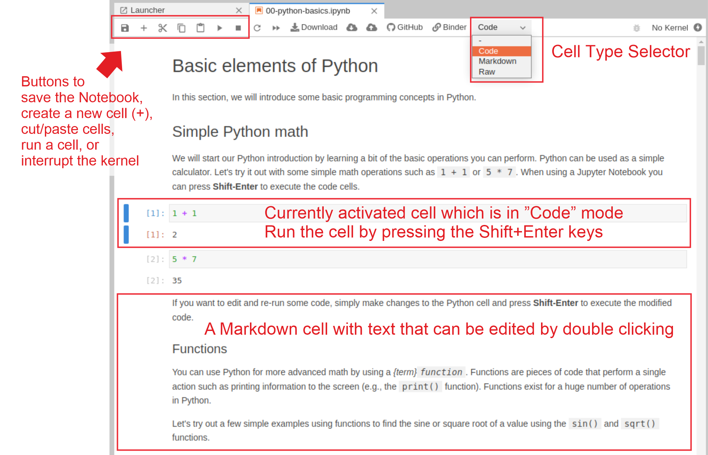

---
jupyter:
  jupytext:
    text_representation:
      extension: .md
      format_name: markdown
      format_version: '1.3'
      jupytext_version: 1.11.5
  kernelspec:
    display_name: Python 3 (ipykernel)
    language: python
    name: python3
---

# Using JupyterLab for writing code

[JupyterLab](https://jupyterlab.readthedocs.io/en/stable/getting_started/overview.html)[^JupyterLab] is an open-source browser-based *{term}`Integrated Development Environment`* for programming and doing data science. The JupyterLab interface consists of different components, such as a file browser, terminal, Python interpreter, text editor, and so on. When you run a JupyterLab (see next section for details how to do this), the interface will be automatically opened in a web browser. JupyterLab is a versatile programming tool that can do many things, but most importantly, you can use it to write and run code, create and write Jupyter Notebooks (combining both text and code), and e.g. explore files and outputs from your analyses. The main interface components of JupyterLab are shown in Figure 1.13, which is (approximately) what you would see when you first open a JupyterLab on your computer:

 - The file browser (navigation panel) on the left can be used for instance to navigate on your file system and create new files or folders (you can right-click on empty white space to see different options). If you double-click a specific file in the browser, it will open it. Selecting a file (a blue box appears) and right-clicking the file, opens various options that you can do with the file, such as renaming, copying, duplicating or deleting it. 
 - A "launcher panel" on the right

   
_**Figure 1.13**. The main interface components of JupyterLab IDE._
   
Jupyter Notebooks (as described in the previous section) are documents that can be used and run inside the JupyterLab environment containing the computer code and rich text elements (such as figures, tables and links). Jupyter Notebooks are perfect for documenting a data science workflow in an interactive format. We use JupyterLab/Jupyter Notebooks as the default programming environment in this book. All of the book materials are available in a JupyterLab setting which you can start using immediately without any installations using Binder (see Preface for details).

_**Figure 1.14**. The basic components of a Jupyter Notebook opened in JupyterLab._

## Footnotes

[^JupyterLab]: <https://jupyterlab.readthedocs.io/en/stable/getting_started/overview.html>
