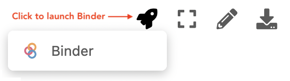

---
jupyter:
  jupytext:
    text_representation:
      extension: .md
      format_name: markdown
      format_version: '1.3'
      jupytext_version: 1.11.5
  kernelspec:
    display_name: Python 3 (ipykernel)
    language: python
    name: python3
---

# Quickly getting started (without installing Python)

One of the convenient features of the JupyterLab environment is that users interact with their code through a web browser. This means you can interact with Jupyter Notebooks that are saved locally on your computer or on a remote server/website. However, unlike a normal web page, interacting with Jupyter Notebooks does require a Jupyter server is running to be able to provide the interactive functionality in the notebook.

## Free cloud services for Jupyter notebooks

Fortunately, there are a number of free online services that provide support for interacting with Jupyter Notebooks, and make it easy for you to quickly explore how they work. Below, we provide a very brief overview of two of the more popular free services and some links for how to get started using them.

- **Binder**: [Binder](https://mybinder.org)[^Binder] is a freely available service related to the [Jupyter Project](https://jupyter.org)[^Jupyter] that allows users to create cloud-based computing environments that can be used to execute Jupyter Notebooks. The notebooks can be hosted in a variety of locations, including on [GitHub.com](https://github.com), and their website at [mybinder.org](https://mybinder.org) provides detailed instructions about how to create your own computing environments. For use with this book, you can launch interactive versions of the notebook files used to produce the book materials on the book website at [pythongis.org](https://pythongis.org) by clicking on the "rocket ship icon" (Figure 1.15). This is the easiest way to get started learning Python and exploring the book materials!

    
   
    _**Figure 1.15**. The "rocket ship icon" that can be used to launch interactive versions of notebooks from the book website._

    Please note, however, that there are a few important limitations to using the Binder service:

    - The server will [become inactive after approximately 10 minutes of inactivity](https://mybinder.readthedocs.io/en/latest/about/user-guidelines.html#how-long-will-my-binder-session-last), which means you may need to reconnect in order to continue working with your notebook(s) and may possibly lose your changes.
    - There is no persistent storage, so it is not possible to store changes to your notebooks using Binder. If you are interested in saving your changes, it may be best to read Section 1.6 about how to install Python on your own computer.
    
- **Google Colaboratory (Colab)**: [Google Colab](https://colab.research.google.com/)[^Colab] is another free service provided by Google that can be used to interact with Jupyter Notebooks, although it differs from Binder in both the interface to the notebooks and its features. The interface is a more consistent with that of other Google applications and some terms differ from the equivalents used in JupyterLab, for example. However, a nice feature about Google Colab is that multiple people can work together on the same notebooks at the same time, and it is possible to save your modifications! More information about Google Colab can be found at <https://colab.research.google.com/>.

## Footnotes

[^Binder]: <https://mybinder.org>
[^Colab]: <https://colab.research.google.com/>
[^Jupyter]: <https://jupyter.org>
