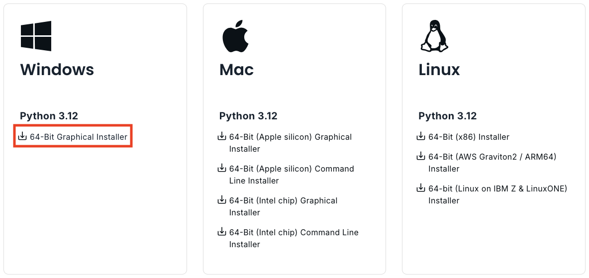
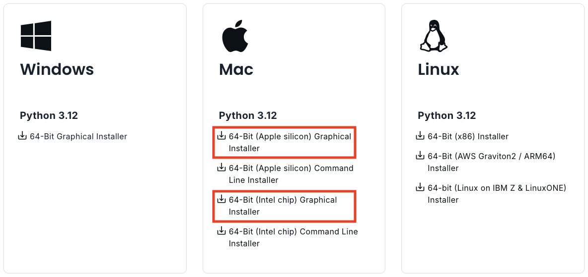
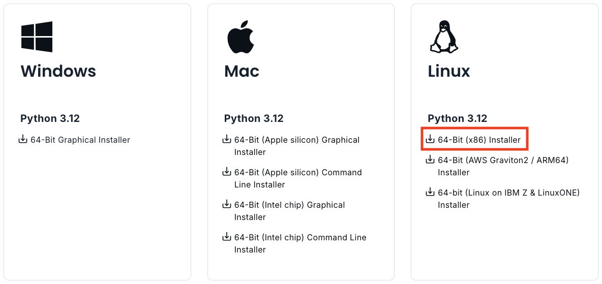

---
jupyter:
  jupytext:
    text_representation:
      extension: .md
      format_name: markdown
      format_version: '1.3'
      jupytext_version: 1.11.5
  kernelspec:
    display_name: Python 3 (ipykernel)
    language: python
    name: python3
---

<!-- #region pycharm={"name": "#%% md\n"} -->
# Installing Python and adding libraries
<!-- #endregion -->

<!-- #region pycharm={"name": "#%% md\n"} -->
## Essentials for managing your Python environment

Knowing how to install Python and many of its wonderful libraries is one of the first things that you want to learn. Luckily, installing Python and its libraries is very easy once you are familiar with some basic concepts and approaches to manage your Python installations. In the next paragraphs, we provide some terminology, background information and good practices on how to handle Python installations before showing in detail how to install all the libraries used in this book. Next paragraphs probably include many new terms and some technical details that you might not understand at this point, but don't worry, getting started is easy.  

- **Handling dependencies:** Because Python is one of the most popular programming languages in the world, there is also a huge number of libraries available for it. Having a large ecosystem of libraries is naturally a great thing, but it also bring some challenges that needs to be considered when doing installations. Many of the libraries developed for Python take advantage of, and are strongly linked to, other Python libraries. This is very useful because developers don't need to create everything from scratch when developing libraries, allowing faster and (typically) more stable progress of the libraries. Python's libraries are also evolving and improving all the time, and developers typically publish new versions of the libraries regularly. Because of these regular updates and *`{term} dependencies <Dependency>`* between Python packages, it is important to ensure that different packages (and their different versions) work well together. Luckily, Python has good tools (package managers) to help handling these installations, which solve all the dependencies between libraries for you, and allow you to keep your libraries up-to-date easily. 

- **Python installation with Miniconda:** Even though it is possible to install Python from the Python homepage [^Python website], we highly recommend using Miniconda [^miniconda] to install Python. Miniconda is a Python distribution that comes with Python interpreter and a small number of essential packages, such as package manager called `conda`, which makes it easy to install Python packages. Miniconda is professionally maintained and widely used installation package for getting started with Python. It is free to use for individual hobbyists, students, universities, non-profit organizations, or businesses with less than 200 employees (as of May, 2022). For larger businesses, we recommend to install Python using Miniforge [^miniforge], which is identical to Miniconda, but does not have any commercial restrictions.

- **Package managers:** Package managers, such as conda (or `mamba` which is a faster version of conda) are extremely useful tools to install Python packages. In essence, a package manager is a tool that makes life much easier when installing new packages for Python. Package managers are easy to use from terminal/command prompt, and some IDEs also provide nice graphical user interfaces for handling the installations. In addition to conda/mamba, it is good to know that there are also other package managers for Python (such as pip, Pipenv and poetry). Generally, we encourage you to use conda/mamba when installing packages, because they work reliably with all operating systems (including Windows), and they can also handle packages that contain code written in other languages. Many scientific and GIS libraries for Python include parts which are written in C, due to significant boost in performance (speed). You can also combine installations with conda/mamba and pip which might be sometimes necessary if a package is not available via conda, but can be installed with pip.

- **Virtual environments:** Although *{term}`virtual environments <virtual environment>`* are not necessarily needed when first starting to learn programming, it is a good practice to create an isolated environment for your programming project (e.g. related to a specific course, manuscript/thesis, data analysis pipeline or software project). A virtual environment is a Python programming environment which works in a way that the Python interpreter, libraries and scripts installed into it are isolated from the ones installed in other virtual environments (or used by the operating system). This ensures that all the installed packages work nicely together. You can create multiple environments on your computer for different projects (having e.g. different versions of Python and specific libraries), and you can swap easily between environments by *activating* them from the command prompt with a single command (see next section for details). 

- **Configuring and documenting your environments:** Installing Python packages can be done easily one by one from a command prompt. However, to document and keep track of your packages while ensuring that your installation works smoothly, we recommended to write a dedicated configuration file which lists all the packages in your environment (see Figure 1.12). Python package managers support various formats to list/write your dependencies, but conda/mamba uses a configuration file written to `environment.yaml`. YAML is a human-friendly configuration language which is easy to use and a popular approach to manage Python environments. The name of the file can be anything, but file format should be `.yaml`. In the configuration file, you can control all the specifications of your virtual environment, including the name for your environment and the version of Python that should be used in the environment. In addition, you can specify if you want to use a specific version of a given package (e.g. a slightly older version), or go with the newest version available (which is the default). It is a good practice to install all packages (if possible) from the same conda channel (e.g. `conda-forge` which we recommend), and not to mix conda and pip for installations if not strictly necessary. A conda channel is a remote location/directory having a dedicated web address where packages are stored. The channels serve as the base for hosting packages, and the package managers (such as conda/mamba) search and download the packages from these channels.


_**Figure 1.16**. An example of YAML configuration file used for creating a Python virtual environment._
<!-- #endregion -->

<!-- #region pycharm={"name": "#%% md\n"} -->
## Installing Python on your computer

In order to follow and reproduce the examples in the rest of the book, here we show in practice how to install Python on your own computer along with all of the recommended software libraries we use. This is not strictly necessary, as it is possible to use the Binder cloud computing platform from the book website to interact with the book materials. However, if you would like to get the most out of the book and ensure you're easily able to continue with Python afterward, we strongly recommend you install Python and Jupyter on your own computer.

In the sections that follow, we provide instructions for the installation of the Python using [Miniconda](https://docs.conda.io/en/latest/miniconda.html) [^miniconda]. for the Windows, macOS, and Linux operating systems. Miniconda is a lightweight installer for Python packages that includes a minimal Python environment. You should first install Miniconda and then you can use the [Python environment file we provide]() to set up a Python environment with all of the software libraries used in this book. We provide instructions for both steps below.

This book assumes you are using **Python 3**, so for all operating systems we recommend you install Miniconda based on Python 3. At the time of writing of this book, Python 3.8 is the Python version that is recommended (e.g., Figure 1.12), however future versions of Python 3.X should also be suitable. Importantly, the coding examples we present will not work with Python 2.X, so be careful to install the correct version of Miniconda!
<!-- #endregion -->

<!-- #region pycharm={"name": "#%% md\n"} -->
## Installing Miniconda
<!-- #endregion -->

<!-- #region pycharm={"name": "#%% md\n"} -->
### Windows

To get started, you should first download the version of Miniconda based on Python 3 that is suitable for your computer (Figure 1.13). You can find the latest installer links for various operating systems from the [Miniconda website](https://docs.conda.io/en/latest/miniconda.html#latest-miniconda-installer-links) [^miniconda]. Most likely you should choose the 64-bit installer, though those using a 32-bit operating systems should download the 32-bit version.



_**Figure 1.17**. Miniconda versions available for Windows._

Once you have downloaded the installer, double click on the installer file to install it. You can use the default options, but be aware of the installation types below.

- Single-user installation: Select "**Just Me**" during the installation and Miniconda will only be available for the current user. This should not require administrator rights for the installation.
- System-wide installation: Select "**All Users**" during the installation. This will require administrator rights.

After the installation has completed you can test that the `conda` package manager works by opening the Anaconda Prompt from the Start menu and running a command such as `conda --version`. If the command returns a version number of conda (e.g. `conda 4.9.0`) then everything is working correctly.

You can find some additional tips on installing Miniconda for Windows on the [Miniconda website](https://docs.conda.io/projects/conda/en/latest/user-guide/install/windows.html).

<!-- #endregion -->

<!-- #region pycharm={"name": "#%% md\n"} -->
### macOS

We recommend downloading the version of Miniconda that offers installation using a graphical installer (e.g., `Miniconda MacOSX 64-bit pkg`), and make sure you download the Python 3 package (Figure 1.14).



_**Figure 1.18**. Miniconda versions available for macOS._

Once you have downloaded the installer, double click on the installer file to install it. You can use the default options, but be aware of the installation types below.

- Single-user installation: Select "**Just Me**" during the installation and Miniconda will only be available for the current user. This should not require administrator rights for the installation.
- System-wide installation: Select "**All Users**" during the installation. This will require administrator rights.

After the installation has completed you can test that the `conda` package manager works by opening Terminal or the Anaconda Prompt and running a command such as `conda --version`. If the command returns a version number of conda (e.g. `conda 4.9.0`) then everything is working correctly.

In case you have any problems with the Miniconda installation, you can find some installation tips on the [Miniconda website](https://docs.conda.io/projects/conda/en/latest/user-guide/install/macos.html).

<!-- #endregion -->

<!-- #region pycharm={"name": "#%% md\n"} -->
### Linux

Start by downloading the Miniconda installer for Linux from the [Miniconda website](https://docs.conda.io/projects/conda/en/latest/user-guide/install/linux.html) (Figure 1.15). Be sure you download the Python 3 package.



_**Figure 1.19**. Miniconda versions available for Linux._

Once you have downloaded the installer, you can open a terminal window and type a command to start the installation. You should use the default installer options, but be aware that the command you run will differ depending on the installation type.

- Single-user installation: Start by running the following:

    ```bash
    $ bash Miniconda3-latest-Linux-x86_64.sh
    ```

   Miniconda will only be available for the current user and the installation directory must be a location where that user has write permissions. This should not require administrator rights for the installation.

- System-wide installation: For a system-wide install, run:

    ```bash
    $ sudo bash Miniconda3-latest-Linux-x86_64.sh
    ```

    You will be propted for your password and must have administrator rights to install this way.

After the installation has completed you can test that the `conda` package manager works by opening a terminal and running a command such as `conda --version`. If the command returns a version number of conda (e.g. `conda 4.9.0`) then everything is working correctly. In case you have any problems with the Miniconda installation, you can find some installation tips on the [Miniconda website](https://docs.conda.io/projects/conda/en/latest/user-guide/install/linux.html).
<!-- #endregion -->

<!-- #region pycharm={"name": "#%% md\n"} -->
## Installing the Python libraries used in the book
<!-- #endregion -->

<!-- #region pycharm={"name": "#%% md\n"} -->
As noted above, we will be using the `mamba` package manager to handle the installation of Python packages in Miniconda.
To do this, we must first install mamba and then download some Python environment files that contain the list of packages used in the book.
The steps for installing the Python GIS libraries are below.
<!-- #endregion -->

<!-- #region pycharm={"name": "#%% md\n"} -->
### Installing `mamba`

To get started we will install the `mamba` package manager in our new Miniconda environment (are you tired of all the snake references yet?).
We can install `mamba` by opening a terminal window or command prompt in Windows (as an admin user) and running the following:

```
# Install mamba
conda install mamba -n base -c conda-forge
```

If you're curious, you can find more about mamba in the [online user guide](https://mamba.readthedocs.io/en/latest/index.html) which covers most of the basic things, such as installing new packages.
<!-- #endregion -->

### Download the Python environment files

Download the environment file (`environment.yml`) that contains information about all Python libraries that are needed to run the code examples in this book. 
The file can be downloaded from [**HERE**](https://a3s.fi/swift/v1/AUTH_0914d8aff9684df589041a759b549fc2/PythonGIS/environment/environment.yml) [^environment].

<!-- #region pycharm={"name": "#%% md\n"} -->
### Install the libraries

Once you have obtained the `environment.yml` file you can return to your terminal window, change to the directory where you have downloaded the file and create the environment as shown below. For example, on macOS or Linux you would do the following.

```
# Change to directory containing environment files
cd download_directory
    
# Create the environment using mamba
mamba env create -f environment.yml

# Activate the new environment 
conda activate pythongis
```

This creates a new Python virtual environment called `pythongis`, which contains the packages listed in the file `environment.yml`. The new environment is helpful because it will be isolated from other Python packages you might install on your computer and ensure you have all of the packages needed for this book.

To use the environment (since it will not be the default environment on your computer) you should type something like the following whenever you open a terminal window to use Python.

```
# Activate the your Python environment
conda activate pythongis
```
<!-- #endregion -->

### Running JupyterLab

We use [JupyterLab](https://jupyterlab.readthedocs.io/en/stable/getting_started/overview.html) as the main programming environment in this book.
You can start a JupyterLab instance by running this command on terminal or command prompt (notice the space between the words!):

```
jupyter lab
```

After running the command, JupyterLab should open up automatically in a browser window.


### Installing additional libraries

You can install new packages using the `mamba install` command. The basic syntax for installing packages is `mamba install package-name`.
In addition, we also want to specify the `channel` from where the package is downloaded using the parameter ``-c``. A good rule of thumb is to always install packages from the same channel (in this book, we prefer the `conda-forge` channel). For instance, installing the `pandas` library from the conda-forge channel would be done as follows:

```
mamba install -c conda-forge pandas
```

Once you run this command, you will see also other packages getting installed and/or updated as mamba checks for dependencies of the installed package.
Read more about package installations in the [mamba documentation](https://mamba.readthedocs.io/en/latest/advanced_usage/detailed_operations.html) [^mamba_docs]
It's a good idea to search for installation instructions for each package online. In case you encounter an error message when installing new packages, you might want to first check the versions and channels of existing packages using the `mamba list` command before trying again.


## Footnotes

[^environment]: <https://a3s.fi/swift/v1/AUTH_0914d8aff9684df589041a759b549fc2/PythonGIS/environment/environment.yml>
[^mamba_docs]: <https://mamba.readthedocs.io/en/latest/advanced_usage/detailed_operations.html>
[^miniconda]: <https://docs.conda.io/en/latest/miniconda.html> 
[^miniforge]: <https://github.com/conda-forge/miniforge>
[^Python website]: <https://www.python.org/>
