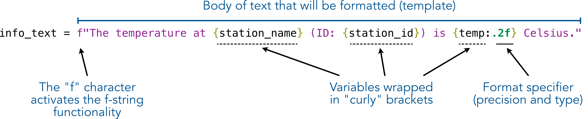

---
jupyter:
  jupytext:
    text_representation:
      extension: .md
      format_name: markdown
      format_version: '1.3'
      jupytext_version: 1.16.4
  kernelspec:
    display_name: Python 3 (ipykernel)
    language: python
    name: python3
---

<!-- #region editable=true slideshow={"slide_type": ""} -->
# Working with text and numbers

Earlier in this chapter we saw how it is possible to combine character strings and numbers using the `+` operator between the different text components. Although this approach works, it can become quite laborious and error prone when you have a more complicated set of textual and/or numerical components that you work with. Hence, we next show a few useful techniques that make manipulating strings easier and more efficient.

There are three approaches that can be used to manipulate strings in Python: (1) f-strings, (2) using the`.format()` method, and (3) using the `%` operator. We recommend using the f-string approach, but we also provide examples of the two other approaches because there are plenty of examples and code snippets on the web where these string formatting approaches are still used. Hence, it is good to be aware of them all. In addition, we show a few useful methods that make working with text in different ways possible.
<!-- #endregion -->

<!-- #region editable=true slideshow={"slide_type": ""} -->
## F-String formatting

In the following, we show how we can combine the `station_name` text, the `station_id` integer number, and the `temp` floating point number together using Python's f-string formatting approach. In addition, we will round a decimal number (`temp`) to two decimal points on the fly.
<!-- #endregion -->

```python editable=true slideshow={"slide_type": ""}
# Station information
station_name = "Helsinki Kaivopuisto"
station_id = 132310

# An example temperature with many decimals
temp = 18.56789876

# 1. The f-string approach (recommended)
info_text = (
    f"The temperature at {station_name} (ID: {station_id}) is {temp:.2f} Celsius."
)

print(info_text)
```



_**Figure 2.2**. F-string formatting explained._


As you can see, using string formatting it is possible to easily modify a body of text "interactively" based on values stored in given variables. Figure 2.2 breaks down the different parts of the string. The text that you want to create and/or modify is enclosed within the quotes preceded with letter `f`. You can pass any existing variable inside the text template by placing the name of the variable within the curly braces `{}`. Using string formatting, it is also possible to insert numbers (such as `station_id` and `temp`) within the body of text without needing first to convert the data types to strings. This is because the f-string functionality kindly does the data type conversion for us in the background without us needing to worry about it (handy!). 

It is also possible to round numbers on the fly to specific precision, such as the two decimal points in our example, by adding the format specifier (`:.2f`) after the variable that we want to round. The format specifier works by first adding a colon (`:`) after the variable name, and then specifying with dot (`.`) that we want to round our value to 2 decimal places (can be any number of digits). The final character `f` in the format specifier defines the type of the formatting that will be done: the character `f` will display the value as a decimal number, the character `e` would make the number appear in scientific notation, while the character `%` would convert the value to percentage representation. 

As we have hopefully demonstrated, f-string formatting is easy to use, yet powerful with its capability to do data conversions on the fly, for example. Hence, it is the recommended approach for doing string manipulation presently in Python. Just remember to add the letter `f` before your string template! 

<!-- #region editable=true slideshow={"slide_type": ""} -->
## Older approaches for string formatting

As mentioned previously, there are also a couple of other approaches that can be used to achieve the same result as above. These older approaches preceded the f-string, which was introduced in Python version 3.6. The first one is the `.format()` method, which is placed after the string in quotes, like this:
<!-- #endregion -->

```python editable=true slideshow={"slide_type": ""}
# 2. .format() approach (no longer recommended)
text2 = (
    "The temperature at {my_text_variable} (ID: {station_id}) is {temp:.2f}.".format(
        my_text_variable=station_name, station_id=station_id, temp=temp
    )
)
print(text2)
```

As you can see, here we get the same result as we did with an f-string, but we used the `.format()` placed after the quotes. The variables were inserted within the text template using curly braces and giving them a name (placeholder) which is expected to have a matching counterpart within the `.format()` parentheses that link to the variable value that will be inserted in the body of text. As you see, the placeholder does not necessarily need to have the same name as the actual variable that contains the inserted value, but it can be anything, like the name `my_text_variable` as in the example above. 

The last (historical) string formatting approach is to use the `%s` operator. In this approach, the placeholder `%s` is added within the quotes, and the variables that are inserted into the body of text are placed inside parentheses after the `%` operator, like this:

```python editable=true slideshow={"slide_type": ""}
# 3. The % operator approach (no longer recommended)
text3 = "The temperature at %s (ID: %s) is %.2f" % (station_name, station_id, temp)
print(text3)
```

The order of the variables within the parentheses specify which `%s` placeholder will receive what information. The order of the variables inside parentheses needs to be corrected always if making changes to the placing of the placeholders, and there should be exactly the same number of variables within the parentheses as there are `%s` placeholders within the text template. Hence, this approach is prone to errors and causing confusion, which is why we do not recommend using it.  

To conclude, using the f-string approach is the easiest and most intuitive way to construct and format text. Hence, we highly recommend learning that approach and sticking with it.

<!-- #region editable=true slideshow={"slide_type": ""} -->
## Manipulating character strings

Here we demonstrate some of the most useful string manipulation techniques, such as splitting strings based on a given character, replacing characters with new ones, slicing strings, concatenating strings, etc. 
The aim is to produce the following text, which contains a list of weather station locations in Helsinki that are represented in uppercase text: `Our selection includes 3 weather stations (KUMPULA, KAISANIEMI, HARMAJA). The first observation is from 01/01/1882.`). The text that we will begin working with is below.
<!-- #endregion -->

```python editable=true slideshow={"slide_type": ""}
text = "Stations: Helsinki Kumpula, Helsinki Kaisaniemi, Helsinki Harmaja"
```

<!-- #region editable=true slideshow={"slide_type": ""} -->
### Splitting strings

Let's start by demonstrating how we can split a string into different parts based on specific character(s). We can split the given text using the colon character (`:`) by passing the character into a method called `.split()`.
<!-- #endregion -->

```python editable=true slideshow={"slide_type": ""}
splitted = text.split(":")
splitted
```

```python
type(splitted)
```

<!-- #region editable=true slideshow={"slide_type": ""} -->
As a result, the body of text was split into two parts in a list, where the first item (at index 0) now has the text `Stations` (i.e., the text preceeding the colon) and the second item (at index 1) contains the body of text listing the stations that are separated by commas.
<!-- #endregion -->

<!-- #region editable=true slideshow={"slide_type": ""} -->
### Slicing strings

Now we can continue working towards our goal by selecting the stations text from the `splitted` list at index 1.
<!-- #endregion -->

```python editable=true slideshow={"slide_type": ""}
stations_text = splitted[1]
stations_text
```

<!-- #region editable=true slideshow={"slide_type": ""} -->
As can be seen, the first character in our string is actually an empty space (' ') before the word Helsinki. We can remove that character easily by slicing the text. Each character in a character string can be accessed based on its position (index) in the same way as with the Python lists that were introduced earlier in this chapter. We can slice our word by specifying that we want to keep all characters after the first position (i.e., removing the empty space). We can do this by adding the position inside square brackets (`[]`) where we want to start accessing the text, and by adding a colon (`:`) after this number, we can specify that we want to keep all the rest of the characters in our text (i.e., we take a slice of it).
<!-- #endregion -->

```python editable=true slideshow={"slide_type": ""}
stations_text = stations_text[1:]
stations_text
```

<!-- #region editable=true slideshow={"slide_type": ""} -->
Now we have accessed and stored all the characters starting from position index 1, and hence dropped the first empty space. An alternative approach for achieving this would be to use a method called `.strip()`. You could also specify a specific range of characters that you want to slice from the word by adding the index position after the colon (e.g. `[1:9]` would have separated the word `Helsinki` from the text).
<!-- #endregion -->

<!-- #region editable=true slideshow={"slide_type": ""} -->
### Replacing text in strings

Currently in the processed text, the word `Helsinki` is repeated multiple times before the station names. We can easily remove this word by replacing the word `Helsinki` with an empty string (`""`), which will basically delete this word from the text. We can accomplish this by using a method called `.replace()` which takes an original word as the first argument and a replacement word (or character(s)) as the second argument. Note here that we also include the space after "Helsinki" in the text that will be replaced.
<!-- #endregion -->

```python editable=true slideshow={"slide_type": ""}
stations_text = stations_text.replace("Helsinki ", "")
stations_text
```

<!-- #region editable=true slideshow={"slide_type": ""} -->
Now we have replaced the word `"Helsinki "` with nothing (an empty string), and as a result we have text where only the station names are listed.
<!-- #endregion -->

<!-- #region editable=true slideshow={"slide_type": ""} -->
### Changing the string case

Finally, we can easily change the text to uppercase using a method called `.upper()`. Similarly, we could make the text all lowercase or capitalize only the first character using `.lower()` or `.capitalize()`, respectively.
<!-- #endregion -->

```python editable=true slideshow={"slide_type": ""}
stations_upper = stations_text.upper()
stations_lower = stations_text.lower()
stations_capitalize = stations_lower.capitalize()

print(stations_upper)
print(stations_lower)
print(stations_capitalize)
```

<!-- #region editable=true slideshow={"slide_type": ""} -->
### Concatenating strings

Although most mathematical operations are applied to numerical values, a common way to combine (or concatenate) character strings is using the addition operator `+`. Let's try to complete our task of creating our target sentences by concatenating three separate character strings into one. As a reminder, the text we are aiming to produce reads `Our selection includes 3 weather stations (KUMPULA, KAISANIEMI, HARMAJA). The first observation is from 01/01/1882.`. We can first define some values we will need to create the target text.
<!-- #endregion -->

```python
first_day = "1"
first_month = "1"
first_year = "1882"
number_of_stations = "3"
```

Note that if we were working with numerical values we would need to convert them to character strings using the `str()` function. Luckily, we already have character strings, so we can proceed with creating our sentences.

As you may have noticed, out date should have the day and month represented with two characters (i.e., with a leading zero). We could use the `+` operator to add together `"0"` and our day or month value (e.g., `first_day = "0" + first_day`), however adding leading zeros to text is a common operation for ensuring consistent widths of text in data files, for example. Because of this, we can use the `.zfill()` function for strings to add leading zeros to our day and month values, as shown below.

```python
first_day = first_day.zfill(2)
first_month = first_month.zfill(2)
```

```python
first_day
```

As you can see, the `.zfill()` function adds leading zeros before a number up to the number of characters specified when using it. In our case, we specified we want `2` characters, so one leading zero was added to our character strings. At this point, we can create a date string we can use for creating our sentences.

```python
date = first_day + "/" + first_month + "/" + first_year
date
```

Looks good. Now we can define the remaining pieces needed to create our sentences and concatenate them to form the target sentences.

```python
first_part = "Our selection includes " + number_of_stations
second_part = " weather stations (" + stations_upper
third_part = "). The first observation is from " + date + "."
```

```python editable=true slideshow={"slide_type": ""}
sentences = first_part + second_part + third_part
sentences
```

Nice! By simply breaking down the sentence into smaller character string segments we were able to use the `+` operator to create two sentences containing several numerical values combined in various ways. Well done!
