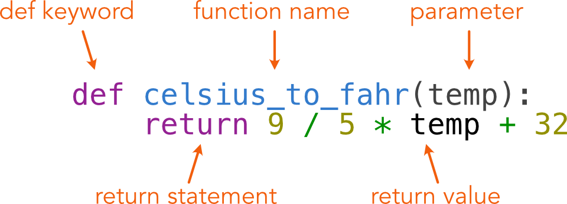

---
jupyter:
  jupytext:
    text_representation:
      extension: .md
      format_name: markdown
      format_version: '1.3'
      jupytext_version: 1.16.4
  kernelspec:
    display_name: Python 3 (ipykernel)
    language: python
    name: python3
---

<!-- #region editable=true slideshow={"slide_type": ""} -->
# Functions

In this lesson we introduce functions as a way of making blocks of code for a specific task that are easy to use and re-use in your programs.
<!-- #endregion -->

## What is a function?

A *{term}`function`* is a block of organized, reusable code that can make your programs more effective, easier to read, and simple to manage. You can think functions as little self-contained programs for performing a specific task, and which you can use repeatedly in your code. One of the basic principles in good programming is "do not to repeat yourself". In other words, you should avoid having duplicate lines of code in your programs. Functions are a good way to avoid such situations and they can save you a lot of time and effort as you don't need to tell the computer repeatedly what to do every time it does a common task, such as converting temperatures from Fahrenheit to Celsius. During the course we have already used some functions such as the `print()` function which is a built-in function in Python.


## Anatomy of a function

Let's consider the task from the first section of this chapter when we converted temperatures from degrees Celsius to Fahrenheit.
Such an operation is a fairly common task when dealing with temperature data.
Thus, we might need to repeat such calculations frequently when analyzing or comparing weather or climate data between the US and Europe, for example.


### Creating a first function

Let's define our first function called `celsius_to_fahr()`. Figure 2.4 explains the main elements of a function.

```python
def celsius_to_fahr(temp):
    return 9 / 5 * temp + 32
```



_**Figure 2.4** An example function with annotation of its important elements._

The function definition opens with the keyword `def` followed by the name of the function and a list of parameter names in parentheses.
The body of the function — the statements that are executed when it runs — is indented below the definition line.

When we call a function, the values we pass to it are assigned to the corresponding parameter variables so that we can use them inside the function (e.g., the variable `temp` in this function example).
Inside the function, we can use a `return` statement to define the value that should be given back when the function is used or called.
Note that using a `return` statement in functions is recommended but not required.


### Calling a function

Now let's try using our function.
Calling our self-defined function is no different from calling any other function such as `print()`.
You need to call it with its name and provide your value(s) as the required parameter(s) inside the parentheses.
Here, we can define a variable `freezing_point` that is the temperature in degrees Fahrenheit we get when using our function with the temperature 0 °C (the temperature at which water freezes). We can then print that value to confirm. We should get a temperature of 32 °F.

```python
freezing_point = celsius_to_fahr(0)
```

```python
print(f"The freezing point of water in Fahrenheit is: {freezing_point}")
```

We can do the same thing with the boiling point of water in degrees Celsius (100 °C). Just like with other functions, we can use our new function directly within something like the `print()` function to print out the boiling point of water in degrees Fahrenheit.

```python
print(f"The boiling point of water in Fahrenheit is: {celsius_to_fahr(100)}")
```

<!-- #region editable=true slideshow={"slide_type": ""} -->
### Creating another function

Now that we know how to create a function to convert degrees Celsius to Fahrenheit, let’s create another function called `kelvins_to_celsius()`. We can define this just like we did with our `celsius_to_fahr()` function, noting that the temperature in degrees Celsius is just the temperature in Kelvins minus 273.15. Just to avoid confusion this time, let's call the temperature variable used in the function `temp_kelvins`.
<!-- #endregion -->

```python editable=true slideshow={"slide_type": ""}
def kelvins_to_celsius(temp_kelvins):
    return temp_kelvins - 273.15
```

Let's use it in the same way as the earlier one by defining a new variable `absolute_zero` that is the Celsius temperature of 0 Kelvins. Note that we can also use the parameter name `temp_kelvins` when calling the function to explicitly state which variable values is being used. Again, let's print the result to confirm everything works.

```python
absolute_zero = kelvins_to_celsius(temp_kelvins=0)
```

```python
print(f"Absolute zero in Celsius is: {absolute_zero}")
```

<!-- #region editable=true slideshow={"slide_type": ""} tags=["question"] -->
#### Question 2.12

Isaac Newton developed [a scale for measuring temperatures](https://en.wikipedia.org/wiki/Newton_scale) that was a precursor to the modern-day Celsius scale. In his system, water would freeze at 0 °N and boil at 33 °N (°N here indicates degrees Newton, not degrees north :D). Although it is difficult to directly convert between the two scales, if we assume that the increments of temperature change are equal between 0 °N and 33 °N we can come up with a temperature conversion equation between degrees Celsius and degrees Newton: $T_{\mathrm{Newton}} = T_{\mathrm{Celsius}} * 0.33$.

Your task here is to create a new function called `celsius_to_newton()` that (1) has one parameter that is the temperature in degrees Celsius to be converted to degrees Newton and (2) returns the temperature in degrees Newton.
<!-- #endregion -->

```python editable=true slideshow={"slide_type": ""} tags=["remove_cell"]
# Use this cell to enter your solution.
```

```python tags=["hide-cell", "remove_book_cell"] editable=true slideshow={"slide_type": ""} black=false
# Solution


def celsius_to_newton(temp_celsius):
    return temp_celsius * 0.33
```

<!-- #region editable=true slideshow={"slide_type": ""} -->
### Functions within a function

What about converting Kelvins to Fahrenheit?
We could write out a new formula for it but we don’t need to.
Instead, we can do the conversion using the two functions we have already created and calling those from the new function we will now create. Let's create a function `kelvins_to_fahr()` that takes the temperature in Kelvins as the parameter value `temp_kelvins` and uses our `kelvins_to_celsius()` and `celsius_to_fahr()` functions within the new function to convert temperatures from Kelvins to degrees Fahrenheit.
<!-- #endregion -->

```python editable=true slideshow={"slide_type": ""}
def kelvins_to_fahr(temp_kelvins):
    temp_celsius = kelvins_to_celsius(temp_kelvins)
    temp_fahr = celsius_to_fahr(temp_celsius)
    return temp_fahr
```

Now let's use the function to calculate the temperature of absolute zero in degrees Fahrenheit. We can then print that value to the screen again.

```python
absolute_zero_fahr = kelvins_to_fahr(temp_kelvins=0)
```

```python
print(f"Absolute zero in Fahrenheit is: {absolute_zero_fahr}")
```

## Function parameters and return values

### Functions with no return value

Although it is recommended to use `return` statements when defining functions, not all functions have or need to have a `return` statement. For example, let's consider a case where the function converts temperatures from Kelvins to degrees Celsius and prints the converted values to the screen. In this situation, the function does not return the converted temperature value.

```python
def print_kelvins_to_celsius(temp_kelvins):
    temp_celsius = kelvins_to_celsius(temp_kelvins)
    print(f"{temp_kelvins} Kelvins is {temp_celsius} degrees Celsius.")
```

```python
print_kelvins_to_celsius(0)
```

Here, we have no `return` statement because the `print()` function handles the main goal of this function: Displaying text output on the screen. So, what happens if we assign the output the function produces to a variable? Let's test that using a variable called `output` and see what is assigned to it.

```python
output = print_kelvins_to_celsius(0)
print(output)
```

As you can see, when we assign the function output to the variable `output` the stored value is `None`. Functions with no `return` statement will automatically return `None`. In our case, this means that the variable `output` exists but does not have an assigned value. As a result, we do not get a `NameError` indicating the variable has not been defined when printing it out. Also, it is good to note that the text values from the `print_kelvins_to_celsius()` function still get written to the screen even if the return value is assigned to `output`.

<!-- #region editable=true slideshow={"slide_type": ""} -->
### Functions with multiple parameters

In the function examples we have seen so far we have created functions with only a single parameter. Of course, it is possible to have several parameters used in functions. In fact, functions with multiple parameters are quite common in many Python libraries.

Let's imagine a situation: You're preparing for a visit to the United States, but are unfamiliar with temperatures in Fahrenheit. A friend from the northern US suggested a temperature of 68 degrees Fahrenheit is ideal for comfort and normally you are comfortable within a range of about 5 degrees above or below such a comfortable temperature. To deal with your situation you would like create a new function called `temp_in_comfort_range()`, which:

1. Takes a temperature in degrees Celsius as an input (`temp_celsius`)
2. Converts the temperatures to degrees Fahrenheit
3. Checks to see whether the converted temperature is within the specified temperature range `temp_fahr_ideal` ± `temp_fahr_range`
5. Returns a Boolean value resulting from the comparison

The function we describe looks similar to some of those we have used earlier but with a bit more complexity. Let's look at the function, test it, and then explore how it works.
<!-- #endregion -->

```python editable=true slideshow={"slide_type": ""}
def temp_in_comfort_range(temp_celsius, temp_fahr_ideal=68.0, temp_fahr_range=5.0):
    temp_fahr = celsius_to_fahr(temp_celsius)
    temp_fahr_min = temp_fahr_ideal - temp_fahr_range
    temp_fahr_max = temp_fahr_ideal + temp_fahr_range
    temp_in_range = temp_fahr >= temp_fahr_min and temp_fahr <= temp_fahr_max
    return temp_in_range
```

<!-- #region editable=true slideshow={"slide_type": ""} -->
Now that we have defined the function, let's test with a Celsius temperature of 21 degrees. For our test case we can also assume an ideal comfort in Fahrenheit of 63.0 - 73.0 degrees (68.0 ± 5.0).
<!-- #endregion -->

```python editable=true slideshow={"slide_type": ""}
temp_in_comfort_range(21.0, 68.0, 5.0)
```

<!-- #region editable=true slideshow={"slide_type": ""} -->
As we can see, 21 degrees Celsius would also be considered a comfortable temperature in the US!. However, you may notice that when we have multiple parameters it is easy to confuse what they represent. In such a case, it can be helpful to include the names of the parameters, as we have seen earlier.
<!-- #endregion -->

```python editable=true slideshow={"slide_type": ""}
temp_in_comfort_range(temp_fahr_ideal=68.0, temp_celsius=21.0, temp_fahr_range=5.0)
```

<!-- #region editable=true slideshow={"slide_type": ""} -->
This does exactly the same thing as the first test of the `temp_in_comfort_range()` function, but now includes parameter names to avoid confusion about what the function does. And note that the order of the parameters does not matter when providing parameter names for all function parameters. This is very helpful when using library functions where you might not know the order of the parameters in the definition.
<!-- #endregion -->

<!-- #region editable=true slideshow={"slide_type": ""} -->
### Required and optional parameters

When creating Python functions it is possible to design them such that not all parameters need to be specified to use the function. In such cases, default values will be used when no parameter value is given. In our `temp_in_comfort_range()` function definition we have provided default values for two parameters: `temp_fahr_ideal=68.0` and `temp_fahr_range=5.0`. Thus, a user could test whether a given temperature in Celsius is with the default temperature range in Fahrenheit (68.0 ± 5.0) by specifying only a single parameter value when using the `temp_in_comfort_range()` function, as shown below.
<!-- #endregion -->

```python editable=true slideshow={"slide_type": ""}
temp_in_comfort_range(19.0)
```

<!-- #region editable=true slideshow={"slide_type": ""} -->
In this case, the function still works because `temp_fahr_ideal` and `temp_fahr_range` are *{term}`optional function parameters <optional parameter>`* with default values that will be used when no parameter value is given for them. So, what happens if no parameters are given to the function?
<!-- #endregion -->

```python editable=true slideshow={"slide_type": ""} tags=["raises-exception"]
temp_in_comfort_range()
```

<!-- #region editable=true slideshow={"slide_type": ""} -->
In this case we see a `TypeError` is raised because the parameter `temp_celsius` must be specified in order to use the `temp_in_comfort_range()` function. In this case, `temp_celsius` is a *{term}`required function parameter <required parameter>`* and must be given in order to use the function because no default value was assigned to `temp_celsius` when the function was defined. Required parameters can be used to ensure that required information for functions is always provided when they are used. When defining functions with both required and optional parameters, required (or positional) parameters must be listed before optional parameters in the function definition.
<!-- #endregion -->

<!-- #region editable=true slideshow={"slide_type": ""} -->
### Functions with multiple return values

Although functions often return a single value it is possible to return multiple values in a single `return` statement in a function. Imagine that in addition to knowing whether a given Celsius temperature is within the comfortable range of Fahrenheit temperatures we would also like to know what the value of the converted temperature was so we can get familiar with comfortable temperatures in Fahrenheit. We can modify our `temp_in_comfort_range()` function to do just that by modifying the `return` statement.
<!-- #endregion -->

```python editable=true slideshow={"slide_type": ""}
def temp_in_comfort_range(temp_celsius, temp_fahr_ideal=68.0, temp_fahr_range=5.0):
    temp_fahr = celsius_to_fahr(temp_celsius)
    temp_fahr_min = temp_fahr_ideal - temp_fahr_range
    temp_fahr_max = temp_fahr_ideal + temp_fahr_range
    temp_in_range = temp_fahr >= temp_fahr_min and temp_fahr <= temp_fahr_max
    return temp_in_range, temp_fahr
```

```python
temp_in_comfort_range(27.0)
```

Now we can see that the temperature 27 degrees Celsius is outside the comfort range in our function and converts to 80.6 degrees Fahrenheit. Clearly this is above the default upper comfort limit of 73 degrees Fahrenheit and thus too hot to be comfortable!

So, two values are returned from the `temp_in_comfort_range()` function now, but what type of data is returned? We can check this by assigning the function output (with a different input temperature) to a variable and checking its type.

```python
comfort_range_output = temp_in_comfort_range(27.0)
type(comfort_range_output)
```

OK, so the function returns two values in a single tuple, meaning we can access individual values using their index value (just like with a list!).

```python
print(comfort_range_output[0])
print(comfort_range_output[1])
```

This seems easy enough, but it is worth noting that it is also possible to directly unpack the tuple values to individual variables when calling the function by providing the same number of variables for assignment as there are returned by the function. Let's see an example.

```python
in_range, fahr_temp = temp_in_comfort_range(27.0)
```

```python
type(in_range)
```

```python editable=true slideshow={"slide_type": ""}
type(fahr_temp)
```

As we can see, this way the multiple values returned from the `temp_in_comfort_range()` function are assigned with their original data type to the listed variables when the function is called.

<!-- #region editable=true slideshow={"slide_type": ""} -->
## Variables inside functions

A common point of confusion for new programmers is understanding how variable names in functions relate to those defined elsewhere in their code (or notebooks).
When defining a function, the variable names given in the function definition exist and will only be used when the function is called.
That might seem confusing, but as it turns out this is an excellent feature in Python that can save you from much suffering.
Let's try to understand this by way of an example.

Let us define modified version of our `kelvins_to_celsius` function where the parameter value is still called `temp_kelvins`, but we now store the converted temperature as temp_celsius first and return that value.
<!-- #endregion -->

```python editable=true slideshow={"slide_type": ""}
def kelvins_to_celsius(temp_kelvins):
    temp_celsius = temp_kelvins - 273.15
    return temp_celsius
```

<!-- #region editable=true slideshow={"slide_type": ""} -->
So, we have defined our function to accept `temp_kelvins` as its only parameter, calculate `temp_celsius`, and return that value.
As you will see below, the variables defined in the function exist only in its *{term}`namespace`*.
Let's confirm that by printing each out.
<!-- #endregion -->

```python tags=["raises-exception"] editable=true slideshow={"slide_type": ""}
temp_kelvins
```

```python editable=true slideshow={"slide_type": ""} tags=["raises-exception"]
temp_celsius
```

<!-- #region editable=true slideshow={"slide_type": ""} -->
Here, in the global namespace we get a `NameError` when trying to access the variables `temp_kelvins` and `temp_celsius` because they have only been defined within the scope of the `kelvins_to_celsius()` function.

Perhaps, however, you are thinking that we have not yet called the function, so that is why we get a `NameError`. Maybe if we use the function, then these variable values will be defined.
Let's try that and print out `temp_kelvins` once again.
<!-- #endregion -->

```python editable=true slideshow={"slide_type": ""}
kelvins_to_celsius(temp_kelvins=293.15)
```

```python tags=["raises-exception"]
temp_kelvins
```

<!-- #region editable=true slideshow={"slide_type": ""} -->
As you can see `temp_kelvins` is still not defined in the global namespace, where values such as `freezing_point` have been defined.

Why does Python work this way?
Well, as it turns out, the benefit of having a separate namespace for functions is that we can define a variable in the global namespace, such as `temp_kelvins` and not need to worry about its name within a function, or the use of a function changing its value.
Inside the function, the value that is passed will be known as `temp_kelvins`, but modifying that value will not alter a variable of the same name in the global namespace.
Let's have a look at another example using a modified `kelvins_to_celsius()` function we can call `kelvins_to_celsius2()`.
<!-- #endregion -->

```python editable=true slideshow={"slide_type": ""}
def kelvins_to_celsius2(temperature):
    temperature = temperature - 273.15
    return temperature
```

<!-- #region editable=true slideshow={"slide_type": ""} -->
Here, we pass in a value as `temperature` and modify the value that is passed in before returning it.
This is probably not a good idea in most cases because it could cause confusion, but it is perfectly valid code.

Let's now define a variable `temperature` in the global namespace, use our function with it, and print its value out afterwards.
<!-- #endregion -->

```python
temperature = 303.15
```

```python
kelvins_to_celsius2(temperature=temperature)
```

```python
temperature
```

<!-- #region editable=true slideshow={"slide_type": ""} -->
As you can see, the value of the variable `temperature` in the global namespace was set to 303.15 and remains 303.15 even after using the `kelvins_to_celsius2()` function.
Although there is a variable inside that function with the same name as the value in the global namespace, using the function assigns the value of `temperature` inside the function and manipulates that value only inside the function.

It is important to be aware that it is possible to access variable values that have been defined in the global namespace from within functions, even if the value has not been passed to the function.
This is because Python will search for variables defined with a given name first inside the function, and then outside the function (the search domain is known as the variable's *{term}`scope`*).
If such a value is found then it can be used by the function, which could be dangerous!

Let's look at an example of behavior in a function that may be unexpected. Here we can define a third version of the `kelvins_to_celsius()` function that we can call `kelvins_to_celsius3()`.
<!-- #endregion -->

```python editable=true slideshow={"slide_type": ""}
def kelvins_to_celsius3(temp):
    temp = temperature - 273.15
    return temp
```

```python
kelvins_to_celsius3(273.15)
```

<!-- #region editable=true slideshow={"slide_type": ""} -->
Perhaps you were expecting to see a value of `0` returned by `kelvins_to_celsius3()`, but that does not occur because `temp` is assigned `temperature - 273.15` inside the function.
Although `temperature` was not passed to `kelvins_to_celsius3()` it is defined in the global namespace and thus can be used by our example function.
Since `temperature = 303.15` we get a value of 30.0 returned when using `kelvins_to_celsius3()`.
Conclusion: Be careful!

More information about namespaces and variables scopes can be found, for example, on the [Real Python website](https://realpython.com/python-namespaces-scope/) [^namespace].
<!-- #endregion -->

<!-- #region editable=true slideshow={"slide_type": ""} -->
## Documenting functions with docstrings

A documentation string, or *{term}`docstring`*, is a block of text that describes what a specific function, library, or script does and how to use it. Although the format of docstrings can vary, there are certain elements of a docstring that are needed for it to function properly. Let's look at an example using one of our functions created earlier in this section.

```python
def kelvins_to_celsius(temp_kelvins):
    """Converts temperature in Kelvins to degrees Celsius."""
    return temp_kelvins - 273.15
```

Here you can see a short bit of text explaining in clear language what this function does. In this case our function is quite simple, but the docstring still helps remove uncertainty about what it can be used to do. So, what can we see in this example?

- A docstring is always the first statement in a module or a function.
- Docstrings are enclosed in `"""triple double quotation marks"""`.
- Short docstrings [can be written on a single line](https://peps.python.org/pep-0257/#one-line-docstrings) [^pep257_one_line].

Seems simple enough, right? However, we can also provide more detailed docstrings, which can be particularly helpful when using functions with multiple parameters. Let's expand the docstring above to provide more information about this function.

```python
def kelvins_to_celsius(temp_kelvins):
    """
    Converts temperature in Kelvins to degrees Celsius.

    Parameters
    ----------
    temp_kelvins: <numerical>
        Temperature in Kelvins

    Returns
    -------
    <float>
        Converted temperature.
    """
    return temp_kelvins - 273.15
```

Here you can now see more information about the expected values for the parameters and what will be returned when using the function. This level of documentation is not needed for every function, but clearly it can be useful, especially when you have multiple parameters. Note here that the suggested format with multiple lines in a docstring is to have the quotation marks on their own separate lines.

Additional information about formatting docstrings can be found in the [Python style guide PEP 8](https://peps.python.org/pep-0008/#documentation-strings) [^pep8_docstring] and the [docstring convention guide PEP 257](https://peps.python.org/pep-0257/) [^pep257]. 
<!-- #endregion -->

<!-- #region editable=true slideshow={"slide_type": ""} -->
## Footnotes

[^namespace]: <https://realpython.com/python-namespaces-scope/>
[^pep8_docstring]: <https://www.python.org/dev/peps/pep-0008/#documentation-strings>
[^pep257]: <https://www.python.org/dev/peps/pep-0257/>
[^pep257_one_line]: <https://www.python.org/dev/peps/pep-0257/#one-line-docstrings>
<!-- #endregion -->
