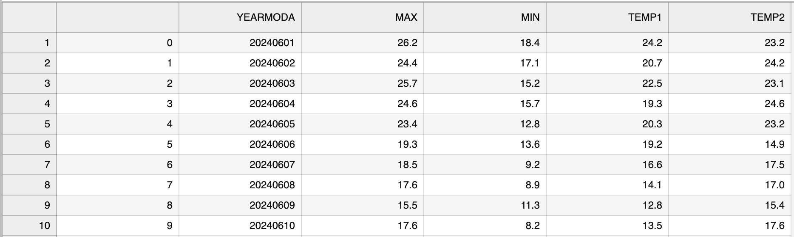
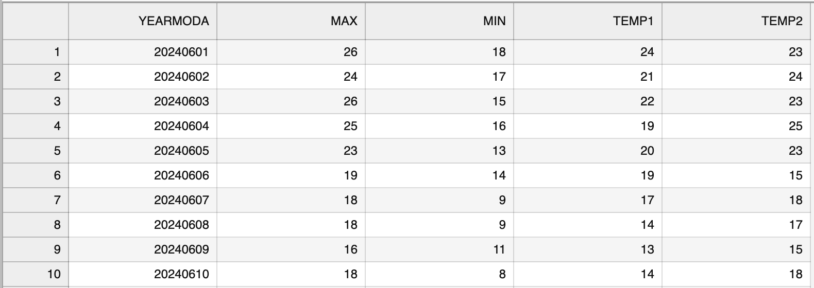

---
jupyter:
  jupytext:
    text_representation:
      extension: .md
      format_name: markdown
      format_version: '1.3'
      jupytext_version: 1.10.3
  kernelspec:
    display_name: Python 3
    language: python
    name: python3
---

# Getting started with pandas


## What is pandas?

``pandas`` [^urlpandas] is a modern, powerful and feature rich library that is designed for doing
data analysis in Python. It is a mature data analytics framework that is widely used among different fields of science, thus there exists a lot of good examples and documentation that can help you get going with your data analysis tasks. The development of pandas started in 2008 and it is now maintained by an active developer community ({cite}`McKinney2017`).

pandas is a "high-level" package, which means that it makes use of several other packages in the background.
Pandas combines the performance of powerful Python libraries such as ``numpy`` [^urlnumpy],
``matplotlib`` [^urlmatplotlib] and ``scipy`` [^urlscipy]. Thus, you can use many of the features included in those packages even without importing them separately. This book focuses primarily on pandas because it is easy-to-use, efficient and intuitive.

One of the most useful features of pandas is its ability to write and read data to and from numerous data formats.
It supports reading and writing data e.g. from/to:

- CSV
- JSON
- HTML
- MS Excel
- HDF5
- Stata
- SAS
- Python Pickle format
- SQL (Postgresql, MySQL, Oracle, MariaDB, etc.)

See full list from the latest pandas documentation [^urlpandasdocs].

<!-- #region deletable=true editable=true -->
## Pandas data structures

In pandas, table-like data are stored in two-dimensional `DataFrame` with labeled rows and columns. You can think of the pandas DataFrame as a programmable spreadsheet. The pandas DataFrame was originally inspired by dataframes that are in-built in the R programming language. One-dimensional sequences of values are stored in pandas `Series`. One row or one column in a pandas DataFrame is actually a pandas Series. You can think of a pandas Series as a clever list. These pandas structures incorporate a number of things we've already encountered, such as indices, data stored in a collection, and data types.


As you can see from Figure X, both the DataFrame and Series in pandas have an index that can be used to select values, but they also have column labels to identify columns in DataFrames. In the next sections, we will use many of these features to explore real-world data and learn some useful data analysis procedures. For a comprehensive overview of pandas data structures, we recommend you to have a look at pandas online documentation about data structures [^urlds] as well as Chapter 5 in {cite}`McKinney2017`.
<!-- #endregion -->

<!-- #region -->
## Reading tabular data 

In the following sections, we will learn how to read data from a text file ("Kumpula-June-2016-w-metadata.txt") which contains weather observations from Kumpula, Helsinki (Finland). The data was retrieved from NOAA [^urlnoaa1] climate database and it contains observed daily mean, minimum, and maximum temperatures from June 2016, recorded by a weather observation station in Kumpula. The file includes altogether 30 rows of observations (one per day). You can read further details from the ``data section`` at the end of the book. The first fifteen rows in the file look like following:

```
# Data file contents: Daily temperatures (mean, min, max) for Kumpula, Helsinki
#                     for June 1-30, 2016
# Data source: https://www.ncdc.noaa.gov/cdo-web/search?datasetid=GHCND
# Data processing: Extracted temperatures from raw data file, converted to
#                  comma-separated format
#
# David Whipp - 02.10.2017

YEARMODA,TEMP,MAX,MIN
20160601,65.5,73.6,54.7
20160602,65.8,80.8,55.0
20160603,68.4,,55.6
20160604,57.5,70.9,47.3
20160605,51.4,58.3,43.2
20160606,52.2,59.7,42.8
```


Now as we have familiarized ourselves with the data, we can continue and see how to read the CSV with pandas. Let's start by importing the ``pandas`` module. It is customary to import pandas as `pd`:
<!-- #endregion -->

```python deletable=true editable=true
import pandas as pd
```

<!-- #region deletable=true editable=true -->
Next, we will read the input data file and store the contents of that file into a variable called `data` Using the `read_csv()` function:
<!-- #endregion -->

```python deletable=true editable=true jupyter={"outputs_hidden": false}
data = pd.read_csv('data/Kumpula-June-2016-w-metadata.txt')
```


Our input file is a comma-delimited file, meaning that the columns in the data are separted by commas (`,`) on each row. The `read_csv()` function uses comma as the default delimiter, hence we did not need to specify it separately in the command above. If all went as planned, you should now have a new variable `data` in memory that contains the input data. 

It is quite common to have some other character instead of comma separating the columns from each other. The `read_csv()` is a generic function for reading text-based data files, supporting files separated by commas, spaces, or other common separators. The `sep` parameter can be used to specify which character is used as a delimiter. For instance `sep=';'`, would assume that the columns in the data file are delimited with semicolon (`;`). For a full list of available parameters, please refer to the pandas documentation for pandas.read_csv [^urlreadcsv], or run `help(pd.read_csv)`. Pandas has also several functions for parsing input data from different formats. For example, reading Excel files can be easily done by using a function `read_excel()`. Another useful function is `read_pickle()` that reads data stored in the Python pickle format. Check out the pandas documentation about input and output functions [^urlpandasiotools] for more details about reading data.


Let's check the the contents of this variable. You can print the contents of your DataFrame (or a snippet of it) simply by calling `data`. However, quite often you want to check only n-number of first (or last) rows in your data. For doing that, we can use the `head()` method of the pandas DataFrame object that will, by default, return the first 5 rows of the DataFrame. You can return any number of rows by adding a number inside the parentheses, such as 10 which will return the first ten rows of data:

```python deletable=true editable=true jupyter={"outputs_hidden": false}
print(data.head(10))
```

<!-- #region deletable=true editable=true -->
This looks OK, but there are some strange values present such as `NaN`, and the first lines of the dataframe look a bit weird. `NaN` stands for "not a number", and might indicate some problem with reading in the contents of the file. Plus, we expected about 30 lines of data, but the index values go up to 36 when we print the contents of the `data` variable. Looks like we need to investigate this further.
<!-- #endregion -->

<!-- #region deletable=true editable=true -->
As we can observe, there are some metadata at the top of the file giving basic information about its contents and source. This isn't data we want to process, so we need to skip over that part of the file when we load it. Here are the 8 first rows of data in the text file (note that the 8th row is blank):
<!-- #endregion -->

<!-- #region deletable=true editable=true -->
```
# Data file contents: Daily temperatures (mean, min, max) for Kumpula, Helsinki
#                     for June 1-30, 2016
# Data source: https://www.ncdc.noaa.gov/cdo-web/search?datasetid=GHCND
# Data processing: Extracted temperatures from raw data file, converted to
#                  comma-separated format
#
# David Whipp - 02.10.2017

```
<!-- #endregion -->

<!-- #region deletable=true editable=true -->
Fortunately, skipping over rows is easy to do when reading data with pandas. We just need to add the `skiprows` parameter when we read the file, listing the number of rows to skip (8 in this case). Let's try reading the datafile again, and this time defining the `skiprows` parameter.
<!-- #endregion -->

```python deletable=true editable=true jupyter={"outputs_hidden": false}
data = pd.read_csv('data/Kumpula-June-2016-w-metadata.txt', skiprows=8)
```

<!-- #region deletable=true editable=true -->
Let's now print the dataframe and see what changed:
<!-- #endregion -->

```python deletable=true editable=true jupyter={"outputs_hidden": false}
data.head()
```

<!-- #region deletable=true editable=true -->
After reading the data, it is always good to check that everything went well by printing out the data as we did here. We can also check the last rows of the data using `data.tail()`:
<!-- #endregion -->

```python
data.tail()
```

<!-- #region deletable=true editable=true -->
Note that pandas DataFrames have **labelled axes (rows and columns)**.  In our sample data, the rows labeled with an index value (`0` to `29`), and columns labelled `YEARMODA`, `TEMP`, `MAX`, and `MIN`. Later on, we will learn how to use these labels for selecting and updating subsets of the data. 
<!-- #endregion -->

<!-- #region deletable=true editable=true -->
It is also possible to read only specific columns from the data when using the `read_csv` function. You can achieve this using the `usecols` parameter when reading the file which accepts a list of column names that will be included in the resulting DataFrame. Also positional indices (e.g. `[0, 1]`) corresponding the position of the column in the file can be used to specify which columns should be read. For additional details, see the pandas documention [^readcsv]. Next, we will read the file `Kumpula-June-2016-w-metadata.txt` again and store its contents into a new variable called `temp_data`. In this case, we will only read the columns `YEARMODA` and `TEMP`, meaning that the new variable `temp_data` should have 30 rows and 2 columns:
<!-- #endregion -->

```python
temp_data = pd.read_csv('data/Kumpula-June-2016-w-metadata.txt', 
                        skiprows=8, usecols=["YEARMODA", "TEMP"])
temp_data.head()
```

As a result, we now have only two columns instead of the original four. Using the `usecols` function to limit the number of columns can be useful when having datafiles with possibly tens or even hundreds of columns. Typically you are not interested in all of them, but you want focus on only a few important ones which you can select already when reading the data.  

<!-- #region editable=true -->
## Writing data to a file

Naturally, it is also possible to write the data from pandas to a file. Pandas is an excellent tool for reading and writing data, as it supports all common data formats by default [^pandasio], such as CSV, Excel, JSON, HDF5, Pickle etc. In addition, reading and writing from/to various databases is supported. One of the most typical output formats is CSV file. Function `to_csv()` can be used to easily save your data in CSV format.
Let's first save the data from our `data` DataFrame into a file called `Kumpula_temp_results_June_2016.csv`.
<!-- #endregion -->

```python editable=true jupyter={"outputs_hidden": false}
# define output filename
output_fp = "Kumpula_temps_June_2016.csv"

# Save dataframe to csv
data.to_csv(output_fp, sep=',')
```

<!-- #region editable=true -->


Now we have the data from our DataFrame saved to a file. Figure X shows how it looks using a JupyterLab viewer.
As we can see, the first column in the datafile contains now the index value of the rows which can be a bit annoying. Also the temperature values are represented with decimals (1 decimal in this case). Sometimes you might want to store the data without any decimals (i.e. round them to a full integer) or to have a smaller number of decimals. Luckily, it is easy to deal with such cases in pandas when saving the files. Next, we will save the temperature values from out `data` DataFrame without the index, and with zero decimals converting the decimal numbers to integers. Omitting the index can be with `index=False` parameter. Specifying how many decimals should be written can be done with `float_format` parameter where text `%.0f` defines pandas to use 0 decimals in all columns when writing the data to a file (changing the value from 0 to 1 would write 1 decimal etc.):
<!-- #endregion -->

```python editable=true jupyter={"outputs_hidden": false}
# define output filename
output_fp2 = "Kumpula_temperatures_integers_June_2016.csv"

# Save dataframe to csv
data.to_csv(output_fp2, sep=',', index=False, float_format="%.0f")
```

<!-- #region editable=true -->
As a result (Figure X), we have a "cleaner" output file without the index column, and temperatures are rounded to integers. This approach can be a useful "trick" to quickly clean and round your numerical data with many decimals.


<!-- #endregion -->

<!-- #region deletable=true editable=true -->
## DataFrame properties

Now we will continue exploring the full dataset that we have stored in the variable `data`. A normal first step when you load new data is to explore the dataset a bit to understand how the data is structured, and what kind of values are stored in there. Let's start by checking the size of our DataFrame. We can use the `len()` function similar to the use with lists to check how many rows we have:
<!-- #endregion -->

```python deletable=true editable=true jupyter={"outputs_hidden": false}
len(data)
```

<!-- #region deletable=true editable=true -->
We can also get a quick sense of the size of the dataset using the `shape`. It returns a `tuple` with the number of rows as the first element and the number of columns as the second element:
<!-- #endregion -->

```python deletable=true editable=true jupyter={"outputs_hidden": false}
data.shape
```

<!-- #region deletable=true editable=true -->
Here we see that our dataset has 30 rows and 4 columns, just as we saw above when printing out the entire DataFrame. Pay attention that we do not use parentheses after the word `shape` when accessing attributes. The `shape` in here is one of the several ``attributes`` related to a pandas DataFrame object. Attributes are typically used to store useful information (or *metadata*) about the object at hand. We will see many more examples of these throughout the book. 

<!-- #endregion -->

Let's also check the column names we have in our DataFrame (yes, it is an attribute as well!). We already saw the column names when we checked the 5 first rows using `data.head()`, but often it is useful to access the column names directly. You can check the column names by calling `data.columns` (returns an index object that contains the column labels) or `data.columns.values`:

```python deletable=true editable=true jupyter={"outputs_hidden": false}
data.columns.values
```

<!-- #region deletable=true editable=true -->
We can also find information about the row identifiers using the `index` attribute:
<!-- #endregion -->

```python deletable=true editable=true jupyter={"outputs_hidden": false}
data.index
```

<!-- #region deletable=true editable=true -->
Here we see how the data is indexed, starting at 0, ending at 30, and with an increment of 1 between each value. This is basically the same way in which Python lists are indexed, however, pandas allows also other ways of identifying the rows. DataFrame indices could, for example, be character strings, or date objects. We will learn more about resetting the index later. What about the data types of each column in our dataFrame? We can check the data type of all columns at once using `pandas.DataFrame.dtypes`:
<!-- #endregion -->

```python deletable=true editable=true jupyter={"outputs_hidden": false}
# Print data types
data.dtypes
```

<!-- #region deletable=true editable=true -->
Here we see that `YEARMODA` is an integer value (with 64-bit precision; ``int64``), while the other values are all decimal values with 64-bit precision (float64).
<!-- #endregion -->


_**Check your understanding (online)**_

Using the interactive online version of this book, see if you can find a way to print out the number of columns in our DataFrame. 

```python
# Add your solution here
```

## Selecting columns


When conducting data analysis, it is very common that you want to choose certain columns from the data for further processing. We can select specific columns based on the column values. The basic syntax is `dataframe[value]`, where value can be a single column name, or a list of column names. Let's start by selecting two columns, `'YEARMODA'` and `'TEMP'`:

```python
selection = data[['YEARMODA','TEMP']]
selection.head()
```

Let's also check the data type of this selection:

```python
type(selection)
```

As we can see, the subset is still a pandas DataFrame, and we are able to use all the methods and attributes related to a pandas DataFrame also with this subset. For example, we can check the shape:

```python
selection.shape
```

<!-- #region deletable=true editable=true -->
We can also access a single column of the data based on the column name:
<!-- #endregion -->

```python deletable=true editable=true jupyter={"outputs_hidden": false}
data['TEMP'].head()
```

What about the type of the column itself?

```python deletable=true editable=true jupyter={"outputs_hidden": false}
type(data['TEMP'])
```

<!-- #region deletable=true editable=true -->
Each column (and each row) in a pandas data frame is indeed a pandas Series. Notice that you can also retreive a column using a different syntax `data.TEMP`. This syntax works only if the column name is a valid name for a Python variable (e.g. the column name should not contain whitespace). The syntax `data["column"]` works for all kinds of column names, so we recommend using this approach.
<!-- #endregion -->

## Unique values

Sometimes it is useful to extract the unique values that you have in your column. We can do that by using `unique()` method:

```python
data['TEMP'].unique()
```

As a result we get an array of unique values in that column. We can also directly access the number of unique values using the `nunique()` method:

```python editable=true jupyter={"outputs_hidden": false}
print("There were", data['TEMP'].nunique(), "days with unique mean temperatures in June 2016.")
```

## Descriptive statistics

<!-- #region deletable=true editable=true -->
pandas DataFrame and Series contain useful methods for getting summary statistics. Available methods include `mean()`, `median()`, `min()`, `max()`, and `std()` (the standard deviation). The statistics can be calculated on a Series level (a single column) or getting the statistics for all columns at once for the whole DataFrame. To check e.g. the mean temperature in out input data, i.e. focusing on a single column (*Series*), we can do following: 
<!-- #endregion -->

```python deletable=true editable=true jupyter={"outputs_hidden": false}
data['TEMP'].mean()
```

The output in this case will be a single floating point number presenting the mean temperature, 59.73 Fahrenheits. To get the mean statistics for all columns in the DataFrame, we can call the `mean()` in a similar manner, but without specifying the column name:

```python
data.mean()
```

<!-- #region deletable=true editable=true -->
Notice that in this case, the result is Series showing the mean values for each column. For an overview of the basic statistics for all attributes in the data, we can use the `describe()` method:
<!-- #endregion -->

```python deletable=true editable=true jupyter={"outputs_hidden": false}
data.describe()
```

As a result, we get the number of values that are not None for each column (count) as well as the basic statistics and quartiles (min, 25%, 50%, 75% and max). It is also possible to get other DataFrame specific information, such as the index dtype and columns, non-null values and memory usage by calling `info()`: 

```python
data.info()
```

<!-- #region deletable=true editable=true -->
## Different ways of constructing pandas objects

Most often we create pandas objects by reading in data from an external source, such as a text file. Here, we will briefly show different ways how you can create pandas objects from Python objects (lists and dictionaries). If you have a very long lists of numbers, creating a pandas Series (or numpy.array) will allow you to interact with these values more efficiently in terms of computing time that using and working with a pure Python list. This is how you can create a pandas Series from a list:
<!-- #endregion -->

```python deletable=true editable=true jupyter={"outputs_hidden": false}
number_series = pd.Series([ 4, 5, 6, 7.0])
print(number_series)
```

<!-- #region deletable=true editable=true -->
Note that Pandas is smart about the conversion, detecting a single floating point value (`7.0`) and assigning all values in the Series the data type float64. If needed, you can also set a custom index when creating the object:
<!-- #endregion -->

```python
number_series = pd.Series([ 4, 5, 6, 7.0], index=['a','b','c','d'])
print(number_series)
```

```python
type(number_series)
```

How about combining several lists and construct a DataFrame from them? Certainly. Let's see how we can convert lists into a pandas DataFrame. Let's first create a few lists having the same number of items each:

```python
stations = ['Hanko', 'Heinola', 'Kaisaniemi', 'Malmi']
latitudes = [59.77, 61.2, 60.18, 60.25]
longitudes = [22.95, 26.05, 24.94, 25.05]
```

Now we can create a pandas DataFrames by using the `pandas.DataFrame` constructor and passing a *Python dictionary* `{"column_1": list_1, "column_2": list_2, ...}` to it, indicating the structure of our data:

```python
new_data = pd.DataFrame(data = {"station" : stations, 
                                "lat" : latitudes, "lon" : longitudes})
new_data
```

It is also possible to create pandas DataFrame from a list of dictionaries. Hence, this approach is quite similar as the previous example, but we organize the data a bit differently. Having a list of dictionaries is common if you happen to work with ``JSON`` files, which are commonly used when reading data from the web (e.g. via ``Application Programming Interface``):

```python
dictionaries = [{'station': 'Hanko', 'lat': 59.77, 'lon': 22.95},
                {'station': 'Heinola', 'lat': 61.2, 'lon': 26.05},
                {'station': 'Kaisaniemi', 'lat': 60.18, 'lon': 24.94},
                {'station': 'Malmi', 'lat': 60.25, 'lon': 25.05}]

# Pass the list into the DataFrame constructor
new_data_2 = pd.DataFrame(dictionaries)
new_data_2
```

As a result, we got an identical DataFrame as in our first example above. Notice, that sometimes you might start working with an empty DataFrame and only later "populate" it with new columns:

```python
df = pd.DataFrame()
print(df)
```

Now we have an empty DataFrame, and we can add new columns to it based on the lists we created earlier. Notice that the following approach requires that the length of all the lists that you want to add are equal:  

```python
df["lon"] = longitudes
df["lat"] = latitudes
df
```

## Exercises

In this exercise your task is to open and explore a NOAA weather data file using Pandas. The data file name is 6153237444115dat.csv and it is located in the data folder (*add link*). An overview of the tasks in this exercise:

 - Import the Pandas module
 - Read the data using Pandas into a variable called data
 - Calculate a number of basic statistics from the data


### Problem 1 - Read the file and clean it

Import the pandas module and read the weather data into a variable called `data`. Print the first five rows of the data file. 


### Problem 2 - Basic characteristics of the data

Based on the `data` DataFrame from Problem 1, answer to following questions:

1. How many rows is there in the data?
2. What are the column names?
3. What are the datatypes of the columns?

<!-- #region -->
### Problem 3 - Descriptive statistics

Based on the `data` DataFrame from Problem 1, answer to following questions:


 - What is the mean Fahrenheit temperature in the data (use the `TEMP` column)?
 - What is the standard deviation of the Maximum temperature (use the `MAX` column)?
 - How many unique stations exists in the data (use the `USAF` column)?
<!-- #endregion -->

## Footnotes

[^urlpandas]: <http://pandas.pydata.org/>
[^urlnumpy]: <http://www.numpy.org/>
[^urlmatplotlib]: <https://matplotlib.org/>
[^urlscipy]: <https://www.scipy.org/>
[^urlpandasdocs]: <https://pandas.pydata.org/pandas-docs/stable/>
[^urlds]: <https://pandas.pydata.org/pandas-docs/stable/user_guide/dsintro.html>
[^urnlnoaa2]: <https://www.ncdc.noaa.gov/cdo-web/>
[^urlreadcsv]: <https://pandas.pydata.org/pandas-docs/stable/reference/api/pandas.read_csv.html>
[^urlpandasiotools]: <https://pandas.pydata.org/pandas-docs/stable/user_guide/io.html#io-tools-text-csv-hdf5>
[^urlpandasattributes]: <https://pandas.pydata.org/pandas-docs/stable/reference/frame.html#attributes-and-underlying-data>
[^urlnoaa1]: <https://www.ncdc.noaa.gov/>
[^readcsv]: <https://pandas.pydata.org/pandas-docs/stable/generated/pandas.read_csv.html>
