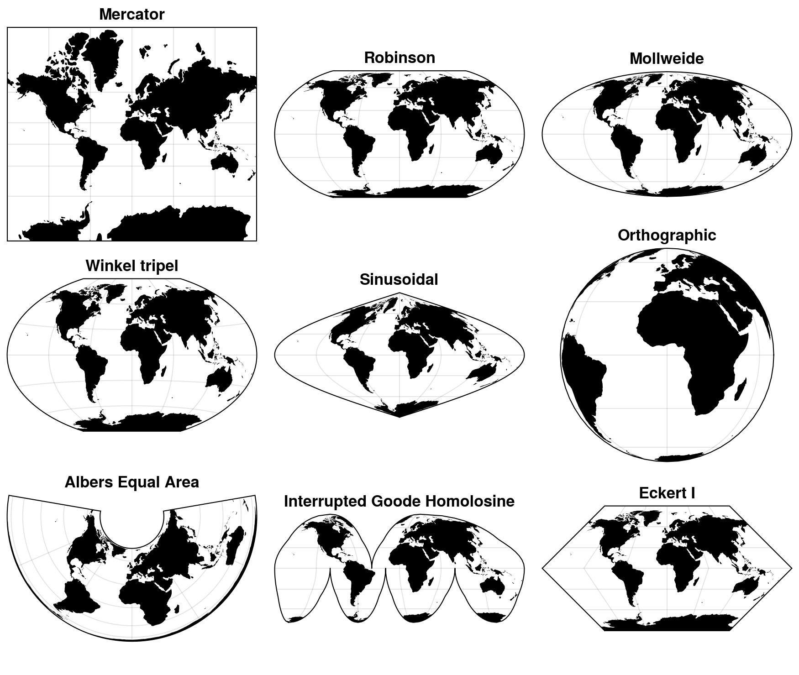

---
jupyter:
  jupytext:
    text_representation:
      extension: .md
      format_name: markdown
      format_version: '1.3'
      jupytext_version: 1.14.4
  kernelspec:
    display_name: Python 3 (ipykernel)
    language: python
    name: python3
---

# Coordinate reference systems


## Georeferencing

Majority of all the information in the world can be traced to a specific location ({cite}`Hahmann_2013`). This process of attaching information about a location to a piece of information is commonly referred as {term}`georeferencing` or {term}`geocoding`. There are various commonly used systems for georeferencing that represent the data at different positional accuracy ({cite}`Longley_2015`), such as place names (varying accuracy),  postal codes (accuracy at areal level), postal addresses (accuracy at door/mailbox level), or latitude and longitude coordinates (up to millimeter level accuracy). In this book, we will do georeferencing by converting addresses into coordinates (and vice versa), which is a common operation to do when working with data that is not directly delivered in geospatial format. 

Being able to position oneself on Earth (and in the universe) has been an important task for humans for centuries. The most spatially accurate information about the location of a specific object can be obtained by using geodetic techniques. Geodesy is the science that focuses on accurately measuring and understanding different properties of the Earth, such as its shape, orientation in space and gravity. It also provides various fundamental methods that enable us to locate ourselves when using navigation services, or do spatial analysis with GIS in a meaningful manner. 


## Key elements of a Coordinate Reference System

Previously, we learned how geographic data can be represented on a computer as vector, raster or network data. However, we didn't yet touch upon one fundamental aspect of geographic data: {term}`coordinate reference system` (CRS). A coordinate reference system is important because without the CRS, the geographic data is simply a collection of coordinates in an arbitrary space. A CRS tells the GIS tools how the coordinates or geometries are related to the places on Earth. In principle, every geographic dataset should have specific CRS-related information attached to it (if not, it might be difficult or impossible to use the data in GIS). This kind of additional information is called as {term}`metadata`, because it provides important contextual information about the dataset, such as CRS or the timestamp when the data was created. 

What kind of things are described with the Coordinate Reference System? A CRS typically describes the geographic data with three main components: datum, map projection and additional parameters. These components provide information about how the geographic data can be linked to the Earth's surface: 

1. **Datum**: A datum specification consists of a model for Earth's size and shape, such as a reference ellipsoid or a geoid, which describes the average sea level surface of the Earth. One of the most commonly used datums is the World Geodetic System (WGS84). Datum also contains information about the origin of the coordinate system, i.e. the reference point at which the ellipsoid/geoid is tied to a known location on Earth. This is used as a reference for determining the location of other control points that have been precisely measured from the origin. Reference points are useful because they can also be used to check the accuracy of GNSS/GPS receivers. Finally, the datum includes the orientation parameters, which describe the orientation of the coordinate system with respect to the Earth's surface. They contain information about the tilt of the axis and the position of the origin relative to the Earth's surface.

2. **Map projection**: The projection defines the mathematical transformation used to map the Earth's surface onto a two-dimensional plane. Each projection has its own strengths and weaknesses, and the choice of projection depends on the intended use of the map and the area to be mapped (see more details below).

3. **Additional Parameters**: These parameters define additional information required to fully define the CRS, such as the central meridian, standard parallel, and scale factor. These parameters may also include information about the origin and orientation of the coordinate system, and the conversion between the projected coordinates and the geographic coordinates.

It is also good to be aware that a CRS can be either geographic (based on latitude and longitude) or projected (based on a Cartesian coordinate system). Geographic CRSs describe positions on the Earth's surface using latitude and longitude, while projected CRSs describe positions on a two-dimensional plane using a Cartesian coordinate system.


## Map projection - Representing curved surface in two dimensions

As mentioned previously, one core component of the coordinate reference system is the *{term}`map projection`* which determines how we draw the geometries representing earth's curved surface on a two-dimensional plane. This process uses a mathematical method to map the coordinates of a location (latitude and longitude) onto a flat surface, i.e. on a map ({cite}`Vermeer2019`). As it happens, transforming data from 3D to 2D is not a very straightforward process, and when we use a map projection the output will always be distorted in some way or another (Figure 5.9). 


_**Figure 5.9**. When representing the curved surface of the Earth in 2D space, the output will always be somehow distorted. Modified after {cite:t}`Vermeer2019`._


A good way to understand the way how the map projection works, is the "orange peel analogy". You can imagine that the Earth is a citrus fruit which you are peeling. A datum is the fruit that you choose to peal (orange, satsuma, grapefruit, lemon), and they all have a bit different shape and size. The map projection then is the approach you choose to peel the fruit and make it flat. 


_**Figure 5.10**. Representing the process of map projection with an orange ([Source](http://profdrikageografia.blogspot.com/2010_12_01_archive.html))._


When using map projections, we always make approximations and hence lose something. There are no projections that would not distort anything or have the same scale throughout the map. Hence, a projection needs to be chosen according to the purpose of use, in order to preserve specific aspects of the map that are the most important to the user. These can be for example the shapes of objects, their surface areas, correct distances between locations, or the compass direction ({cite}`Vermeer2019`).
- If we want to preserve angles and ratios of distances, we speak of a conformal, or angle-preserving projections (such as Mercator projection). These kind of projections has historically been important e.g. for ship navigation. With conformal map projection, both the distances and surface areas are distorted, except at some special points of the map.
- If we want to preserve correct area measure, we speak of an equivalent or equal-area projection (such as Mollweide or Albers equal area). Here, the angles and shapes are distorted, again with the exception of special points or lines. 
- If we want to preserve correct distances, we speak of an equidistant projection (such as Azimuthal equidistant). A projection can be equidistant only for a certain point (i.e. it is centered to specific location) or along certain lines, never everywhere. 


Figure 5.11 illustrates nine different map projections, where the latitude and longitude coordinates representing the land areas of the earth have been systematically transformated into a plain surface. As you can see, there are numerous ways to represent the world in "flattened" state, and all the projections have their unique characteristics, strengths and weaknesses. In other words, there is no perfect or "correct" projection (but they are still useful), and one needs to choose a projection depending on what is the purpose of the map and the best one for your needs. Choosing an appropriate projection for your map is not always straightforward because it depends on what you actually want to represent with your map, and what is the spatial scale of your data.




_**Figure 5.11**. Different map projections that can be used to represent the geographic data on a two-dimensional plane._


## Storing and exchanging the CRS information 

The CRS information of a geographic dataset can be stored in various different ways. Some of the most common systems to store the CRS information are EPSG, PROJ and OGC WKT. All of these basically serve the same purpose: they store the key characteristics of a given coordinate reference system in a standardized manner which is essential for being able to work with geographic data using any GIS software or library (not limited to Python). Below, you can find some basic information about the most commonly used systems to store CRS information:

- **EPSG registry** (Geodetic Parameter Dataset): This is a public registry maintained by the European Petroleum Survey Group (EPSG) that contains information on a wide range of coordinate reference systems, including geographic and projected CRSs, and datums. It is widely used in GIS software and is an open and freely accessible resource. EPSG codes are numbers that identify different CRS from each other. These numbers, such as 4326 for WGS84 coordinate system, are commonly used to determine a CRS for a specific dataset or when reprojecting the data, because these simple numbers are easy to remember and use. We also refer to these EPSG codes commonly in this book.

- **PROJ system**: PROJ is another system and open source library for storing and transforming CRS information from one system to another. The CRS information in this one is commonly stored as a *"proj-strings"*, which includes information about the coordinate system as a plain text following specific naming conventions for the parameters. Typically these parameters provide information e.g. about the datum, ellipsoid, projection of the data, and units for the coordinates (e.g. meters). There can also be information about the Univeral Tranverse Mercator (UTM) zone if the data is using Cartesian coordinate system. In UTM, the data is presented on a plain and the world has been divided into 60 zones where each zone is 6-degrees of longitude in width. You can read more details and useful documentation about coordinate systems from the [PROJ website](https://proj.org/) [^PROJ]. As an example, PROJ4 text for the ETRS-TM35FIN coordinate system (EPSG:3067) commonly used in Finland, is described with following text: 

```
+proj=utm +zone=35 +ellps=GRS80 +towgs84=0,0,0,0,0,0,0 +units=m +no_defs +type=crs`
```

- **OGC WKT**: Open Geospatial Consortium's (OGC) well-known text (WKT) representation of coordinate reference systems is also widely used format to store CRS information. This one is typically more lengthy as it aims to be human-readable and also provide description about coordinate operations. The following shows how the ETRS-TM35FIN coordinate system (EPSG:3067) would be presented as OGW WKT:

```
PROJCS["ETRS89 / TM35FIN(E,N)",
    GEOGCS["ETRS89",
        DATUM["European_Terrestrial_Reference_System_1989",
            SPHEROID["GRS 1980",6378137,298.257222101,
                AUTHORITY["EPSG","7019"]],
            TOWGS84[0,0,0,0,0,0,0],
            AUTHORITY["EPSG","6258"]],
        PRIMEM["Greenwich",0,
            AUTHORITY["EPSG","8901"]],
        UNIT["degree",0.0174532925199433,
            AUTHORITY["EPSG","9122"]],
        AUTHORITY["EPSG","4258"]],
    PROJECTION["Transverse_Mercator"],
    PARAMETER["latitude_of_origin",0],
    PARAMETER["central_meridian",27],
    PARAMETER["scale_factor",0.9996],
    PARAMETER["false_easting",500000],
    PARAMETER["false_northing",0],
    UNIT["metre",1,
        AUTHORITY["EPSG","9001"]],
    AXIS["Easting",EAST],
    AXIS["Northing",NORTH],
    AUTHORITY["EPSG","3067"]]
```

All of these systems and formats are designed to ensure that CRS information can be stored, transmitted, and used consistently across different systems and applications, which is essential for accurate location-based data analysis and mapping. In Chapters 6 and 7, we will see how to work with coordinate reference systems in Python when working with vector and raster data.


## Footnotes

[^PROJ]: <https://proj.org/>
