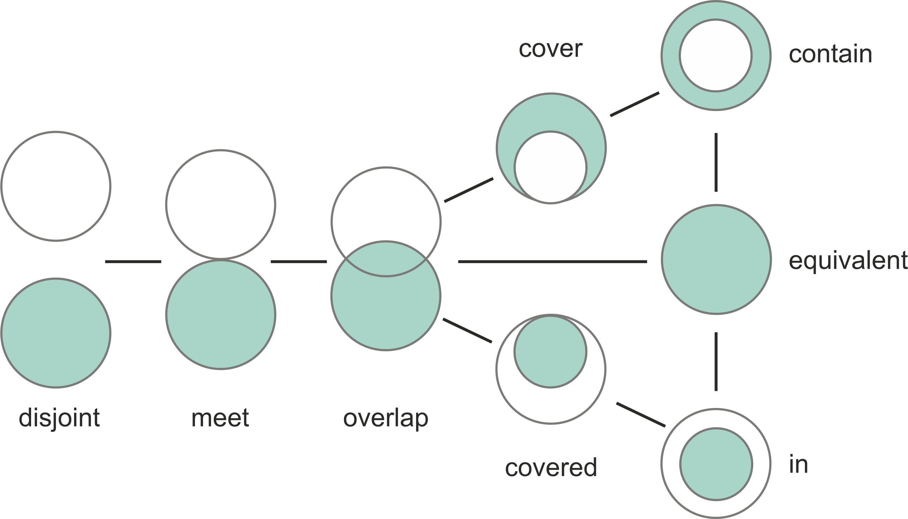

---
jupyter:
  jupytext:
    text_representation:
      extension: .md
      format_name: markdown
      format_version: '1.3'
      jupytext_version: 1.15.2
  kernelspec:
    display_name: Python 3 (ipykernel)
    language: python
    name: python3
---

# Spatial queries

Finding out if a certain point is located inside of an area, or whether a line intersects with another line (or a polygon) are one of the fundamental geospatial operations that are needed when e.g. selecting data for a specific region. These kind of spatial queries relate to {term}`topological spatial relations` which are fundamental constructs that describe how two or more geometric objects relate to each other concerning their position and boundaries. Topological spatial relations can be exemplified by relationships such as *contains*, *touches* and *intersects* ({cite}`Clementini_1994`). In GIS, these kind of topological relations play a crucial role as they enable queries that are less concerned with the exact coordinates or shapes of geographic entities but more focused on their relative arrangements and positions. For instance, regardless of their exact shape or size, a lake *inside* a forest maintains this relationship even if the forest's boundaries or the lake's size change slightly, as long as the lake remains enclosed by the forest. Next, we will learn a bit more details about these topological relations and how to use them for spatial queries in Python.


## Topological spatial relations

Computationally, conducting queries based on topological spatial relations, such as detecting if a point is inside a polygon can be done in different ways but most GIS software rely on something called {term}`Dimensionally Extended 9-Intersection Model` ([DE-9IM](https://en.wikipedia.org/wiki/DE-9IM) [^DE-9IM]). DE-9IM is a fundamental framework in GIS used for describing and analyzing spatial relationships between geometric objects ({cite}`Clementini_1993`). DE-9IM provides a systematic matrix-based approach where the rows and columns represent the interior, boundary, and exterior of two geometric shapes being compared. By examining the intersections of these parts, a detailed characterization of their spatial relationship can be achieved. When testing how two geometries relate to each other, the DE-9IM model gives a result which is called {term}`spatial predicate`. The **Figure 6.XX** shows eight common spatial predicates based on the spatial relationship between the geometries ({cite}`Egenhofer_1992`). Many of these predicates, such as *intersects*, *within*, *contains* and *touches* are commonly used when selecting data for specific area of interest or when joining data from one dataset to another based on the spatial relation between layers. 



_**Figure 6.XX**. Eight common spatial predicates formed based on spatial relations between two geometries. Modified after Egenhofer et al. (1992)_


The top row of the **Figure 6.XX** shows spatial predicates in which the geometries A and B are clearly disjoint from each other, contained or within each other, or identical to each other. The bottom row shows examples of spatial relationships that are slightly "special cases" in one way or another. When two geometries *touch* each other, they have at least one point in common at the border, but their interiors do not intersect with each other. When the interiors of the geometries A and B are on top of each other (or have at least one point in common), the geometries are said to be *intersecting* with each other. The spatial predicate for *covers* is when the interior of geometry B is almost totally within A, except at least one common coordinate at the border. Similarly, if geometry A is almost totally contained by the geometry B (except at least one common coordinate at the border) the spatial predicate is called *covered by*. These eight examples represent some of the common spatial predicates based on two Polygon shapes. When other shapes are considered (Points, LineStrings), there are plenty of more topological relations: altogether 512 with 2D data.


## Making spatial queries in Python

Luckily, when working with Python, we do not need to create such functionalities ourselves, but we can take advantage of DE-9IM functionalities implemented in shapely and geopandas that can evaluate the topolocical relationships between geographical objects.

There are basically two ways of conducting PIP in Shapely:

1. using a function called
   [within()](https://shapely.readthedocs.io/en/stable/manual.html#object.within)
   that checks if a point is within a polygon
2. using a function called
   [contains()](https://shapely.readthedocs.io/en/stable/manual.html#object.contains)
   that checks if a polygon contains a point

Notice: even though we are talking here about **Point** in Polygon
operation, it is also possible to check if a LineString or Polygon is
inside another Polygon.

Let's import shapely functionalities and create some points:

```python
from shapely.geometry import Point, Polygon

# Create Point objects
p1 = Point(24.952242, 60.1696017)
p2 = Point(24.976567, 60.1612500)
```

Let's also create a polygon using a list of coordinate-tuples:

```python deletable=true editable=true jupyter={"outputs_hidden": false}
# Create a Polygon
coords = [
    (24.950899, 60.169158),
    (24.953492, 60.169158),
    (24.953510, 60.170104),
    (24.950958, 60.169990),
]
poly = Polygon(coords)
```

```python
# Let's check what we have
print(p1)
print(p2)
print(poly)
```

<!-- #region deletable=true editable=true -->
- Let's check if those points are ``within`` the polygon:
<!-- #endregion -->

```python
# Check if p1 is within the polygon using the within function
p1.within(poly)
```

```python deletable=true editable=true jupyter={"outputs_hidden": false}
# Check if p2 is within the polygon
p2.within(poly)
```

<!-- #region deletable=true editable=true -->
Okey, so we can see that the first point seems to be inside that polygon
and the other one isn't.

-In fact, the first point is quite close to close to the center of the polygon as we
can see if we compare the point location to the polygon centroid:
<!-- #endregion -->

```python deletable=true editable=true jupyter={"outputs_hidden": false}
# Our point
print(p1)

# The centroid
print(poly.centroid)
```

<!-- #region deletable=true editable=true -->
It is also possible to do PIP other way around, i.e. to check if
polygon contains a point:
<!-- #endregion -->

```python
# Does polygon contain p1?
poly.contains(p1)
```

```python deletable=true editable=true jupyter={"outputs_hidden": false}
# Does polygon contain p2?
poly.contains(p2)
```

<!-- #region deletable=true editable=true -->
Thus, both ways of checking the spatial relationship are identical; [contains()](https://shapely.readthedocs.io/en/stable/manual.html#object.contains) is inverse to [within()](https://shapely.readthedocs.io/en/stable/manual.html#object.within) and vice versa.

Which one should you use then? Well, it depends:

-  if you have **many points and just one polygon** and you try to find out
   which one of them is inside the polygon: You might need to iterate over the points and check one at a time if it
   is **within()** the polygon.

-  if you have **many polygons and just one point** and you want to find out
   which polygon contains the point: You might need to iterate over the polygons until you find a polygon that **contains()** the point specified (assuming there are no overlapping polygons)
<!-- #endregion -->

<!-- #region -->

## Intersect

Another typical geospatial operation is to see if a geometry intersects
or touches another one. Again, there are binary operations in Shapely for checking these spatial relationships:

- [intersects():](https://shapely.readthedocs.io/en/stable/manual.html#object.intersects) Two objects intersect if the boundary or interior of one object intersect in any way with the boundary or interior of the other object.

- [touches():](https://shapely.readthedocs.io/en/stable/manual.html#object.touches) Two objects touch if the objects have at least one point in common and their interiors do not intersect with any part of the other object.
   

Let's try these out.

Let's create two LineStrings:
<!-- #endregion -->

```python deletable=true editable=true
from shapely.geometry import LineString, MultiLineString

# Create two lines
line_a = LineString([(0, 0), (1, 1)])
line_b = LineString([(1, 1), (0, 2)])
```

<!-- #region deletable=true editable=true -->
Let's see if they intersect
<!-- #endregion -->

```python deletable=true editable=true jupyter={"outputs_hidden": false}
line_a.intersects(line_b)
```

<!-- #region deletable=true editable=true -->
Do they also touch?
<!-- #endregion -->

```python deletable=true editable=true jupyter={"outputs_hidden": false}
line_a.touches(line_b)
```

<!-- #region deletable=true editable=true -->
Indeed, they do and we can see this by plotting the features together
<!-- #endregion -->

```python deletable=true editable=true jupyter={"outputs_hidden": false}
# Create a MultiLineString from line_a and line_b
multi_line = MultiLineString([line_a, line_b])
multi_line
```

<!-- #region deletable=true editable=true -->
_**Figure 6.27**. ADD PROPER FIGURE CAPTION!._

Thus, the ``line_b`` continues from the same node ( (1,1) ) where ``line_a`` ends.

However, if the lines overlap fully, they don't touch due to the spatial relationship rule, as we can see:

Check if `line_a` touches itself:
<!-- #endregion -->

```python deletable=true editable=true jupyter={"outputs_hidden": false}
# Does the line touch with itself?
line_a.touches(line_a)
```

<!-- #region deletable=true editable=true -->
It does not. However, it does intersect:
<!-- #endregion -->

```python deletable=true editable=true jupyter={"outputs_hidden": false}
# Does the line intersect with itself?
line_a.intersects(line_a)
```

## Point in Polygon using Geopandas

Next we will do a practical example where we check which of the addresses from [the geocoding tutorial](geocoding_in_geopandas.ipynb) are located in Southern district of Helsinki. Let's start by reading a KML-file ``PKS_suuralue.kml`` that has the Polygons for districts of Helsinki Region (data openly available from [Helsinki Region Infoshare](http://www.hri.fi/fi/dataset/paakaupunkiseudun-aluejakokartat).

Let's start by reading the addresses from the Shapefile that we saved earlier.

```python deletable=true editable=true
import os

os.environ["USE_PYGEOS"] = "0"
import geopandas as gpd

fp = "data/Helsinki/addresses.shp"
data = gpd.read_file(fp)

data.head()
```

<!-- #region deletable=true editable=true -->


It is possible to read the data from KML-files with GeoPandas in a similar manner as Shapefiles. However, we need to first, enable the KML-driver which is not enabled by default (because KML-files can contain unsupported data structures, nested folders etc., hence be careful when reading KML-files). Supported drivers are managed with a library called `fiona` that `geopandas` uses in the background to read files. Let's first check which formats are currently supported by calling [`fiona.supported_drivers`](https://github.com/Toblerity/Fiona/blob/master/fiona/drvsupport.py):
<!-- #endregion -->

```python
import geopandas as gpd
import fiona

fiona.supported_drivers
```

- Let's enable the read and write functionalities for KML-driver by passing ``'rw'`` to whitelist of fiona's supported drivers:

```python deletable=true editable=true
fiona.supported_drivers["KML"] = "rw"
```

Let's check again the supported drivers:

```python
fiona.supported_drivers
```

<!-- #region deletable=true editable=true -->
Now we should be able to read a KML file using the geopandas [read_file()](http://geopandas.org/reference/geopandas.read_file.html#geopandas.read_file) function.

- Let's read district polygons from a KML -file that is located in the data-folder:
<!-- #endregion -->

```python deletable=true editable=true
# Filepath to KML file
fp = "data/Helsinki/PKS_suuralue.kml"
polys = gpd.read_file(fp, driver="KML")
```

```python
# Check the data
print("Number of rows:", len(polys))
polys.head(11)
```

Nice, now we can see that we have 23 districts in our area. 
Let's quickly plot the geometries to see how the layer looks like: 

```python
polys.plot()
```

<!-- #region deletable=true editable=true -->
_**Figure 6.28**. ADD PROPER FIGURE CAPTION!._

We are interested in an area that is called ``Eteläinen`` (*'Southern'* in English).

Let's select the ``Eteläinen`` district and see where it is located on a map:

<!-- #endregion -->

```python
# Select data
southern = polys.loc[polys["Name"] == "Eteläinen"]
```

```python
# Reset index for the selection
southern.reset_index(drop=True, inplace=True)
```

```python
# Check the selction
southern.head()
```

- Let's create a map which shows the location of the selected district, and let's also plot the geocoded address points on top of the map:

```python deletable=true editable=true
import matplotlib.pyplot as plt

# Create a figure with one subplot
fig, ax = plt.subplots()

# Plot polygons
polys.plot(ax=ax, facecolor="gray")
southern.plot(ax=ax, facecolor="red")

# Plot points
data.plot(ax=ax, color="blue", markersize=5)

plt.tight_layout()
```

<!-- #region deletable=true editable=true -->
_**Figure 6.29**. ADD PROPER FIGURE CAPTION!._

Okey, so we can see that, indeed, certain points are within the selected red Polygon.

Let's find out which one of them are located within the Polygon. Hence, we are conducting a **Point in Polygon query**.

First, let's check that we have  `shapely.speedups` enabled. This module makes some of the spatial queries running faster (starting from Shapely version 1.6.0 Shapely speedups are enabled by default):
<!-- #endregion -->

```python deletable=true editable=true
# import shapely.speedups
from shapely import speedups

speedups.enabled

# If false, run this line:
# shapely.speedups.enable()
```

<!-- #region deletable=true editable=true -->
- Let's check which Points are within the ``southern`` Polygon. Notice, that here we check if the Points are ``within`` the **geometry**
  of the ``southern`` GeoDataFrame. 
- We use the ``.at[0, 'geometry']`` to parse the actual Polygon geometry object from the GeoDataFrame.
<!-- #endregion -->

```python deletable=true editable=true
pip_mask = data.within(southern.at[0, "geometry"])
print(pip_mask)
```

<!-- #region deletable=true editable=true -->
As we can see, we now have an array of boolean values for each row, where the result is ``True``
if Point was inside the Polygon, and ``False`` if it was not.

We can now use this mask array to select the Points that are inside the Polygon. Selecting data with this kind of mask array (of boolean values) is easy by passing the array inside the ``loc`` indexer:

<!-- #endregion -->

```python deletable=true editable=true
pip_data = data.loc[pip_mask]
pip_data
```

<!-- #region deletable=true editable=true -->
Let's finally confirm that our Point in Polygon query worked as it should by plotting the points that are within the southern district:
<!-- #endregion -->

```python deletable=true editable=true
# Create a figure with one subplot
fig, ax = plt.subplots()

# Plot polygons
polys.plot(ax=ax, facecolor="gray")
southern.plot(ax=ax, facecolor="red")

# Plot points
pip_data.plot(ax=ax, color="gold", markersize=2)

plt.tight_layout()
```

<!-- #region deletable=true editable=true -->
_**Figure 6.30**. ADD PROPER FIGURE CAPTION!._

Perfect! Now we only have the (golden) points that, indeed, are inside the red Polygon which is exactly what we wanted!
<!-- #endregion -->

## Footnotes

[^DE-9IM]: <https://en.wikipedia.org/wiki/DE-9IM>
