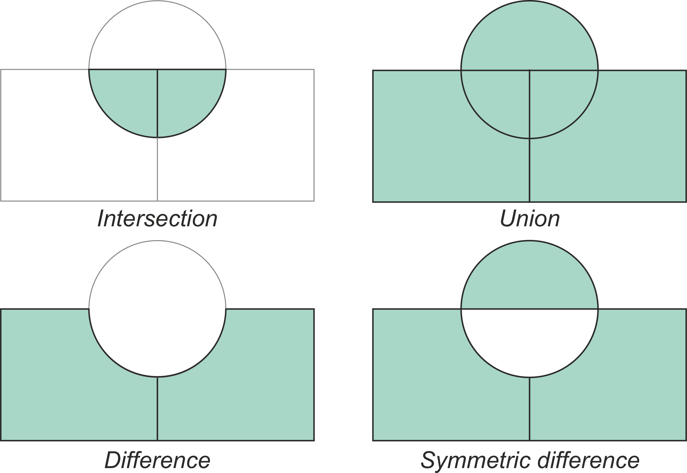

---
jupyter:
  jupytext:
    text_representation:
      extension: .md
      format_name: markdown
      format_version: '1.3'
      jupytext_version: 1.15.2
  kernelspec:
    display_name: Python 3 (ipykernel)
    language: python
    name: python3
---

<!-- #region editable=true slideshow={"slide_type": ""} -->
# Vector overlay operations

Map overlay is probably the oldest analysis technique in GIS to understand relations between layers of geographic information. Already in the mid 19th century, John Snow famously identified the source of cholera outbreak in London to a specific public water pump by overlaying two point maps on top of each other ({cite}`unwin_1996`). Map overlay has been an important analytical tool for very long time, as being able to combine and analyse multiple layers of spatial data together is crucial for various spatial planning processes, including e.g. suitability analyses, environment impact assessment, or when doign zoning and landuse plans (e.g. {cite}`keeble_1952`; {cite}`masser_1999`; {cite}`steinitz_1976`). 

Overlay operations can be done both with vector and raster data. Vector overlay operations are commonly used technique to produce new geometries and associated attribute data based on two or more vector layers. When working with multiple spatial datasets (especially polygon or line layers), you might need to create new shapes based on places where the layers overlap (or do not overlap) with each other. Typical overlay operations include union, intersection, and difference (**Figure 6.50**). These are named after the result of the combination of two or more input layers which produce at least one (or more) output layer. Being able to combine spatial data layers like this is an important feature in most GIS tools. These manipulations are also often called as set operations.

The basic idea of vector overlay operations is demonstrated in **Figure 6.50** where the green areas represent the areas which constitute the result after the overlay operation. It is good to keep in mind that overlays operate at the GeoDataFrame level, not on individual geometries, and the properties from both are retained (often, not always). In effect, for every shape in the left GeoDataFrame, this operation is executed against every other shape in the right GeoDataFrame



_**Figure 6.50**. Typical vector overlay operations between two geographic layers (circle and rectangles)._

<!-- #endregion -->

<!-- #region editable=true slideshow={"slide_type": ""} -->
To demonstrate how these overlay operations work in practice, we will carry out vector overlay operations between two Polygon datasets that represent i) the postal code areas in the Helsinki city center and ii) a 3000 meter buffer around the Helsinki railway center. Let's start by reading the datasets and prepare them for analysis:
<!-- #endregion -->

```python editable=true slideshow={"slide_type": ""}
import geopandas as gpd

postal_areas = gpd.read_file("data/Helsinki/Helsinki_centre_postal_areas.gpkg")
railway_station = gpd.read_file("data/Helsinki/Helsinki_railway_station.gpkg")

# Check the data
postal_areas.head()
```

```python
postal_areas.shape
```

```python editable=true slideshow={"slide_type": ""}
railway_station.head()
```

From here we can see that the `postal_areas` include MultiPolygon geometries representing altogether thirty postal code areas, whereas the `railway_station` represents a single `Point` for the Helsinki Railway station. As vector overlay operation happens between two geographic datasets, it is necessary to ensure that they both share the same Coordinate Reference System. Hence, let's first check that the `.crs` are matching using the Python's `assert` statement that tests whether the condition is `True`. If the test fails, the `assert` will throw an `AssertionError` with the message that we provide as text like in the following:

```python
assert postal_areas.crs == railway_station.crs, "The CRS does not match!"
```

Great, the CRS matches between the layers. Hence, let's continue and create a 3 kilometer buffer around the Helsinki railway station which we will use in our vector overlay operations:

```python editable=true slideshow={"slide_type": ""}
station_buffer = railway_station.copy()
station_buffer["geometry"] = station_buffer.buffer(3000)
```

Here, we first created a copy of the original GeoDataFrame and then used the `.buffer()` method to create a Polygon circle with 3000 meter radius. Let's visualize the data on a map so that we can get a better understanding of the two layers and how they overlap with each other:

```python editable=true slideshow={"slide_type": ""}
m = postal_areas.explore(tiles="CartoDB Positron")
m = station_buffer.explore(m=m, color="red")
m
```

<!-- #raw editable=true slideshow={"slide_type": ""} tags=["hide-cell"] raw_mimetype="" -->
% This cell is only needed to produce a figure for display in the hard copy of the book.
\adjustimage{max size={0.9\linewidth}{0.9\paperheight}, caption={\emph{\textbf{Figure 6.51}. A sample of postal code areas in the Helsinki city centre and a 3km buffer around Helsinki railway station.}}, center, nofloat}{../img/figure_6-51.png}
{ \hspace*{\fill} \\}
<!-- #endraw -->

<!-- #region editable=true slideshow={"slide_type": ""} -->
_**Figure 6.51**. A sample of postal code areas in the Helsinki city centre and a 3km buffer around Helsinki railway station._
<!-- #endregion -->

<!-- #region editable=true slideshow={"slide_type": ""} -->
## Intersection
<!-- #endregion -->

<!-- #region editable=true slideshow={"slide_type": ""} -->
We are now ready to conduct an overlay analysis between these layers. We will create a new layer based postal code polygons that `intersect` with our Helsinki layer. We can use a method called `.overlay()` to conduct the overlay analysis between the given GeoDataFrame (`postal_areas`) and a second GeoDataFrame (`station_buffer`). With parameter `how` we can control how the overlay analysis is conducted. Possible values are `'intersection'`, `'union'`, `'symmetric_difference'`, `'difference'`, and `'identity'`. Let's start by doing an overlay using `"intersection"` as the overlay operation:
<!-- #endregion -->

```python editable=true slideshow={"slide_type": ""}
# Intersection
intersection = postal_areas.overlay(station_buffer, how="intersection")
intersection.head()
```

```python
intersection.shape
```

As a result we got a new GeoDataFrame that includes 23 postal code areas that intersected with the `station_buffer`. As we can see, due to the overlay operation, the dataset contains the attributes from both input layers, i.e. it works in a bit similar manner as `sjoin()` demonstrated in Chapter 6.7. To make it easier to understand how different vector overlay operations work, let's create an easy helper function called `plot_vector_overlay()` that creates a comparison map based on the results before and after the overlay operation. To do this, we use `matplotlib` library and create a subplot with 2 separate plots:

```python editable=true slideshow={"slide_type": ""}
import matplotlib.pyplot as plt


def plot_vector_overlay(gdf1, gdf2, result, title):
    """
    Creates two maps next to each other based on `gdf1`, `gdf2` and the
    `result` GeoDataFrames.
    """

    fig, (ax1, ax2) = plt.subplots(nrows=1, ncols=2, figsize=(8, 5))

    ax1 = gdf1.plot(ax=ax1)
    ax1 = gdf2.plot(ax=ax1, color="red", alpha=0.3)

    result.plot(ax=ax2)

    # Fetch bounds and apply to axis 2
    xmin, ymin, xmax, ymax = gdf1.total_bounds

    ax2.set_xlim(xmin, xmax)
    ax2.set_ylim(ymin, ymax)

    fig.suptitle(title, fontsize=16)
    # Add an arrow between the plots
    fig.text(0.49, 0.5, "⇨", fontsize=30, color="red")
    ax1.axis("off")
    ax2.axis("off")
    plt.tight_layout()
    return fig, ax1, ax2
```

Now we can call this function to create a visualizaton that demonstrates how the intersection overlay operations behaves:

```python
fig, ax1, ax2 = plot_vector_overlay(
    gdf1=postal_areas, gdf2=station_buffer, result=intersection, title="Intersection"
)
```

_**Figure 6.52**. Result after conducting vector overlay operation by intersecting the two layers._


As we can see, the `"intersection"` overlay operation keeps the postal code areas that intersect with the circle and keeps all those geometries in the result. Important thing to notice is that with `overlay()` the intersecting GeoDataFrame (`station_buffer`) will also modify the input geometries by cutting them in the border areas where they cross. This is one of the key differences between `.overlay()` and `sjoin()` methods as `sjoin()` will not modify the input geometries. As mentioned earlier, attribute data from both GeoDataFrames are kept from the features that are part of the result.  In the following, we will show one-by-one, how different overlay operations (i.e. union, difference, symmetric difference, identity) influence the results.


## Union

In a similar manner as with intersection, we can conduct overlay operation using `"union"` as below:

```python editable=true slideshow={"slide_type": ""}
# Union
union = postal_areas.overlay(station_buffer, how="union")

fig, ax1, ax2 = plot_vector_overlay(
    gdf1=postal_areas, gdf2=station_buffer, result=union, title="Union"
)
```

<!-- #region editable=true slideshow={"slide_type": ""} -->
_**Figure 6.53**. Result after conducting vector overlay operation based on union._
<!-- #endregion -->

```python
union.shape
```

When using `"union"` overlay operation, the geometries from both GeoDataFrames are kept in the result. As you can see, the number of rows has increased quite significantly from 30 to 42 rows. This happens because the postal code geometries are again modified by the `station_buffer` in the areas where the geometries cross each other: the postal code geometry is splitted in two in areas where the buffer geometry crosses the postal code geometry. Hence, this will increase the number of rows in the final output. 

<!-- #region editable=true slideshow={"slide_type": ""} tags=["question"] -->
#### Question 6.13

Did you fully understand why the number of rows increase after doing the union overlay? If not, use the `.explore()` and investigate the geometries in areas where the postal code areas and the ring (border) of the buffer geometry cross each other. When you hover over the border, what happens with the attribute values?
<!-- #endregion -->

```python editable=true slideshow={"slide_type": ""} tags=["remove_cell"]
# Use this cell to enter your solution.
```

```python editable=true slideshow={"slide_type": ""} tags=["hide-cell", "remove_book_cell"]
# Answer
print(
    """
When hovering over the buffer geometry border, the attribute values in the table change. 
Inside the ring, the attributes of the Helsinki railway station are kept in the results, whereas outside of the ring 
the table does not include any data for the columns associated with the railway station.
"""
)

# Solution
union.explore()
```

## Difference and symmetric difference

Sometimes it might be useful to focus extract geometries that area *outside* a given layer. This can be achieved by using the `.overlay()` with `"difference"` operator:

```python editable=true slideshow={"slide_type": ""}
# Difference
difference = postal_areas.overlay(station_buffer, how="difference")

fig, ax1, ax2 = plot_vector_overlay(
    gdf1=postal_areas, gdf2=station_buffer, result=difference, title="Difference"
)
```

_**Figure 6.54**. Result after conducting vector overlay operation based on difference._

```python
difference.columns.values
```

```python
difference.shape
```

As can be seen from the results above, the `"difference"` will keep the postal code geometries that are outside of the buffer geometry (note we output `difference.columns.values` here to output only the column names). In terms of attributes, only the columns that are present in the source GeoDataFrame (i.e. `postal_areas`) are kept. 

The symmetric difference overlay operation is an interesting one. It will keep the geometries and attributes outside of the `station_buffer` layer, as well as create a geometry within the `station_buffer` that includes areas that are within the `station_buffer` ring but outside the `postal_areas` GeoDataFrame. I.e. in our case, it mostly contains water areas that surround the Helsinki city centre as shown below:

```python editable=true slideshow={"slide_type": ""}
# Symmetric Difference
symmetric_difference = postal_areas.overlay(station_buffer, how="symmetric_difference")

fig, ax1, ax2 = plot_vector_overlay(
    gdf1=postal_areas,
    gdf2=station_buffer,
    result=symmetric_difference,
    title="Symmetric Difference",
)
```

_**Figure 6.55**. Result after conducting vector overlay operation based on symmetric difference._

```python
symmetric_difference.columns
```

```python
symmetric_difference.shape
```

```python
symmetric_difference.tail()
```

As can be seen from above, the table includes now the attributes from the `postal_areas` GeoDataFrame as well as the attributes from `station_buffer` in the last row of the resulting GeoDataFrame. 


## Identity

As a last overlay operation, we have the `"identity"` which computes a geometric intersection of the input features and identity features. The input features or portions thereof that overlap identity features will get the attributes of those identity features. The basic idea is very similar to `"union"` but in this case, the areas outside of `postal_areas` GeoDataFrame will not be filled with the `station_buffer` geometry as demonstrated below:

```python editable=true slideshow={"slide_type": ""}
# Identity
identity = postal_areas.overlay(station_buffer, how="identity")

fig, ax1, ax2 = plot_vector_overlay(
    gdf1=postal_areas, gdf2=station_buffer, result=identity, title="Identity"
)
```

_**Figure 6.56**. Result after conducting vector overlay operation based on identity._

```python editable=true slideshow={"slide_type": ""}
identity.columns
```

```python
identity.shape
```

```python
identity.loc[20:25]
```

As can be seen from the results above, the output now includes attribute information from both GeoDataFrames and the geometries in the `postal_areas` are split into multiple parts in places where the `station_buffer` cuts them. However, the geometry of the `station_buffer` itself is not included at all in the results. 
