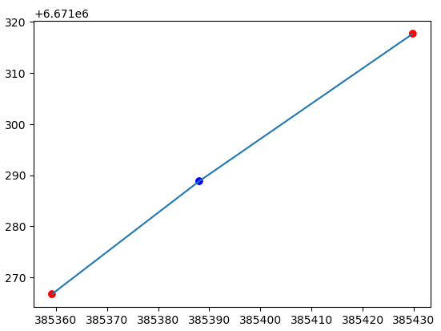

---
jupyter:
  jupytext:
    text_representation:
      extension: .md
      format_name: markdown
      format_version: '1.3'
      jupytext_version: 1.16.7
  kernelspec:
    display_name: Python 3 (ipykernel)
    language: python
    name: python3
---

<!-- #region editable=true slideshow={"slide_type": ""} -->
# Representing geographic data as networks

As we briefly introduced in Chapter 5.2, networks are data structures that consists of nodes that are connected to other nodes via edges which ultimately construct a network topology (or a graph as it is referred in graph theory). In this section, we will show how you can construct spatial networks using Python based on geographic data. We will show how you can create a simple graph from scratch, as well as how to create a network from a given dataset with `LineString` objects or from OpenStreetMap data that makes it possible to create networks from all over the world that can be used for various network analysis purposes.

Contents:

- Basic concepts: nodes, edges, node/edge attributes, topology, connectivity, directionality, what Python tools are out there that can be used?
- How to create a simple graph from scratch
- How to create a graph from a file representing streets
- How to create a routable graph from OpenStreetMap
- Other uses of graphs - morphology, spatial weights, etc.
- Saving graphs to disk
<!-- #endregion -->

<!-- #region editable=true slideshow={"slide_type": ""} -->
## What is a network?

As networks are widely used in various domains, the terminology related to networks can sometimes be a bit confusing. To clarify some of the ambiguity related to the terminology, we will explain some common network-related terminology along the way to make it clear how we refer to specific concepts in this book emphasizing the linkage to GIS. Most of the terminology derives from graph theory and network theory.

`Graph` is a collection of `nodes` and `edges` that constitute a graph structure. A `graph` is an abstract concept commonly used e.g. in mathematics and computer science which emphasizes the connections and relationships between entities (nodes) rather than exact geographic positions or distances. This graph structure is also called as `network topology`. A `network` then again is sometimes defined as **a  graph with attributes**, whereas `spatial network` is a `network` that is used to represent real-world systems on a geographic space. For example, street network is typically not only represented as a collection of `nodes` (intersections) and `edges` (streets) but there are various additional attributes associated with the network, such as length, speed limit, number of lanes, the location of crossroads etc. In practice, the terms `graph`, `network` and `spatial network` are often used in synonymous manner, although there can be subtle differences in terms of how they are defined in different contexts. In this book, we will broadly use the term `graph` when talking about any of these concepts. After all, all of these concepts are graph structures, regardless of whether they have attribute information or not.

In the following, we will dive deeper to all of these aspects and construct various types of networks which aim to make it easier to understand how all of this works using Python. We recommend to start by reading through the section 8.1.2 because this section introduces fundamental concepts related to graphs and various useful functionalities of the `networkx` library. 
<!-- #endregion -->

## Creating a graph from scratch

In the following sections, we will show how you can create a simple 1) undirected and 2) directed graph from scratch without any specific data source and explain the basic concepts, data structures and methods related to `networkx` library.


### Undirected graph

We will start our exploration with networks by constructing a simple `graph` with `nodes` and `edges` using the `networkx` library. But what is a `node` exactly? A `node` is a point entity that can represent more or less anything in the world, such as a person, computer or location. In GIS context, `node` of a `spatial network` typically refers to a specific location, such as intersection in the street network or a building. In graph theory, `node` is typically called as `vertex`. However, in GIS, we typically differentiate the two: `node` is specific to a point at which a line ends or connects to another line, whereas `vertices` can be in between the `nodes` as intermediate points (Figure 8.1) constructing the shape of a given line geometry (e.g. a curved road). Thus, every `node` of a `graph` can be considered as a `vertex` but not all `vertices` are `nodes`. When working with real-world networks (e.g. street networks), it is typical that the actual geometry of the street segment is simplified when constructing the graph and only the nodes are kept (i.e. the first and last point of LineStrings).



_**Figure 8.1.** Nodes (in red) and a vertex (blue) extracted from a simple LineString geometry._


In Python, we can use the `networkx` library and its `nx.Graph()` construct to create an undirected graph. Let's initialize an "empty" graph and store it into a variable `G` that we can later use to populate it with `nodes` and `edges`:

```python
import networkx as nx
import matplotlib.pyplot as plt

G = nx.Graph()
G
```

```python
G.nodes
```

By calling the `.nodes` attribute, it is possible to return all the nodes of a given graph. As we can see, our graph is still empty without any nodes. We can easily add nodes to our graph by using the `.add_node()` method which can be used to add nodes to a given graph one at a time. In the following, we will add five nodes to our graph and give them simple letter ids from `a` to `e`:

```python
G.add_node("a")
G.add_node("b")
G.add_node("c")
G.add_node("d")
G.add_node("e")
```

```python
G.nodes.data()
```

As we see, the graph contains five nodes. By calling the `.nodes.data()` method, we can return not only the nodes of the graph, but also the attributes associated with the nodes. Here, we do not yet have any node attributes associated with our data, which is the reason why we only see empty dictionaries (`{}`) associated with each node. Already at this stage, we can plot our graph even without any edges by using the `nx.draw()` function that is a handy tool to plot `networkx` graph objects (uses `matplotlib` library in the background for plotting):

```python
nx.draw(G=G, with_labels=True, font_color="white")
```

_**Figure 8.1.** Nodes visualized in arbitrary space._

As we can see, at the moment the nodes are located arbitrarily in space because we do not have any specific locations defined for our `nodes`. As mentioned earlier, graphs do not necessarily need any information about the exact locations of the nodes to be able to draw a graph structure. However, the plot above is not yet a graph, because we do not have any edges associated with the nodes that would show how they relate or connect to each other. 

Thus, let's continue by creating `edges` which are the other core element of a graph. A single `edge` is basically a connection between two `nodes`. `Edge` can also be called as `line` or `link` (depending on the context). To create edges, we can use the `.add_edge()` method where we define how the nodes are connected to each other. In `networkx`, the nodes that are connected to each other are often referred as `u` (first node) and `v` (last node). In the following, we will define the topology of our graph by defining one edge at a time how the nodes are connected to each other:

```python
# Add edges            
G.add_edge("a", "b")
G.add_edge("a", "c")
G.add_edge("b", "d")
G.add_edge("c", "d")
G.add_edge("d", "e")
```

```python
G.edges
```

As we can see, by accessing the `.edges` we can get a list of node-pairs that construct the connections (i.e. edges) between the nodes. Now we can again plot the graph to see how our network topology looks like:

```python
nx.draw(G, with_labels=True, font_color="white")
```

_**Figure 8.X.** A simple graph with five nodes and edges._

Now we have a very simple graph structure where the nodes are connected to each other as we defined them in the previous step. This kind of graph structure can already be useful for various purposes. If we for example consider that these nodes would represent persons, we could see how those persons are interacting with each other (who knows who). However, as we are mostly interested to study and understand `spatial networks`, let's continue and see how we can present this simple graph in such a way that the locations of the nodes are not in arbitrary space but they have exact locations.


#### Adding node attributes

As mentioned earlier, edges and nodes can have attributes associated with them (e.g. coordinates, distance, volume, capacity) which make them very useful data structure for various analytical purposes, such as conducting way-finding where the target is to find an optimal path between two locations on a network. In the following, we will add the same nodes with ids (`a, b, c, d, e`) but at this time we add coordinates for these nodes as `node attributes`. To do this, we construct a simple data collection that is a `list` of `tuples` where each `tuple` contains the information for a given node. As the first item, we provide the id for a given node (e.g. `"a"`) and as the second item we provide all the node attributes as a Python `dictionary`. In practice, you can add as many node attributes as you like in this `dictionary`, but in our case, we now only add one attribute which we call `"coords"` that will contain the x and y coordinates for a given node: 

```python
node_collection = [("a", {"coords": (0,5)}),
                   ("b", {"coords": (5,5)}),
                   ("c", {"coords": (0,0)}),
                   ("d", {"coords": (5,0)}),
                   ("e", {"coords": (10,0)}),
                  ]
```

```python
G = nx.Graph()
G.add_nodes_from(node_collection)
```

We can add this collection of nodes into our `graph` by using the `.add_nodes_from()` method which allows you to add multiple nodes at once without the need to call multiple times `.add_node()` as we did in our previous example. Now, our graph includes not only the nodes, but also the associated attributes as we can see here:

```python
G.nodes.data()
```

#### Adding edge attributes

Adding edges to a given graph with `edge attributes` works in a very similar manner as adding nodes and node attributes as shown previously. When we want to add a collection of edges to a `graph` we create a `list` that contains tuples with information about the connections, i.e. which nodes are linked to each other (e.g. `"a"` and `"b"`), and the edge attributes as a `dictionary`. Here, each `tuple` represents a single edge, where the first and second item corresponds to the connected node-ids and the third item corresponds to the edge attributes. In our case, we add a single edge attribute called `"weight"` which could represent the cost (e.g. distance or time) to move from one node to another, or the importance of a given edge (e.g. the number of people interacting between these nodes in one way or another):

```python
edge_collection = [("a", "b", {"weight": 1}),
                   ("a", "c", {"weight": 1}),
                   ("b", "d", {"weight": 2}),
                   ("c", "d", {"weight": 1}),
                   ("d", "e", {"weight": 3}),
                  ]
```

Now we can add this collection of edges into our graph `G` by using the `.add_edges_from()` method which can be used to add multiple items at once to the given graph (similar to how we added multiple nodes). As a result, our graph now contains not only the information about the connections (edges), but also the associated `edge attributes`:

```python
G.add_edges_from(edge_collection)
G.edges.data()
```

#### Visualizing a spatial network

In the previous steps, we prepared a network (a.k.a a graph) that has the necessary information to construct and visualize a (planar) spatial network, where the nodes and edges are not located in arbitrary space but they are tied to our physical world with coordinates. To be able to visualize this spatial network with `networkx`, we first need to extract the coordinates of each node in our graph. We can do this easily by using the `nx.get_node_attributes()` function which will iterate over the nodes and associated node attributes to construct a `dictionary` that contains the node-id as `key` and the coordinate-tuple as `value`:

```python
# Extract node locations
positions = nx.get_node_attributes(G, "coords")
positions
```

With this information, we can now draw the network using the `nx.draw()` function similarly as in our previous example. However, now we determine the exact location for every node by using the `pos` parameter that is used to map the nodes to given locations:

```python
nx.draw(G, pos=positions, with_labels=True, font_color="white")
```

_**Figure 8.X.** A simple spatial network with five nodes and edges._

Now we have visualized a simple spatial network where the locations of the nodes are pre-determined by us according the coordinates that we used when constructing the graph. Thus, we can be sure that the network always looks exactly the same when we visualize it (which is important for physical real-world networks), which is not the case if visualizing the network without the node coordinates. In fact, if you run the previous code without using the `pos` parameter multiple times, it is likely that you get a different looking graph each time:

```python
fix, (ax1, ax2, ax3, ax4) = plt.subplots(ncols=4, figsize=(14,4))

nx.draw(G, with_labels=True, font_color="white", ax=ax1)
nx.draw(G, with_labels=True, font_color="white", ax=ax2)
nx.draw(G, with_labels=True, font_color="white", ax=ax3)
nx.draw(G, pos=positions, with_labels=True, font_color="white", ax=ax4)
```

_**Figure 8.X.** Defining the node locations ensures that the graph always looks the same (as in the rightmost subplot)._


When we constructed our graph, we also included `edge attributes`. It is also possible to assign colors to edges and/or annotate them according a given edge attribute when visualizing which make it easier to understand the characteristics of our network. To annotate the edges, i.e. show a given edge attribute on top of the edges, we first need to parse the labels that we associate with the edges. We can do this in a very similar manner as how we extracted the node coordinates previously, but in this case we use the `nx.get_edge_attributes()` which returns a `dictionary` containing a tuple of the node-ids of a given edge as a `key` and the edge attribute (here `"weight"`) as the `value`:

```python
# Parse edge labels
weights = nx.get_edge_attributes(G, "weight")
weights
```

```python
edge_values = list(weights.values())
edge_values
```

Now we can draw the network in such a way that we determine the color of each edge according the `"weight"` attribute and also label the edges so that we can see the actual edge attribute values as well. To determine the color of the edges, we can use the `edge_color` parameter that can be used to determine a single color for all edges or, as in our case, provide a list of values that are mapped to a given color map that we define with the parameter `edge_cmap`. To label the edges, we use the `nx.draw_networkx_edge_labels()` function that draws and positions the labels on top of the graph as follows:

```python
# Draw network with colored edges
nx.draw(G, 
        pos=positions, 
        with_labels=True, 
        font_weight="bold", 
        font_color="white", 
        node_color="grey",
        edge_color=edge_values,
        edge_cmap=plt.cm.copper,
        
)

# Draw edge labels
nx.draw_networkx_edge_labels(
    G, 
    positions,
    edge_labels=weights,
    font_color='red', 
    font_weight="bold",
);
```

_**Figure 8.X.** A graph with edge labels and colors that are determined by the edge attribute._


### Directed graph

Networks can be `directed` or `undirected`, which determines the `directionality`, i.e. in which direction the nodes are connected to each other. In broad terms, the directionality determines how the interaction happens (or is allowed to happen) between the nodes. In directed graphs, `edges` are always directed, meaning that we need to define the direction how the nodes are connected to each other for each edge. For instance, if we want to have an edge between nodes `A` and `B` that can be traversed to both direction we actually need to construct two edges (also called as a `multi-edge`), i.e. one per direction: 1) the node A is connected to node B, and, 2) the node B is connected to node A. We briefly described this logic already in Chapter 5 (see Figure 5.8 and Table 5.1). These kind of directed edges are sometimes called as `arcs`. A good example of such directed network is a street network where considering directionality is important as the travel direction can be restricted to a certain direction in specific parts of the network due to one-way-streets (e.g. when travelling by car). However, networks do not always need to be directed in the context of transport. Undirected graphs can be used e.g. for walking or cycling related network analysis, as with those travel modes it is typically possible to travel the same street in any direction you like. 


We can create a directed graph with `networkx` in a very similar manner as we did in the previous section when we created an undirected graph. To initialize a directed graph, we can use the `nx.MultiDiGraph()` that allows the creation of multiple edges between the same pair of nodes:

```python
G_directed = nx.MultiDiGraph()
G_directed
```

We can now populate our directed graph with nodes and node attributes in a similar fashion as we did with the undirected graph:

```python
node_collection = [("a", {"coords": (0,5)}),
                   ("b", {"coords": (5,5)}),
                   ("c", {"coords": (0,0)}),
                   ("d", {"coords": (5,0)}),
                   ("e", {"coords": (10,0)}),
                  ]
# Add nodes
G_directed.add_nodes_from(node_collection)
G_directed.nodes.data()
```

However, when constructing the edges, we now need to define a separate edge for each direction. In our case, we create bidirectional edges (i.e. multi-edge) everywhere except between the nodes `c` and `d` which we determine to be one-way as shown below. We also add a couple of edge attributes, i.e. `weight` and `color` where the green color indicates a bidirectional edge, and blue represents oneway, respectively. We can again use the `.add_edges_from()` method to add these edges to our graph:

```python
edge_collection = [("a", "b", {"weight": 1, "color": "green"}),
                   ("b", "a", {"weight": 1, "color": "green"}),
                  
                   ("a", "c", {"weight": 1, "color": "green"}),
                   ("c", "a", {"weight": 1, "color": "green"}),
                  
                   ("b", "d", {"weight": 2, "color": "green"}),
                   ("d", "b", {"weight": 2, "color": "green"}),

                   # One-way
                   ("c", "d", {"weight": 1, "color": "blue"}),
                   
                   ("d", "e", {"weight": 3, "color": "green"}),
                   ("e", "d", {"weight": 3, "color": "green"}),
                  ]
# Add edges
G_directed.add_edges_from(edge_collection)
G_directed.edges.data()
```

Great! Now our graph is constructed and we can plot it using the same approaches and methods that we learned in the previous section:

```python
# Extract exact node locations
positions = nx.get_node_attributes(G_directed, "coords")

# Parse edge labels
edge_labels = nx.get_edge_attributes(G_directed, "weight") 

# Parse edge colors
edge_colors = list(nx.get_edge_attributes(G_directed, "color").values())
```

```python
# Draw the graph with edge labels
nx.draw(G_directed, 
        with_labels=True, 
        pos=positions, 
        font_color="white", 
        node_color="grey",
        edge_color=edge_colors
       )

nx.draw_networkx_edge_labels(
    G_directed, 
    positions,
    edge_labels=edge_labels,
    font_color='red', 
    font_weight="bold",
);
```

_**Figure 8.X.** A directed graph with edge labels showing the weight, and colors and arrows indicating the directionality._


Now our visualized network shows not only the structure of the graph, but also the directionality which we encoded into the graph when constructing it. The small arrows at the end of the lines show the direction how the nodes are connected to each other. As we can see, all edges except the one highlighted with blue color are bidirectional. If we imagine that this network would represent a very simple street network, you could travel the "blue street" only from node `c` to `d` (i.e. a one-way street), whereas all the other streets you can travel to both directions. 

<!-- #region editable=true slideshow={"slide_type": ""} -->
## Creating a graph from geometries
<!-- #endregion -->

### Undirected graph using a GeoDataFrame

<!-- #region editable=true slideshow={"slide_type": ""} -->
Data was obtained from Digiroad
<!-- #endregion -->

```python editable=true slideshow={"slide_type": ""}
import geopandas as gpd

fp = "data/digiroad_helsinki.gpkg"
streets = gpd.read_file(fp)
streets.head()
```

```python
streets.plot();
```

```python
def gdf_to_graph(gdf):
    """Creates a NetworkX Graph from GeoDataFrame consisting of LineString objects.

    Parameters
    ----------

    gdf : GeoDataFrame
        GeoDataFrame containing the LineString data.

    """

    # Create the NetworkX graph
    graph = nx.Graph()
        
    # Generate edge dictionary
    for edge in gdf.itertuples():
        coords = edge.geometry.coords

        # Get first and last node of the edge (excluding vertices)
        first, last = coords[0], coords[-1]

        # Edge attributes
        edge_attr = edge._asdict()

        graph.add_edge(first, last, **edge_attr)

    # Generate node attributes
    node_attrs = {node: {"coords": node, "x": node[0], "y": node[1]} for node in graph.nodes}
    nx.set_node_attributes(graph, node_attrs)  
    
    # Relabel the indices
    graph = nx.convert_node_labels_to_integers(graph)

    # Add some useful attributes    
    graph.graph['crs'] = gdf.crs

    return graph
```

Next we will break it down few steps at a time to understand what happens here. Let's start by investigating what happens inside the loop:

```python
graph = nx.Graph()

for edge in streets.itertuples():
    # Get the coordinates
    coords = edge.geometry.coords

    # Get first and last node of the edge (excluding vertices)
    first, last = coords[0], coords[-1]

    # Get the edge attributes
    edge_attributes = edge._asdict()

    # Add to the graph
    graph.add_edge(first, last, **edge_attributes)
    break
```

Now we iterated over one edge in our street network and stopped the loop to be able to investigate what our variables contain. The `coords` variable contain the coordinates of all the vertices in the first edge of our street network:

```python
list(coords)
```

As we can see, there are 3 vertices in this `LineString` object representing a given street. When constructing the graph topology, we only care about the `nodes` of the street segment geometry (i.e. the first and last coordinates of the geometry). This means that in case there are vertices between the nodes, those will not be taken into consideration in the topology of the graph (unless specifically needed for some special use case). Thus, the network topology itself does not need to have the full geometry of the street segments for it to work. 

```python
# Create a GeoDataFrame out of the vertices
vertices = gpd.GeoDataFrame(geometry=[Point(coordpair) for coordpair in coords])

fig, ax = plt.subplots()
streets.iloc[0:1].plot(ax=ax)
vertices.plot(ax=ax, color=["r", "b", "r"])
```

_**Figure 8.X.** Only the nodes (in red) will be used to construct the edge for a given network topology._

Considering only the nodes and ignoring the vertices has also benefits as doing this reduces the size of the graph and makes it faster to run any analyses on it. Thus, we only take the first and last coordinate-pair of the edge geometry which we will use as nodes:

```python
print("First node:", first)
print("Last node:", last)
```

Although the network topology only considers the nodes, this does not mean that you would loose the actual geometries of the street network, as we can still store the full geometry as an edge attribute of our graph. The `edge_attributes` variable contains all the associated information from the given row in our `GeoDataFrame` as a dictionary:

```python
edge_attributes
```

When we call the `graph.add_edge(first, last, **edge_attributes)`, we add this edge to the given `graph` in which the `**edge_attributes` command unpacks the values of the dictionary and inserts them as attributes for the given edge. Thus, when we investigate the contents of the edges at this point in time, we will see that the actual `geometry` is also stored for the edge:

```python
graph.edges.data()
```

At this point, you might wonder what happened with the `nodes` as we did not specifically add them to the graph in a similar manner as in our earlier examples? We can investigate how the `nodes` look like at this stage:

```python
graph.nodes.data()
```

As we can see, `networkx` actually adds the nodes automatically to the graph when we call the `.add_edge()` method based on the nodes provided to construct a given edge. However, as we can see from the nodes' data above, these nodes do not contain any information about the nodes in the nodes attributes as it is only an empty dictionary at this stage. This is something that we can handle afterwards as it is possible to set the node attributes also after the topology has been constructed based on the edges alone. To do this, we can e.g. parse the coordinates of the nodes and store that information as node attributes using the `nx.set_node_attributes()` as follows:

```python
# Create a dictionary that contain the node attributes
node_attrs = {node: {"coords": node, "x": node[0], "y": node[1]} for node in graph.nodes}
nx.set_node_attributes(graph, node_attrs)  
```

```python
graph.nodes.data()
```

As we can see, now the `nodes` of our graph includes three attributes that provide information about the location of the nodes: `coords`, `x` and `y`. 

Finally, you might have noticed that the `ids` for the nodes in our graph are quite cumbersome as they basically represent the exact coordinates of the nodes. Luckily, it is easy to relabel the node ids into a format that is easier to use and understand, using simple integer values as the ids. We can do this by using the `nx.convert_node_labels_to_integers()` function as follows:

```python
graph = nx.convert_node_labels_to_integers(graph)
```

```python
graph.edges.data()
```

```python
graph.nodes.data()
```

As we can see, now the ids for the nodes were altered from long coordinate tuples into simple integers, such as `0` and `1`, which are much easier to understand and use if you e.g. want to select specific node from the graph. 

As a very last thing in our `gdf_to_graph()` function, we add a custom attribute to our graph where we store the coordinate reference system information of the input `GeoDataFrame` which can be useful information when using the given graph for analysis with other datasets:

```python
graph.graph["crs"] = streets.crs
graph.graph["crs"]
```

That's it! This is how you can create an undirected graph based on a given `GeoDataFrame` that consists of `LineString` objects. The input data we used here represents streets, but the input data can basically be about anything as long as the geometries of the input data are represented as `LineString` objects and the data itself does have a network-like structure. In a similar manner, you could represent e.g. rivers, pipelines, power lines, social networks etc. 

Let's finally use our `gdf_to_graph()` function and create a full network topology based on our `streets` `GeoDataFrame`:

```python
G = gdf_to_graph(streets)

positions = {node: (attrs["x"], attrs["y"]) for node, attrs in G.nodes.data()}

nx.draw(G, 
        pos=positions, 
        node_color="red",
        node_size=0.5,
       )
```

### Directed graph using a GeoDataFrame


Now as we have learned how to create a simple undirected graph based on `LineString` geometries, we will continue and expand the previous example to construct a directed graph topology that considers the permitted direction of movement along the streets. When working with street network data and analyzing e.g. the travel times or distances by car, it is necessary to take into consideration one-way streets as those are extremely common especially in larger cities. On these streets, a person can only drive to a specific direction, and if you would need to travel to opposite direction, making an U-turn would not be possible but you would need to travel further to find another path where the driving is permitted to the direction you are heading. Thus, one-way streets can have significant influence on the paths between given locations which need to be taken into account when doing network analysis. If directionality would not be taken into account (like in our previous example), our analyses and results will likely provide incorrect path suggestions and unrealistic results. 

In the following, we will continue working with the same street network as in our previous example but now we will create a directed graph where the permitted direction of travel is taken into consideration. Let's start again by reading the data:

```python
import geopandas as gpd

fp = "data/digiroad_helsinki.gpkg"
streets = gpd.read_file(fp)
streets.head()
```

Here, the `direction` column includes information about the allowed direction of the traffic flow, i.e. whether the traffic is permitted in both directions or whether it is a oneway street. In this street network dataset the values are coded as shown in Table 8.1. As we can see based on these first five rows, there seem to be a couple of street segments that can be travelled to both directions indicated with value `2` (i.e. the edge should be bidirectional). In addition, there are couple of segments where the travel is permitted against the digitization direction (value `3`) and one where the travel is permitted in the direction of digitization. The direction of digitization basically means the order how the vertices (points) of a given `LineString` have been digitized when the data was created. 


: _**Table 8.1**. The rules for directed graph in terms of permitted direction of traffic._

| Value | Direction of traffic flow                                                             |
|-------|---------------------------------------------------------------------------------------|
| 2     | Traffic is permitted in both directions                                               |
| 3     | Traffic is permitted against the direction of digitization (end-node to start-node) |
| 4     | Traffic is permitted in the direction of digitization (start-node to end-node)      |


```python
def gdf_to_directed_graph(gdf, direction='direction', both_ways=2, against=3, along=4):
    """Creates a NetworkX MultiDiGraph from road network GeoDataFrame.

    Parameters
    ----------

    gdf : GeoDataFrame
        GeoDataFrame containing the road network data.

    direction : str
        Name for column that contains information about the allowed driving directions

    both_ways : int
        Value specifying that the road is drivable to both directions.

    against : int
        Value specifying that the road is drivable against the digitizing direction.

    along : int
        Value specifying that the road is drivable along the digitizing direction.

    """

    # Create the NetworkX graph
    graph = nx.MultiDiGraph()
        
    # Generate edge dictionary
    for edge in gdf.itertuples():
        coords = edge.geometry.coords

        # Get first and last node of the edge (excluding vertices and possible Z coordinate)
        first, last = coords[0][:2], coords[-1][:2]

        # Edge attributes
        edge_attr = dict(edge._asdict())

        # Create edges according the direction rules
        if edge_attr[direction] == both_ways:

            # If road is bi-directional add it in both ways
            graph.add_edge(first, last, **edge_attr)
            graph.add_edge(last, first, **edge_attr)

        elif edge_attr[direction] == along:

            # Add the edge along digitization direction
            graph.add_edge(first, last, **edge_attr)

        elif edge_attr[direction] == against:
            
            # Add the edge against digitization direction
            graph.add_edge(last, first, **edge_attr)

    # Generate node attributes
    node_attrs = {node: {"coords": node, "x": node[0], "y": node[1]} for node in graph.nodes}
    nx.set_node_attributes(graph, node_attrs)  
    
    # Relabel the indices
    graph = nx.convert_node_labels_to_integers(graph)

    # Add some useful attributes    
    graph.graph['crs'] = gdf.crs

    return graph
```

```python
G = gdf_to_directed_graph(streets)
```

```python jupyter={"source_hidden": true}
positions = {node: attrs["coords"] for node, attrs in G.nodes.data()}
```

```python jupyter={"source_hidden": true}
edge_colors = ["blue" if attrs["direction"] == 2 else "red" for u, v, attrs in G.edges.data()]
```

```python
fig, ax = plt.subplots(figsize=(10,10))

nx.draw(G, 
        ax=ax,
        pos=positions, 
        node_color="black",
        node_size=0.5,
        edge_color=edge_colors,
        arrows=False,
       )
```

## Preparations for routing: Adding edge attributes

Next we will show how you can modify the network so that it is more useful for routing purposes. We will calculate the travel time it takes to cross a given street segment assuming that the person would be driving according the speed limits. The `maxspeed` column in our data provides information about the speed limit (km per hour) on a given street element. This is very useful information as we can use this to calculate the "free-flow" travel time which indicates the time it takes to cross a specific street segment assuming that a given person would be able to travel as fast as the speed limit allows. Notice that in cities, it is common that the actual driving speed can be lower than the speed limit due to congestion but we will ignore this for now to keep things simple. 

```python
streets.head(2)
```

Let's start by creating an attribute for travel time which we can calculate based on the length of the `LineString` and the `maxspeed` column. As we do not yet have information about the length stored in our data, we will also calculate and store it in a dedicated column called `length_m` (in meters). Notice that when calculating length, it is important that your input data is in projected coordinate system. In case your data has e.g. `WGS84` as the CRS, you should first reproject your data into an appropriate metric system (see Chapter 6.4). In our case, the input data is already in projected EUREF-FIN coordinate reference system having meters as units:

```python
streets.crs.axis_info
```

To calculate the length of each street segments, we can use the `.length` which returns the length of the lines in meters:

```python
streets["length_m"] = streets.length
streets.head(2)
```

Now we have all the information needed to calculate the free-flow travel time. To calculate the travel time in seconds, we can use a following formula that considers the speed limit information in km/h and the distance as meters (which is how our data is constructed in our `streets` dataset):

$$
t = \frac{3.6 \, d}{v}
$$

Where:  

- \(t\) = travel time in **seconds (s)**  
- \(d\) = distance in **meters (m)**  
- \(v\) = speed limit in **kilometers per hour (km/h)**

The multiplication of distance by 3.6 is a conversion factor between meters per second and kilometers per hour:

$$
1 \ \text{m/s} = \frac{3600}{1000} \ \text{km/h} = 3.6 \ \text{km/h}
$$

Let's now use the formula to calculate the travel time which we store in `time_s` column, rounding the value to a full second:

```python
streets["time_s"] = 3.6 * streets["length_m"] / streets["maxspeed"]
streets["time_s"] = streets["time_s"].round(0).astype(int)
streets.head()
```

```python
import osmnx as ox
```

```python
nodes, edges = ox.graph_to_gdfs(G)
```

```python
nodes.head()
```

```python
edges.head()
```

As many Python libraries related to working with have been 

```python
import neatnet

streets_cleaned = neatnet.remove_interstitial_nodes(streets)
streets_cleaned.shape
```

```python

```
